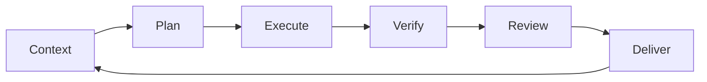

# Day 1｜從「會寫 Code」到可治理：為什麼企業需要 AI 開發工作流

「新增一個管理者可以停用使用者帳號的功能。」乍看之下，可能只是新增一個按鈕、一支 API，再更新資料庫欄位。

但真正開始實作後，問題會迅速變多：只有哪些角色可以執行停用？操作者能不能停用自己？停用後，既有登入 Session 是否必須失效？前端要如何顯示狀態？API 是否需要保留審計紀錄？測試要涵蓋哪些權限組合？部署時是否需要資料庫 Migration？如果上線後發生誤停用，維運人員能不能追查並復原？

這類需求的難點，通常不在於「能不能寫出程式碼」，而在於能否把需求、風險、驗證與交付串成一個可靠流程。

AI coding agent 讓產生程式碼變得更快，也讓工程師可以用自然語言描述任務，再由 AI 讀取程式庫、提出修改、執行指令，甚至完成測試。然而，企業導入 AI 的關鍵，不是讓 AI 單次產出更多程式碼，而是建立一套可治理、可驗證、可重複的工程工作流。

## AI coding agent 解決的是執行效率，不是工程責任

在個人專案中，工程師可能直接對 AI 說：「幫我加上停用帳號功能。」如果程式可以執行，畫面看起來也正常，任務似乎就完成了。

企業系統不能只用這種標準判斷。因為一個功能可能同時影響：

- 身分驗證與授權
- 個人資料與資安邊界
- API 契約與前端行為
- 單元測試、整合測試與回歸測試
- 資料庫 Schema 與部署流程
- Log、監控、告警與事故追蹤
- 程式碼審查、變更紀錄與發布權限

AI 可以協助處理這些工作，但不能自行決定企業願意承擔什麼風險，也不能代替組織對正式環境的發布責任。真正成熟的做法，是把 AI 放進既有的軟體工程控制點中，讓每次修改都能回答三個問題：

1. 這次變更到底要解決什麼問題？
2. 我們如何知道它沒有破壞原本的行為？
3. 誰批准它進入下一個環境？

## ChatGPT 與 Codex：分工不同，但必須接在同一條流程上

在本系列中，可以把 ChatGPT 視為偏向「思考、設計與審查」的協作夥伴。

ChatGPT 適合協助工程師：

- 將模糊需求拆成可執行的工作項目
- 釐清角色、權限、例外情境與非功能需求
- 比較不同架構與實作方案
- 設計測試案例與驗收條件
- 審查變更是否符合原始目標
- 協助整理技術決策與交付文件

Codex 則更接近「在實際程式庫中工作的執行代理」。它可以依照授權範圍讀取檔案、理解既有結構、修改程式、執行測試與工具，並回報實際執行結果。這種能力的價值，不只是寫出一段函式，而是讓修改能夠發生在真實的 Repository 上，並留下可檢查的證據。

不過，兩者都不能取代工程治理。ChatGPT 可能提出看似合理、但不符合現有系統限制的設計；Codex 也可能成功修改檔案，卻沒有涵蓋某個關鍵權限情境。因此，AI 的輸出必須被放進明確的上下文、規則、測試與審查流程。

## 本系列的核心閉環：Context → Plan → Execute → Verify → Review → Deliver

企業 AI 開發工作流可以整理成六個階段：



### 1. Context：先提供正確上下文

AI 不知道企業的隱性規則。工程師必須先提供需求文件、相關模組、技術限制、不可修改的範圍，以及目前的測試與部署方式。

上下文不是把整個 Repository 一次丟給 AI，而是讓它知道「這次任務與哪些事有關」。上下文越清楚，後續計畫越容易被檢查。

### 2. Plan：先計畫，再動手

Plan 階段要說明預計修改哪些檔案、採用什麼方案、可能影響哪些相依功能，以及如何驗證。

如果 AI 一開始就直接改檔，工程師很難在早期發現方向錯誤。先看計畫，能把昂貴的返工提前變成低成本的討論。

### 3. Execute：限制範圍地執行

執行不代表讓 AI 無限制地修改任何內容。應該明確定義允許讀寫的目錄、可執行的指令、不可碰觸的設定，以及遇到不確定事項時必須停止詢問的條件。

小範圍、可回溯的變更，通常比一次要求 AI 重構整個模組更容易治理。

### 4. Verify：用證據確認結果

「看起來可以」不是驗證。Verify 應包含測試、Lint、型別檢查、Migration 檢查、建置或其他與專案相關的驗證。

更重要的是記錄實際執行了什麼、結果為何、哪些檢查沒有執行，以及原因是什麼。沒有證據的成功，只是一個推測。

### 5. Review：檢查程式，也檢查需求

Review 不只看 Diff 是否漂亮，還要確認變更是否符合需求、是否引入權限漏洞、是否遺漏錯誤處理、是否改變既有 API 行為。

這裡可以由 ChatGPT 協助進行初步審查，但正式核准仍應遵循團隊的 Code Review 與分支保護規則。

### 6. Deliver：交付可理解、可追蹤的成果

交付物不只是修改後的檔案，還應包含變更摘要、測試結果、已知限制、部署注意事項與後續建議。

當其他工程師接手，或幾週後需要追查事故時，這些資訊往往比當初產生程式碼的速度更有價值。

## 可直接使用的任務契約 Prompt

以下範本可以在交給 ChatGPT 或 Codex 前使用。它的重點，是把「想做什麼」與「如何判定完成」寫清楚。

```text
你是本專案的工程協作代理，請先閱讀必要的程式碼與文件，再提出計畫；未經確認不要擴大修改範圍。

Goal:
- 實作：<描述要解決的業務問題與預期結果>

Scope:
- 可修改範圍：<目錄、檔案或模組>
- 必須涉及：<API、UI、資料庫、測試等>
- 不在本次範圍：<明確列出排除項目>

Constraints:
- 遵循：<語言版本、框架、既有設計模式、命名規則>
- 不得修改：<敏感設定、公共介面或指定檔案>
- 權限與資安要求：<角色、資料存取、輸入驗證等>
- 遇到需求矛盾或不確定事項時，先停止並提出問題

Acceptance Criteria:
- <條件一>
- <條件二>
- <例外情境與錯誤行為>

Verification:
- 執行測試：<指令>
- 執行 Lint／型別檢查／建置：<指令>
- 回報每個指令的實際結果，不要推測未執行的結果

Deliverables:
- 修改的檔案與變更摘要
- 測試與驗證結果
- 已知限制、風險與部署注意事項
```

## 人類工程師仍然負責什麼？

AI 可以加速分析與執行，但以下責任不能外包：

首先是需求決策。產品規則、例外情境與優先順序，必須由了解業務的人確認。

其次是權限與風險。涉及個資、付款、管理功能或外部整合時，人類必須決定風險邊界與必要控制。

第三是驗收。測試通過不等於需求正確；工程師與產品負責人仍要確認使用者真正得到想要的行為。

最後是發布責任。誰批准變更進入正式環境、何時發布、如何回滾，以及事故發生時誰負責處理，不能由 AI 自行決定。

接下來 30 天，本系列會從 Prompt 與上下文管理開始，逐步進入 Codex CLI、MCP、測試策略、Code Review、資安掃描、CI/CD、Docker、Kubernetes、雲端部署，以及成本與維運。這些主題不會被當成彼此孤立的工具教學，而會放回同一條可追蹤的工程閉環中。後續文章將以實際操作與驗證為主；在尚未執行前，不預先宣稱測試數據或案例成果。

## 今日可執行清單

1. 挑選一個真實但範圍小的待辦事項，寫出 Goal、Scope 與 Constraints。
2. 為需求補上至少三個 Acceptance Criteria，包含一個錯誤或權限情境。
3. 要求 ChatGPT 先拆解需求並提出 Plan，不要立即產生程式碼。
4. 使用 Codex 在隔離分支執行小範圍修改，保存實際測試與檢查結果。
5. 以 Diff、驗證證據與已知限制完成一次人工 Review。

下一篇預告：先別急著寫 Prompt——如何建立 AI 能正確理解的 Repository Context。
