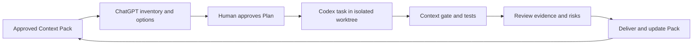

# Day 3｜多代理越多越快？用 Repository Context Pack 讓 Codex 有邊界地執行

## 影片版

[](https://www.youtube.com/watch?v=mW9jNtuN8Fo)

---

> 本文是 2026 iThome 鐵人賽系列「不只會寫 Code：用 ChatGPT × Codex 打造企業級 AI 開發工作流」第 3 天。Day 1 建立 Context → Plan → Execute → Verify → Review → Deliver 的閉環；Day 2 把模糊需求收斂成可驗收規格。今天把這份規格推進 Repository，處理多代理協作時最容易被忽略的問題：上下文漂移。

## 先看一個很容易發生的失控場景

假設團隊要把「訂單匯出」拆給三個工作者：

- 一個工作者修改 API 與權限檢查。
- 一個工作者補上背景工作與重試。
- 另一個工作者負責測試、文件與監控。

如果三個人拿到的資訊不一樣，結果可能不是單純的 Merge conflict，而是更難察覺的語意衝突：API 工作者以為只有內部管理員能匯出；Worker 工作者以為客服也可以觸發；測試工作者則按照舊的同步下載流程寫測試。每個變更單獨看都像合理，合在一起卻沒有一致的安全邊界。

這就是 **Context drift**：工作者在執行過程中，對需求、Repository 規則、允許修改範圍或驗收條件的理解逐漸分岔。Prompt 寫得更長，不會自動解決這個問題；我們需要把 Context 變成可版本化、可檢查、可交接的工程輸入。

## Repository Context Pack 是什麼？

Repository Context Pack 不是把整個 Repository 壓成一大段文字，也不是把聊天紀錄複製給每一個 agent。它是一份針對單一變更的最小必要上下文，至少要回答五件事：

| 層次 | 必須固定的內容 | 企業治理價值 |
| --- | --- | --- |
| 身分 | branch、source commit、Context Pack 版本 | 知道這份規格是對哪一版程式碼提出的 |
| 業務 | 目標、驗收條件、非目標與已決策政策 | 避免 agent 自行補完產品規則 |
| Repository | 入口模組、相鄰實作、資料流與依賴 | 讓讀取範圍足夠，但不把無關檔案全部塞進去 |
| 品質 | 測試、Lint、型別檢查、建置與回滾命令 | 讓 Verify 有可重現的基準 |
| 治理 | 可修改路徑、唯讀路徑、敏感設定、Owner 與核准者 | 把最小權限與責任邊界寫出來 |

Context Pack 的重點不是「資訊越多越好」，而是 **每個 agent 讀到同一份可驗證的事實**。如果 Repository 在執行期間已經換了 commit，或 Plan 參考的 Context Pack 版本不同，就應該停止執行，而不是默默用新舊混合的資訊繼續修改。

## ChatGPT 先做上下文盤點，不急著寫程式

在這一階段，我會把 ChatGPT 放在「上下文分析師與方案審查者」的位置。它可以先讀取需求、Repository 索引、測試慣例與治理規則，整理成 Context Pack 草案；但不能把尚未確認的政策當成事實，也不應直接修改工作目錄。

可以使用下面的任務契約：

```text
你是本 Repository 的上下文分析師，不是直接寫檔的執行代理。

請根據提供的需求、Repository 索引與工程規則，輸出：
1. Context Inventory：本次變更真正需要的檔案、命令與決策。
2. Missing Context：缺少但會影響實作的資訊；未知項目一律標記 OPEN。
3. Repository Map：入口、相鄰模組、測試位置與不可修改範圍。
4. Plan Options：至少兩個可行方案，列出相容性、效能、維運與回滾取捨。
5. Recommended Plan：任務編號、依賴、允許修改路徑、驗收條件與驗證命令。
6. Risk Review：權限、個資、併發、失敗重試、觀測性與部署風險。

限制：
- 不要猜測 OPEN 項目的答案。
- 不要把整個 Repository 視為允許修改範圍。
- 不要宣稱未執行的測試已通過。
- 等待人類核准 Recommended Plan 後，才進入 Codex 執行階段。
```

這個分工和 Day 2 的需求閘門是一致的：ChatGPT 負責把不確定性攤開、比較方案並提出追問；產品與技術負責人決定政策；Codex 才在已確認的邊界內執行。若 ChatGPT 沒有列出「它不知道什麼」，Context Pack 就還不完整。

## 把 Context Pack 寫成可以被工具讀取的資料

純 Markdown 方便人閱讀，但對自動化閘門來說，最好再提供結構化 manifest。下面是一個簡化版本；`source_commit` 應填入實際 commit，不能使用聊天中的模糊描述：

```json
{
  "context_id": "orders-export",
  "version": 3,
  "source_commit": "<approved-commit>",
  "allowed_paths": [
    "src/export/**",
    "tests/export/**",
    "docs/exports.md"
  ],
  "read_only_paths": [
    "src/auth/**",
    "config/**"
  ],
  "verification": [
    "python3 -m unittest -v"
  ],
  "open_questions": []
}
```

這裡有幾個容易被忽略的細節：

1. **允許路徑要比 Repository 小**：`src/**` 不是合理的最小範圍；它會讓一個只改匯出的任務碰到付款、身分或基礎設施模組。
2. **唯讀路徑要明確列出**：權限模組、部署設定與密鑰載入通常不是本次任務可以順手重構的地方。
3. **OPEN 必須有出口**：如果 `open_questions` 仍有項目，Plan 狀態應是 `blocked` 或 `draft`，不能進入 executing。
4. **驗證命令是交付的一部分**：每一個 agent 都知道成功要用什麼證據證明，而不是各自挑一個看起來方便的命令。

## Plan 不是待辦清單，而是變更契約

一份適合交給 Codex 的 Plan，除了任務描述，還要把「可以動哪裡、依賴誰、完成要證明什麼」寫清楚。例如：

```yaml
plan_version: 1
context_id: orders-export
context_version: 3
status: approved

tasks:
  - id: export-api
    goal: 加入權限與輸入邊界檢查
    depends_on: []
    paths:
      - src/export/api.py
      - tests/export/test_api.py
    acceptance_refs: [AC-01, AC-02]
    verification:
      - python3 -m unittest -v tests/export/test_api.py

  - id: export-worker
    goal: 讓背景工作只讀取原租戶資料並保留重試證據
    depends_on: [export-api]
    paths:
      - src/export/worker.py
      - tests/export/test_worker.py
    acceptance_refs: [AC-03, AC-04]
    verification:
      - python3 -m unittest -v tests/export/test_worker.py
```

Plan 至少需要四個不變量：

- `context_id` 與 `context_version` 必須和執行當下的 Context Pack 相同。
- 每個 task 的 `paths` 必須落在白名單內，不能碰到唯讀路徑。
- `depends_on` 必須形成可解析的有向無環圖，不能循環依賴。
- 每個 task 都要連到驗收條件與驗證命令，不能只有一句「完成實作」。

把這些規則寫進工具，就能在 Codex 開始改檔前先拒絕低品質 Plan。失敗越早發生，成本越低。

## 多代理協作：先隔離工作目錄，再談平行

多代理不是把同一個資料夾同時交給幾個程序。比較安全的方式是：

```text
main / integration
├── worktree-agent-api       → export-api
├── worktree-agent-worker    → export-worker
└── worktree-agent-tests     → 測試與文件
```

每個 worktree 都從同一個 approved commit 建立，並且綁定自己的 task id。代理人之間透過明確的介面、測試與 patch 交接，而不是讀取彼此尚未提交的暫存修改。

這裡最重要的規則不是「盡量平行」，而是 **不要讓兩個 task 同時擁有同一檔案的寫入權**。如果確實需要修改同一個介面，先把它拆成有順序的任務，或指定一個 integration task 統一合併。平行化的是獨立工作，不是衝突本身。

交給 Codex 的執行提示可以長這樣：

```text
請執行 Plan task=export-api。

開始前：
- 確認目前 commit 等於 Context Pack 的 source_commit。
- 讀取 CONTRIBUTING、相鄰模組與本 task 列出的檔案。
- 若 context_id、版本或允許路徑不一致，立即停止並回報。

執行中：
- 只修改 task.paths 內的檔案。
- 不自行解答 OPEN 項目，不進行無關重構。
- 先補對應驗收測試，再實作最小變更。

完成後回報：
- 修改檔案與 diff 摘要。
- 每個 verification 命令的實際輸出。
- 尚未驗證的風險與需要人工 Review 的決策。
```

這個提示沒有把責任交給一句「請小心一點」，而是把停止條件、工作範圍與證據格式寫成可檢查的規則。

## 搭配 GitHub 實作範例：先擋住漂移，再讓代理人動手

我在系列 Repository 補上一個不依賴第三方套件的 Python 範例：[查看 Day 3 Context Gate](https://github.com/rufushsu9987/ithome-ironman-2026-chatgpt-codex/tree/main/day03/example-context)。

它會檢查：

- Context Pack 是否有版本、來源 commit、路徑白名單與驗證命令。
- Plan 的 `context_version` 是否仍然對得上。
- task 是否重複、依賴是否不存在或形成循環。
- task 的路徑是否越過白名單，或碰到唯讀／敏感範圍。
- 每個 task 是否提供驗收條件與可重現的驗證命令。

下載 Repository 後可執行：

```bash
cd day03/example-context
python3 -m unittest -v
python3 context_gate.py context_pack.json plan.json
```

本次實際執行結果是 6 項測試通過，並得到 `CONTEXT_OK id=orders-export version=3` 與 `PLAN_OK tasks=2 ids=export-api,export-worker`。這不是 Codex 本身的替代品，而是一個放在「開始修改前」的治理閘門。它把本來只能靠口頭提醒的規則，變成可以在本機、CI 或 Pull Request 檢查中重複執行的證據。

## Verify 與 Review：檢查上下文、計畫與程式三個面向

多代理流程的 Verify 不應只看最後的測試綠燈，至少要分成三層：

| 驗證層次 | 問題 | 具體證據 |
| --- | --- | --- |
| Context 驗證 | agent 是否從核准的 Repository 版本開始？ | source commit、Context Pack hash、版本比對 |
| Plan 驗證 | task 是否在範圍內、依賴可解析、每條規則可驗收？ | context gate、路徑白名單與 DAG 檢查 |
| 行為驗證 | 程式是否實現需求且沒有破壞既有行為？ | 單元／整合測試、Lint、建置與人工 Diff Review |

人工 Review 可以使用下面這份清單：

- [ ] Diff 只出現在 task.paths，沒有順手修改設定或無關模組。
- [ ] 變更仍符合 Day 2 的 Given／When／Then，而不是只讓 happy path 通過。
- [ ] 權限、租戶隔離、個資、重試與冪等沒有被拆分到不同 agent 後遺失。
- [ ] 測試命令和輸出可以由另一位工程師重跑。
- [ ] Plan 狀態從 `approved` 變成 `verified` 前，所有 OPEN 項目都已得到決策。
- [ ] 沒有把 token、`.env`、client secret 或個人環境檔案放進 patch。

如果 Context 驗證失敗，即使程式測試是綠燈，也不能把結果標記為可交付。因為那只能證明「某一版程式碼在某一組假設下可以跑」，不代表它符合這次核准的變更契約。

## 把今天的流程接回六階段閉環



今天的新增點，是把 `Context` 與 `Plan` 從對話中的文字，提升成可以被版本控制與工具檢查的物件。這讓後面的 Execute、Verify 與 Review 有共同基準，也讓「為什麼這個 agent 可以改這個檔案」不再只能回頭翻聊天紀錄。

## GitHub 專案

本文的 Markdown 來源與 Context Gate 範例已保存於系列 Repository：

| 資源 | 連結 |
| --- | --- |
| 系列專案 | [ithome-ironman-2026-chatgpt-codex](https://github.com/rufushsu9987/ithome-ironman-2026-chatgpt-codex) |
| Day 3 文章來源 | [day03/article.md](https://github.com/rufushsu9987/ithome-ironman-2026-chatgpt-codex/blob/main/day03/article.md) |
| Context Pack 與 Plan 範例 | [day03/example-context](https://github.com/rufushsu9987/ithome-ironman-2026-chatgpt-codex/tree/main/day03/example-context) |
| Day 3 圖解原始檔 | [day03/diagrams](https://github.com/rufushsu9987/ithome-ironman-2026-chatgpt-codex/tree/main/day03/diagrams) |

## 今日小結

Day 3 的核心不是讓更多 agent 同時工作，而是讓每個 agent 從同一個、可驗證的 Context Pack 出發，依照有版本、有依賴、有路徑白名單與驗收證據的 Plan 執行。ChatGPT 負責盤點與比較，團隊負責政策核准，Codex 負責在隔離邊界內實作與回報；Context Gate 則在動手前先擋住漂移。

下一篇預告：從 Plan 到可回溯執行——如何替 Codex CLI 設定最小權限、工作樹隔離與安全停止條件。
