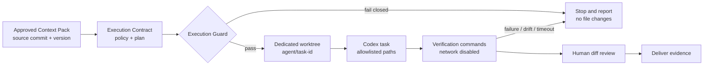
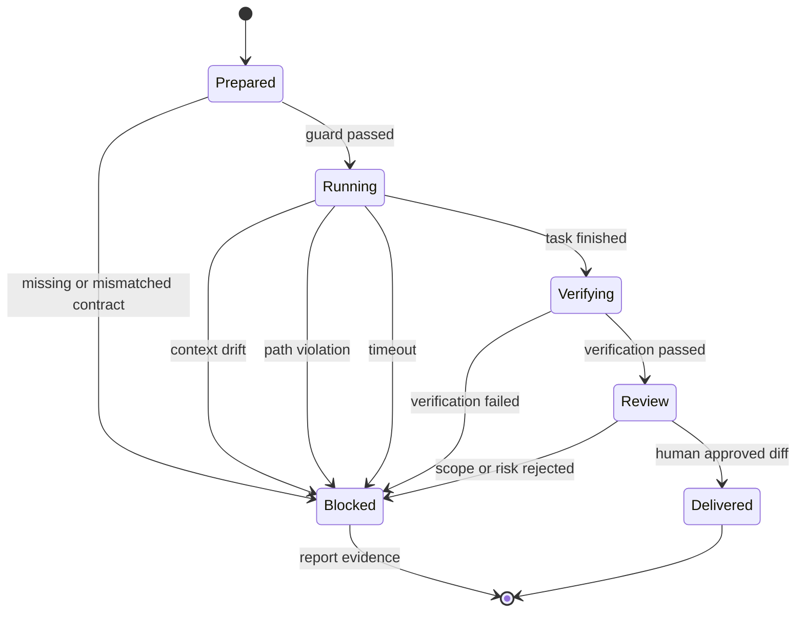

# Day 4｜會跑不等於能改！用最小權限與工作樹隔離守住 Codex 執行邊界

## 影片版

[](https://www.youtube.com/watch?v=k2UEzgYGGyw)
> 圖 1｜Day 4 影片用執行閘門、專屬工作樹與停止條件，說明如何把 AI 代理人的修改範圍鎖在可驗收邊界內。

---

> 本文是 2026 iThome 鐵人賽系列「不只會寫 Code：用 ChatGPT × Codex 打造企業級 AI 開發工作流」第 4 天。Day 2 把模糊需求整理成 Given／When／Then；Day 3 再把必要上下文封裝成 Repository Context Pack 與 Plan Contract。今天繼續往執行階段推進：即使 Plan 已經核准，也不能讓代理人直接取得整個 Repository 的寫入權。

## 先問一個不太舒服的問題：測試通過，就代表可以交付嗎？

假設 Codex 收到一個「補上訂單匯出 API 權限檢查」的任務。它在本機執行測試，結果全部通過；但同一個執行工作目錄裡還有：

- 付款模組與管理員權限設定。
- 其他代理人尚未提交的修改。
- `.env`、憑證或本機測試資料。
- 可能被順手重構的部署檔案。

這時候，「測試通過」只證明某些行為在某個狀態下可運作，不代表代理人沒有：

1. 讀到不應該讀的秘密或個人資料。
2. 改到這次任務以外的模組。
3. 覆蓋另一個代理人尚未完成的修改。
4. 在發現上下文漂移後，仍然沿用舊假設繼續執行。
5. 觸發網路請求、發布命令或不可逆的清理操作。

所以 Day 4 的核心判斷是：**會跑不等於能改；測試綠燈也不等於執行邊界合格。**

## 執行邊界不是一句「請小心」，而是一份契約

如果我們只在 Prompt 寫「請不要修改其他檔案」，這個要求很難被機器驗證，也很難在事故後回答「當時到底允許改什麼」。比較可靠的做法，是在 Execute 之前建立 Execution Contract，固定以下五個面向：

| 面向 | 要固定的欄位 | 驗證問題 |
| --- | --- | --- |
| 身分 | `context_id`、版本、`source_commit` | 代理人從核准的哪一版程式碼開始？ |
| 工作空間 | branch、`worktree`、task ID | 是否在自己的工作樹，而不是主目錄直接寫入？ |
| 寫入範圍 | `allowed_paths`、`read_only_paths` | 每一個要修改的路徑是否都在白名單？ |
| 執行能力 | network、timeout、命令限制 | 是否關閉不必要的網路與發布能力？ |
| 停止與證據 | drift、path violation、驗證失敗、人工 Review | 發生異常時會不會 fail closed？完成後留下什麼證據？ |

這份契約不是要取代作業系統的沙箱或 CI，而是把「代理人工作邊界」變成在流程最前面就能檢查的輸入。真正的權限控制，仍然要由容器、OS、CI、分支保護與秘密管理共同完成。

## ChatGPT 先比較執行模式，Codex 再在核准邊界內動手

延續前幾天的分工，ChatGPT 不直接把一個模糊的「請安全修改」交給 Codex，而是先比較不同執行模式的風險與可回滾性：

| 執行模式 | 優點 | 主要風險 | 適用情境 |
| --- | --- | --- | --- |
| 直接在主工作目錄修改 | 最快、沒有工作樹管理成本 | 汙染主分支、覆蓋他人修改、邊界難追蹤 | 一次性、低風險個人實驗 |
| 單一暫存分支 | 有基本 Git 隔離 | 多個 agent 仍可能互相踩檔案；權限範圍不清楚 | 小型單代理任務 |
| 每個 task 一個 worktree | 變更互不覆蓋，容易回收 | 需要管理 branch、建立與清理 worktree | 多代理或企業 Repository |
| worktree＋Execution Guard＋Verify | 具備隔離、白名單、停止條件與證據 | 初期需要寫契約與 gate | 需要可追溯、可審查的正式變更 |

本文採最後一種。重點不是讓流程變慢，而是把昂貴的錯誤提前到「還沒有改檔」之前被拒絕。

## 先定義 Policy：整個 Repository 的安全底線

下面是本日範例的 `policy.json`。它描述的是這個任務允許使用的基準，不是某個 agent 的個人偏好：

```json
{
  "context_id": "orders-export",
  "context_version": 3,
  "source_commit": "approved-commit",
  "allowed_paths": [
    "src/export/**",
    "tests/export/**",
    "docs/exports.md"
  ],
  "read_only_paths": [
    "src/auth/**",
    "config/**"
  ],
  "sensitive_patterns": [
    ".env",
    "*.pem",
    "**/*secret*",
    "**/*token*"
  ],
  "max_runtime_seconds": 900,
  "network": "disabled",
  "approval": "required_on_boundary",
  "stop_conditions": [
    "context_drift",
    "path_violation",
    "verification_failure",
    "timeout"
  ]
}
```

這裡有幾個容易被忽略的設計：

- `allowed_paths` 刻意比整個 `src/**` 小；只允許訂單匯出相關範圍。
- `read_only_paths` 即使與本次需求相鄰，也不能讓 agent 順手重構。
- `sensitive_patterns` 是額外的拒絕層；即使白名單誤放了設定路徑，也應該擋住秘密檔案。
- `network=disabled` 是預設安全值。若真的需要下載依賴或呼叫測試服務，應拆成另一個明確核准的 task，而不是讓所有程式碼修改都擁有網路。
- `stop_conditions` 必須完整列出。沒有停止條件的自動化，遇到漂移時很容易從「執行」變成「猜測」。

## 再定義 Plan：每個 task 只能擁有自己的工作樹

Policy 還不夠，Plan 必須把每個 task 的寫入權拆開：

```json
{
  "context_id": "orders-export",
  "context_version": 3,
  "source_commit": "approved-commit",
  "status": "approved",
  "tasks": [
    {
      "id": "export-api",
      "branch": "agent/export-api",
      "worktree": ".worktrees/export-api",
      "paths": [
        "src/export/api.py",
        "tests/export/test_api.py"
      ],
      "commands": [
        ["python3", "-m", "unittest", "-v", "tests/export/test_api.py"]
      ],
      "acceptance_refs": ["AC-01", "AC-02"],
      "timeout_seconds": 600,
      "network": "disabled",
      "stop_on_drift": true,
      "requires_human_review": true
    }
  ]
}
```

`worktree` 不只是方便的資料夾名稱，而是執行隔離的識別欄位。範例要求 task `export-api` 只能使用 `.worktrees/export-api`，避免代理人直接在主目錄修改。`paths` 則是檔案層級的變更宣告；如果兩個 task 同時宣告同一個檔案，應該在執行前拒絕，而不是等 Merge conflict 才發現責任不清。

可以把整體流程畫成下面這樣：



> 圖 2｜Execution Guard 在 Codex 開始修改前檢查契約，通過後才進入專屬 worktree，失敗則停止並留下原因。

## Gate 要檢查什麼？

把規則寫進程式後，至少要涵蓋以下拒絕條件：

### 1. Context 不一致就停止

如果 Plan 的 `context_version` 比 Context Pack 舊，或 `source_commit` 不同，不能因為「檔案看起來還在」就繼續。這是上下文漂移，不是普通的版本差異。

### 2. 路徑越界就停止

每個 task 的 `paths` 要逐一通過白名單、唯讀清單與敏感模式。`../config/secret`、絕對路徑、`.env`、憑證與 token 檔案，都應在檔案系統操作前被拒絕。

### 3. 工作樹不正確就停止

即使路徑白名單正確，如果 task 直接把 `worktree` 指向 `.`，仍然不能執行。隔離是路徑邊界之外的第二層保護，因為代理人可能建立未列出的暫存檔或工具產物。

### 4. 命令能力超出任務就停止

範例把網路、發布、強制刪除、`git push`、`git reset --hard` 等命令列為禁止片段。這不是完整的 shell sandbox，但能先攔住常見的「測試順手做了外部副作用」風險。正式系統應再用 argv allowlist、容器與 OS 權限做真正的執行限制。

### 5. 沒有停止與 Review 設定就停止

`stop_on_drift=true` 與 `requires_human_review=true` 不是裝飾欄位。前者定義遇到未知變更時要停；後者保留人對 diff、權限與資料影響的最終責任。

## 搭配 GitHub 實作範例：不改檔也能驗證邊界

我在系列 Repository 新增一個不依賴第三方套件的 Python 範例：[查看 Day 4 Execution Guard](https://github.com/rufushsu9987/ithome-ironman-2026-chatgpt-codex/tree/main/day04/example-execution-guard)。

執行方式：

```bash
cd day04/example-execution-guard
python3 -m unittest -v
python3 execution_guard.py policy.json plan.json
```

這份範例不會真的啟動 Codex，因此不會假裝「沙箱已經建立」；它把責任切得很清楚：**在執行器之前驗證契約，執行器本身再套用平台層級的 sandbox 與權限。**

本次驗證涵蓋 9 個案例：

- approved plan 通過。
- Context version 漂移被拒絕。
- 白名單外路徑被拒絕。
- read-only 路徑被拒絕。
- 敏感檔案被拒絕。
- 直接使用 Repository root 當 worktree 被拒絕。
- 網路命令被拒絕。
- 未設定 `stop_on_drift` 被拒絕。
- 兩個 task 競爭同一路徑被拒絕。

成功輸出會包含：

```text
EXECUTION_OK context=orders-export version=3 tasks=1
TASK_OK id=export-api worktree=.worktrees/export-api paths=2 timeout=600s network=disabled
VERIFY_COMMAND python3 -m unittest -v tests/export/test_api.py
STOP_CONDITIONS context_drift,path_violation,timeout,verification_failure
```

### 給 Codex 的執行提示也要包含停止條件

當 Contract 通過後，才把 task 交給 Codex。提示可以保持短，但不能省略邊界與證據格式：

```text
請執行 Plan task=export-api。

開始前：
- 確認目前 commit 等於 Context Pack 的 source_commit。
- 確認目前工作目錄是 .worktrees/export-api。
- 只讀取與修改 task.paths 列出的檔案。
- 若 context、版本、commit 或工作樹不一致，立即停止。

執行中：
- 不自行解答 OPEN 項目。
- 不呼叫網路、不發布、不修改秘密或唯讀路徑。
- 不進行與 acceptance_refs 無關的重構。

完成後：
- 執行 task.commands 內的驗證命令。
- 回報實際輸出、修改檔案與尚未驗證的風險。
- 等待人工 Review，不自行 push 或 merge。
```

這段提示仍然不能取代真正的權限控制；它的價值在於讓代理人、執行器與 Review 者看到同一份可追蹤的契約。

## Verify 不只看測試綠燈：三層證據

Day 4 的 Verify 可以拆成三層：

| 層次 | 驗證內容 | 失敗時的動作 |
| --- | --- | --- |
| Contract Verify | context、版本、commit、worktree、路徑白名單 | 不建立執行程序，回報 gate error |
| Process Verify | network、timeout、命令與停止條件 | 終止 task，保留 stdout／stderr 與狀態 |
| Behavior Verify | 測試、Lint、型別、Diff 與人工 Review | 不進入 Deliver，修正或退回 Plan |

狀態機可以表示成：



> 圖 3｜執行狀態遇到漂移、越界、逾時或驗證失敗時都回到 Blocked，不把部分成功誤標成可交付。

人工 Review 可以沿用這份最小清單：

- [ ] Diff 只出現在 task 宣告的路徑。
- [ ] 沒有新增秘密、token、`.env` 或個人環境檔案。
- [ ] 測試命令與輸出可以由另一位工程師重跑。
- [ ] 需求仍符合 Day 2 的 Given／When／Then。
- [ ] Context drift、權限、租戶隔離、個資與重試風險有被說明。
- [ ] 沒有自行 `push`、`merge` 或發布外部副作用。

## 和 Day 2、Day 3 接起來：從規格到受控執行

目前這條工作流的責任鏈如下：

```text
Day 2  ChatGPT：把模糊需求變成驗收條件
  ↓
Day 3  Context Pack：固定 Repository 與治理上下文
  ↓
Day 4  Execution Contract：固定 worktree、路徑、能力與停止條件
  ↓
Codex：在核准範圍內實作、測試、回報證據
  ↓
人類 Review：檢查 diff、風險與交付決策
```

這裡的關鍵不是把所有決策交給工具，而是把「工具可以自動拒絕的事情」先形式化。ChatGPT 仍然負責分析與比較；產品與技術負責人仍然決定政策；Codex 仍然負責 repository 內的實作；Execution Guard 則負責在錯誤邊界出現時先踩煞車。

## GitHub 專案

本文的 Markdown 來源、可執行範例與圖解原始檔已保存於系列 Repository：

| 資源 | 連結 |
| --- | --- |
| 系列專案 | [ithome-ironman-2026-chatgpt-codex](https://github.com/rufushsu9987/ithome-ironman-2026-chatgpt-codex) |
| Day 4 文章來源 | [day04/article.md](https://github.com/rufushsu9987/ithome-ironman-2026-chatgpt-codex/blob/main/day04/article.md) |
| Execution Guard 範例 | [day04/example-execution-guard](https://github.com/rufushsu9987/ithome-ironman-2026-chatgpt-codex/tree/main/day04/example-execution-guard) |
| 執行邊界圖解 | [day04/diagrams/execution_boundary.mmd](https://github.com/rufushsu9987/ithome-ironman-2026-chatgpt-codex/blob/main/day04/diagrams/execution_boundary.mmd) |
| 停止條件狀態圖 | [day04/diagrams/stop_conditions.mmd](https://github.com/rufushsu9987/ithome-ironman-2026-chatgpt-codex/blob/main/day04/diagrams/stop_conditions.mmd) |
| 前一天 Day 3 | [Repository Context Pack](https://ithelp.ithome.com.tw/articles/10401737) |

## 今日小結

Day 4 的結論可以濃縮成一句話：**先限制代理人能做什麼，再讓它開始做事。**

一個可治理的 Codex 執行流程至少要有：核准的 source commit、獨立 worktree、明確的路徑白名單、關閉不必要的網路與發布能力、可檢查的停止條件，以及人類對 diff 的最後 Review。這些規則讓失敗更早發生，也讓成功不只是「看起來能跑」，而是有一組可以重跑、可審查、可追溯的證據。

下一篇預告：當多個 task 都通過執行閘門後，如何用 Verify 與 Review 統一收斂測試、Diff、風險與交付證據，避免「每個 agent 都說自己完成」卻沒有人能判定整體是否可交付。
