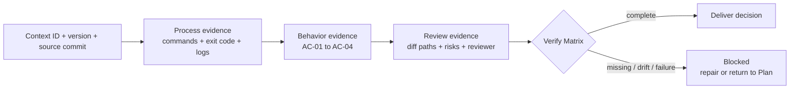
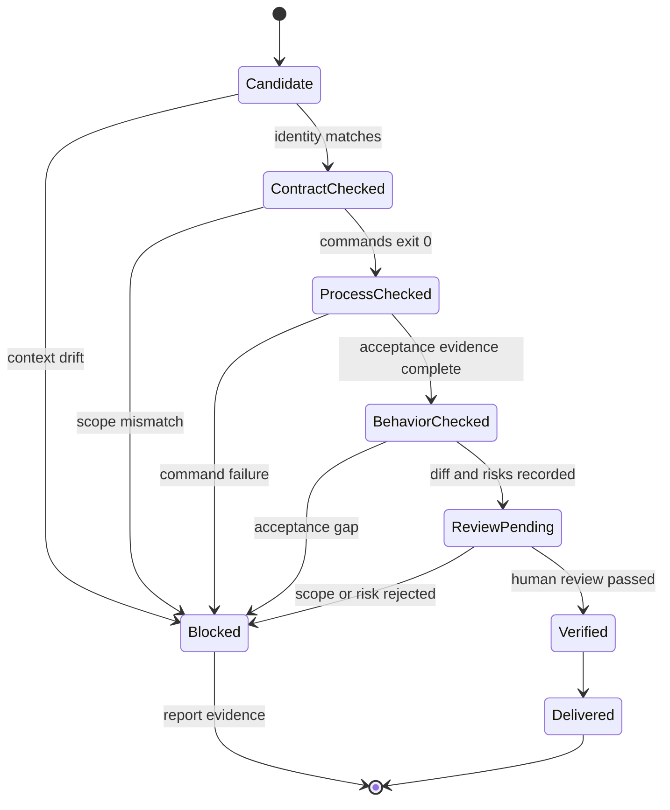

# Day 5｜每個 Agent 都說完成了？用 Verify Matrix 收斂測試、Diff 與交付證據

## 影片版

[](https://www.youtube.com/watch?v=SLtDRNtKy0s)

> 圖 1｜Day 5 Verify Matrix 影片封面，點擊圖片可觀看完整影片。

---

> 本文是 2026 iThome 鐵人賽系列「不只會寫 Code：用 ChatGPT × Codex 打造企業級 AI 開發工作流」第 5 天。Day 2 把模糊需求整理成 Given／When／Then；Day 3 固定 Repository Context Pack 與 Plan Contract；Day 4 再用 Execution Contract、工作樹隔離與 Execution Guard 限制代理人可以怎麼執行。今天處理下一個常見問題：每個 task 都回報完成，卻沒有人能判定整體是否真的可以交付。

## 先看一個很容易被誤判為成功的回報

多個 agent 平行完成訂單匯出變更後，可能各自回報：

```text
API agent: tests passed
Worker agent: implementation complete
Docs agent: README updated
```

這些訊息都可能是真的，但仍然無法回答幾個交付前必問的問題：

- 它們是不是從同一個 `context_id`、版本與 `source_commit` 開始？
- 執行的命令是否真的成功，還是只貼了一段沒有 exit code 的文字？
- Day 2 定義的每條 acceptance criteria 是否都被驗證，而不是只跑 happy path？
- diff 有沒有超出 Day 3／Day 4 宣告的路徑白名單？
- 風險、未決項目與人工 Review 是否留下可追溯證據？

因此 Day 5 的核心判斷是：**測試綠燈不是交付結論；交付需要一份可以逐格核對的 Verify Matrix。**

## Verify Matrix 是什麼？

Verify Matrix 不是另一份「看起來很完整」的報告，而是把 Plan 中的 task、acceptance ref 與可重跑證據放進同一個結構。每一格都要能回答「驗證了什麼、由誰驗證、失敗時要去哪裡找證據」。

本日範例將它拆成四層：

| 層次 | 要回答的問題 | 最小證據 |
| --- | --- | --- |
| Contract | 執行時仍然使用核准的上下文嗎？ | `context_id`、`context_version`、`source_commit` |
| Process | 指定的驗證流程有成功執行嗎？ | argv、`exit_code=0`、log 或報告位置 |
| Behavior | 每一條需求驗收都真的通過嗎？ | `AC-xx`、狀態、測試輸出或案例證據 |
| Review | 變更範圍與風險有人負責嗎？ | diff 路徑、風險清單、Review 人員與紀錄 |

四層不是把同一件事重複寫四次。Contract 驗證「前提是否一致」，Process 驗證「命令是否真的跑過」，Behavior 驗證「需求行為是否成立」，Review 驗證「這份結果是否值得交付」。缺一層，就只能說「部分檢查完成」。



> 圖 2｜Verify Matrix 將上下文、執行、行為與 Review 證據收斂成可交付或阻擋的決策。

## 先把「完成」改寫成可驗收的資料

一個 task 的回報不應只有 `done: true`。它至少要帶著 Plan 的身分與四層證據：

```json
{
  "id": "export-api",
  "layers": {
    "contract": {
      "status": "pass",
      "evidence": ["api-context.json"]
    },
    "process": {
      "status": "pass",
      "commands": [
        {
          "argv": ["python3", "-m", "unittest", "-v"],
          "exit_code": 0,
          "evidence": "api-tests.log"
        }
      ]
    },
    "behavior": {
      "status": "pass",
      "acceptance": [
        {"ref": "AC-01", "status": "pass", "evidence": "api-AC-01.json"},
        {"ref": "AC-02", "status": "pass", "evidence": "api-AC-02.json"}
      ]
    },
    "review": {
      "status": "pass",
      "reviewer": "engineering-review",
      "diff_paths": ["src/export/api.py", "tests/export/test_api.py"],
      "risks": [],
      "evidence": "api-review.md"
    }
  }
}
```

這個格式刻意把 `acceptance` 放在 task 底下，而不是讓 agent 自己發明一組結果。驗證器可以拿 Plan 裡的 `acceptance_refs` 對照：少一條、重複一條或多出一條，都不是「大概完成」，而是應該回到修正流程的明確錯誤。

## Contract：先確認結果屬於這次變更

Day 3 的 Context Pack 與 Day 4 的 Execution Contract 已經固定了三個關鍵身分：

```text
context_id = orders-export
context_version = 3
source_commit = approved-commit
```

Verify Matrix 必須重新檢查，而不是假設前一關通過後就永遠有效。原因很實際：

1. 平行 task 可能在不同 branch 上重新產生報告。
2. Plan 可能在執行期間被更新，但舊報告仍然留在資料夾裡。
3. 代理人可能把另一個 task 的 log 附到本次結果。
4. Repository 已經換 commit，測試綠燈卻不是這次核准範圍的證據。

如果 `context_version` 不一致，驗證器應該直接輸出 `VERIFY_BLOCKED`，而不是把不同版本的 evidence merge 起來。這是 fail closed 的邊界：不確定時停止，不能用「看起來差不多」補洞。

## Process：exit code 比一句「測試通過」可靠

在 Process layer 裡，命令必須以 argv、exit code 與證據位置呈現：

| 欄位 | 作用 | 不足時的風險 |
| --- | --- | --- |
| `argv` | 知道實際執行了什麼 | 只寫「跑過測試」，無法重跑 |
| `exit_code` | 知道程序是否成功結束 | 把 warning、部分輸出誤判成成功 |
| `evidence` | 找到完整 stdout／stderr、coverage 或報告 | Review 者無法追溯原始結果 |

這裡仍然不能把 exit code 當成全部。測試命令可能只涵蓋一個模組，也可能沒有檢查 migration、型別或安全掃描。因此 Process layer 是「命令成功執行」的證據，不是「產品一定正確」的保證。

## Behavior：一條 acceptance 對一條證據

Day 2 的 Given／When／Then 是需求入口，Day 5 要把它接回交付出口。以訂單匯出為例：

| Ref | Given／When／Then 的判斷 | Verify Matrix 要留下什麼 |
| --- | --- | --- |
| AC-01 | 有權限的管理者可以建立匯出任務 | 測試案例、輸入與成功回應 |
| AC-02 | 無權限角色被拒絕且不建立任務 | 拒絕結果與沒有副作用的證據 |
| AC-03 | Worker 只讀取原租戶的資料 | 租戶隔離測試與查詢範圍 |
| AC-04 | 失敗重試保留可追蹤狀態 | 重試序號、狀態轉移與 log |

真正重要的不是矩陣看起來有四列，而是每一列都有可重跑的來源。若 `AC-02` 沒有證據，不能因為 `AC-01` 通過就推論權限邊界也沒問題；若 `AC-04` 沒有重試紀錄，不能只看最後一次成功結果。

## Review：把 diff 與風險放回同一個決策

即使 Contract、Process、Behavior 都是 pass，仍然要檢查 diff。Day 4 已經把允許修改路徑、唯讀路徑與人工 Review 寫入 Execution Contract；Day 5 要求這些結果出現在交付證據裡：

```text
Review PASS
- reviewer: engineering-review
- diff_paths: src/export/api.py, tests/export/test_api.py
- risks: []
- evidence: api-review.md
```

至少要拒絕以下情況：

- diff 出現在 `src/billing/**`，但 Plan 只允許 `src/export/**`。
- 修改 `config/**` 或 `src/auth/**` 等唯讀範圍。
- 只有 agent 自己寫「已 Review」，沒有指定人或責任角色。
- 測試綠燈，但未說明尚未驗證的 migration、個資、租戶隔離或回滾風險。

`risks: []` 也不是鼓勵大家把風險清單留空；它表示 Review 者已經檢查並判定目前沒有需要阻擋交付的已知風險。若仍有風險，應該寫成明確的 `OPEN` 或 `blocked` 狀態，交給產品與技術負責人決定，不要把未知項目藏起來。

## 用狀態機定義「不能交付」

Verify Matrix 適合搭配明確狀態，而不是只用一個布林值：



> 圖 3｜證據矩陣從 Candidate 逐層前進，任何上下文漂移、命令失敗、驗收缺口或 Review 風險都回到 Blocked。

建議把狀態轉移限制在這幾個事件：

| 目前狀態 | 允許的下一步 | 必要證據 |
| --- | --- | --- |
| `Candidate` | `ContractChecked` 或 `Blocked` | 身分比對結果 |
| `ContractChecked` | `ProcessChecked` 或 `Blocked` | 命令與 exit code |
| `ProcessChecked` | `BehaviorChecked` 或 `Blocked` | 每條 acceptance |
| `BehaviorChecked` | `ReviewPending` 或 `Blocked` | diff、風險、Review 請求 |
| `ReviewPending` | `Verified` 或 `Blocked` | 人工 Review 紀錄 |
| `Verified` | `Delivered` | 發布／合併的交付證據 |

這個狀態機的價值，是讓「部分成功」有明確語意。兩個 task 中一個 Verified、一個 Blocked 時，整體不能標成 Delivered；應該保留已完成的證據，修正失敗 task，再重新產生矩陣。

## GitHub 實作範例：用標準函式庫做 fail-closed 驗證

我在系列 Repository 新增一個不依賴第三方套件的 Python 範例：[查看 Day 5 Verify Matrix](https://github.com/rufushsu9987/ithome-ironman-2026-chatgpt-codex/tree/main/day05/example-verify-matrix)。

執行方式：

```bash
cd day05/example-verify-matrix
python3 -m unittest -v
python3 verify_matrix.py policy.json plan.json verification.json
```

本次範例涵蓋兩個 task、四條 acceptance 與四層證據。驗證器會實際檢查：

- report 的 `context_id`、版本與 `source_commit` 是否和 Policy／Plan 一致。
- 每個 task 是否都有 Contract、Process、Behavior、Review 四層。
- 每個命令是否有非空 argv、`exit_code=0` 與 evidence。
- 每一條 `acceptance_ref` 是否都對應到 pass 與 evidence。
- diff 是否在 `allowed_paths` 內且不觸碰 `read_only_paths`。
- 需要人工 Review 的 task 是否真的由人類責任角色核准，而不是 agent 自我核准。

本次實際執行結果為 12 項測試通過，並輸出：

```text
VERIFY_OK context=orders-export version=3 tasks=2 acceptance=4 evidence=10
TASK_VERIFIED id=export-api acceptance=2 evidence=5
TASK_VERIFIED id=export-worker acceptance=2 evidence=5
LAYERS contract,process,behavior,review
NEXT_STATE deliver
```

這個範例不是 CI、沙箱或程式碼審查系統的替代品。它示範的是較小但很關鍵的責任：把「交付前需要哪些證據」寫成可重跑的資料契約，讓 CI、PR bot 或人工 Review 可以使用同一套判斷。

## 從四天串成一條可治理的交付鏈

```text
Day 2  ChatGPT：需求 → Given／When／Then
  ↓
Day 3  Context Pack：固定 context、Repository 與 Plan
  ↓
Day 4  Execution Contract：限制 worktree、路徑、命令與停止條件
  ↓
Codex：在核准邊界內實作並產生原始證據
  ↓
Day 5  Verify Matrix：逐 task 收斂 Contract、Process、Behavior、Review
  ↓
人類決定：Verified → Deliver，或 Blocked → 修正／回到 Plan
```

這條鏈的重點不是增加表格，而是把責任交接點固定下來：

- ChatGPT 不應把未知政策藏在 prompt 裡，而要把 OPEN 項目列出來。
- Codex 不應只回報摘要，而要產生可重跑命令與證據位置。
- Verify 不應只看最後一個測試程序，而要核對上下文、範圍、行為與 Review。
- 人類仍保留對風險、政策與發布的最後決策權。

## GitHub 專案

本文的 Markdown 來源、可執行範例與圖解原始檔已保存於系列 Repository：

| 資源 | 連結 |
| --- | --- |
| 系列專案 | [ithome-ironman-2026-chatgpt-codex](https://github.com/rufushsu9987/ithome-ironman-2026-chatgpt-codex) |
| Day 5 文章來源 | [day05/article.md](https://github.com/rufushsu9987/ithome-ironman-2026-chatgpt-codex/blob/main/day05/article.md) |
| Verify Matrix 範例 | [day05/example-verify-matrix](https://github.com/rufushsu9987/ithome-ironman-2026-chatgpt-codex/tree/main/day05/example-verify-matrix) |
| Verify Matrix 流程圖 | [day05/diagrams/verify_matrix.mmd](https://github.com/rufushsu9987/ithome-ironman-2026-chatgpt-codex/blob/main/day05/diagrams/verify_matrix.mmd) |
| 證據狀態圖 | [day05/diagrams/evidence_layers.mmd](https://github.com/rufushsu9987/ithome-ironman-2026-chatgpt-codex/blob/main/day05/diagrams/evidence_layers.mmd) |
| 前一天 Day 4 | [Execution Boundary](https://ithelp.ithome.com.tw/articles/10401856) |

## 今日小結

Day 5 的結論是：**不要把 agent 的「完成」當成交付；把它拆成可以逐格核對的證據矩陣。**

只要 Contract、Process、Behavior、Review 四層都對得上同一份 Context／Plan，且每一條 acceptance、每一個 diff 與每一個風險都有可追溯證據，團隊才有資格把狀態從 Verified 推進到 Deliver。否則就保留 Blocked，讓失敗回到可修正的流程，而不是用一段漂亮的摘要掩蓋缺口。

下一篇預告：Verify 通過之後，如何把測試、Review 與變更摘要整理成可交接的 Deliver Pack，讓下一個人接手時不需要重新翻聊天紀錄。
