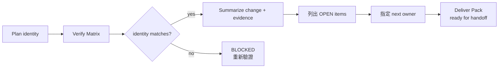
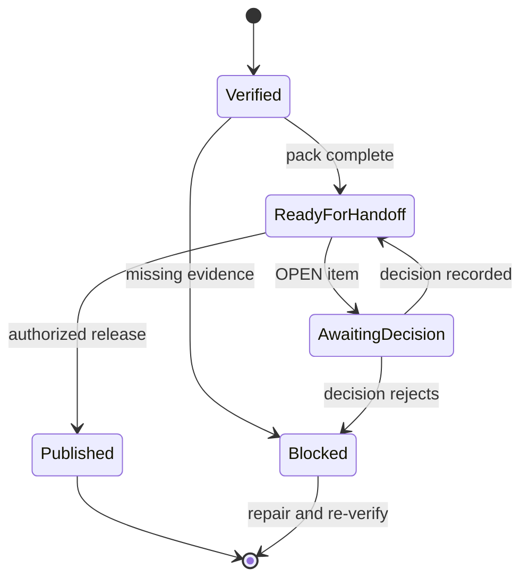

# Day 6｜測試通過還不夠！用 Deliver Pack 讓下一個人接得上

> 本文是 2026 iThome 鐵人賽系列「不只會寫 Code：用 ChatGPT × Codex 打造企業級 AI 開發工作流」第 6 天。

前幾天，我們把一條 AI 輔助開發流程逐步收斂：

- Day 2：把模糊需求改寫成 Given／When／Then。
- Day 3：固定 Repository Context Pack 與 Plan Contract。
- Day 4：用 Execution Contract、工作樹隔離與 Execution Guard 限制代理人可以怎麼執行。
- Day 5：用 Verify Matrix 核對 Contract、Process、Behavior 與 Review 四層證據。

今天要處理最後一個很容易被忽略的交接問題：**Verify 通過之後，下一個人如何在幾分鐘內知道改了什麼、驗證了什麼、還有哪些事情不能直接假設？**

答案是一份可重建的 Deliver Pack。

## 先看一個「測試都綠了」的交接現場

想像一個訂單匯出功能完成後，群組裡出現這些訊息：

```text
API agent：tests passed
Worker agent：implementation complete
Docs agent：README updated
```

如果你是下一位接手的人，仍然要重新找：

- 這次變更屬於哪個 `context_id` 與哪個版本？
- 哪一份 Plan 決定了這些 task？
- 測試命令的完整 argv 與 exit code 是什麼？
- 每一條 acceptance criteria 的證據放在哪裡？
- diff 實際修改了哪些路徑？
- 還有沒有產品、資安或回滾上的未決項目？
- 下一步是送 Review、部署，還是先等待人工決策？

這些問題如果要靠下一個人重新翻聊天紀錄，交接就還沒有完成。

## Deliver Pack 不是另一份漂亮的 README

Deliver Pack 是把已驗證的結果整理成一個**可交接、可重跑、可繼續判斷**的最小包。它不取代原始 log，也不把風險藏起來；它只把下一個決策需要的索引固定下來。

一份最小 Deliver Pack 至少有六個區塊：

| 區塊 | 要回答的問題 | 來源 |
| --- | --- | --- |
| Identity | 這份結果屬於哪個 context、版本與 source commit？ | Context Pack、Plan |
| Change | 這次到底改了什麼？ | 變更摘要、diff |
| Evidence | 哪些命令、驗收與 Review 已經通過？ | Verify Matrix |
| Scope | diff 是否仍在允許的路徑內？ | Execution Contract、Review |
| Open items | 哪些事情還不能假設已完成？ | 風險與待決清單 |
| Next step | 下一個責任人要做什麼？ | 交接決策 |

它的重點不是文件變長，而是讓資訊從「分散在多個 agent 回報」變成「下一個人可以一次讀完的索引」。

## 先固定交接身分，再整理內容

Deliver Pack 不能只看最後一次測試輸出。它要重新帶上 Day 3 到 Day 5 的身分欄位：

```json
{
  "context_id": "orders-export",
  "context_version": 3,
  "source_commit": "approved-commit",
  "final_status": "verified",
  "next_step": {
    "owner": "release-manager",
    "action": "確認部署窗口與回滾檢查"
  }
}
```

如果 `context_version` 與 Verify Matrix 不一致，或 `source_commit` 已經漂移，就不能把它包裝成可交接結果。正確狀態應該是 `BLOCKED`，並指出需要重新驗證的原因。



> 圖 1｜Deliver Pack 先確認驗證結果仍屬於同一份 Plan，再整理變更、證據、未決項目與下一步責任人。

## Change 摘要要能讓人快速判斷範圍

「完成訂單匯出」不是好的變更摘要。接手者需要知道的是：

- 哪個行為被加入或改變？
- 哪些檔案真的被修改？
- 哪些檔案刻意沒有碰？
- 有沒有 API、資料權限、租戶隔離或 migration 影響？

例如：

```text
變更：將訂單 CSV 匯出拆成 API 建立任務與 Worker 取用資料兩個步驟。
範圍：src/export/**、tests/export/**、docs/exports.md。
未修改：src/auth/**、config/**。
影響：需要確認部署窗口；不包含資料庫 schema 變更。
```

這段話不是用來取代 diff，而是讓 Review 者先建立正確的閱讀順序：先看目的，再看證據，最後核對實際 diff。

## Evidence 要保留「如何重跑」而不是只有結論

Deliver Pack 的 Evidence 區塊應該保留最小可重跑資訊：

```json
{
  "task": "export-api",
  "process": {
    "argv": ["python3", "-m", "unittest", "-v"],
    "exit_code": 0,
    "evidence": "api-tests.log"
  },
  "behavior": [
    {"ref": "AC-01", "status": "pass", "evidence": "api-AC-01.json"},
    {"ref": "AC-02", "status": "pass", "evidence": "api-AC-02.json"}
  ],
  "review": {
    "reviewer": "engineering-review",
    "evidence": "api-review.md"
  }
}
```

「測試通過」是一個摘要；`argv`、`exit_code=0` 與 evidence 路徑才是接手者可以實際使用的證據。若只有摘要，下一個人還是得相信原作者，而不是重建判斷。

## OPEN 不代表失敗，隱藏 OPEN 才危險

一份 Deliver Pack 可以是可交接的，但不代表所有風險都已消失。例如：

| 狀態 | 意義 | 正確做法 |
| --- | --- | --- |
| `PASS` | 這一層已有可追溯證據 | 保留 evidence 位置 |
| `OPEN` | 需要產品或技術負責人決定 | 指定 owner、期限與 action |
| `BLOCKED` | 缺少必要證據或身分漂移 | 停止交接，回到修正流程 |
| `DECIDED` | 人工責任人已留下決策 | 記錄決策者與時間 |

「目前沒有已知阻擋項目」和「風險清單是空的」不是同一句話。Deliver Pack 應該把未知或待決項目列出來，而不是為了讓狀態變綠而刪掉它們。

## 交接完成，不等於已經發布

這裡要刻意分開三個狀態：

```text
Verified       = 證據已經逐層通過
Ready for handoff = 下一個責任人可以接手
Published      = 外部發布動作已完成，且有公開 URL
```

Verify Matrix 通過，只能讓結果進入 Deliver Pack；Deliver Pack 完成，只能表示交接資訊準備好了。部署、合併或公開發布仍然要依照另一份權限與審批流程執行。



> 圖 2｜Verified、交接就緒與 Published 是不同狀態；未經授權的外部發布不能被 Deliver Pack 代替。

## GitHub 實作範例：把交接包寫成可驗證產物

本日新增一個不依賴第三方套件的 Python 範例：[查看 Day 6 Deliver Pack](https://github.com/rufushsu9987/ithome-ironman-2026-chatgpt-codex/tree/main/day06/example-deliver-pack)。

執行方式：

```bash
cd day06/example-deliver-pack
python3 -m unittest -v
python3 deliver_pack.py \
  --plan fixtures/plan.json \
  --verification fixtures/verification.json \
  --change fixtures/change.json \
  --out DELIVER_PACK.md
```

範例會檢查：

- Plan 與 verification 的 `context_id`、版本與 `source_commit` 是否一致。
- 每個 task 是否都有 Contract、Process、Behavior、Review 四層 pass。
- 每個命令是否有非空 argv、`exit_code=0` 與 evidence。
- Plan 宣告的 acceptance ref 是否逐條出現，沒有遺漏或重複。
- diff 路徑是否為相對路徑，且沒有路徑穿越。
- 交接摘要、OPEN item 的 owner／action 與下一步責任人是否完整。

驗證器的責任很小：它不執行部署、不批准風險，也不替人類做發布決策。它只確保「交接包裡的結論」真的有足夠資料支撐。

## 從 ChatGPT × Codex 到可接手的交付物

把前六天串起來，可以看到每個工具的責任邊界：

```text
ChatGPT：需求 → Given／When／Then，列出 OPEN 問題
  ↓
Repository Context Pack：固定 context、版本與 source commit
  ↓
Plan Contract：固定 task、路徑與 acceptance refs
  ↓
Codex：在 Execution Contract 內修改、測試並留下原始 evidence
  ↓
Verify Matrix：逐 task 核對 Contract、Process、Behavior、Review
  ↓
Deliver Pack：整理變更、證據、OPEN items 與下一步 owner
  ↓
人類責任人：決定 Review、合併、部署或發布
```

這條鏈的最後一個改善，不是讓 AI 自己做更多事情，而是讓下一個人少做一次考古工作。每個階段都把自己的輸出交給下一個階段，並且保留可以回頭驗證的證據。

## 今日小結

Day 6 的核心判斷是：**交接不是把「完成」再說一次，而是把下一個決策需要的身分、證據、範圍、風險與責任人放進同一份可重建的 Deliver Pack。**

當 Verify Matrix 只告訴我們「結果通過」，Deliver Pack 進一步回答「下一個人怎麼接」。它不把 `OPEN` 偽裝成 `PASS`，也不把 `Ready for handoff` 誤寫成 `Published`。

下一篇可以繼續往外延伸：當多個 Deliver Pack 要進入同一個版本或發布窗口時，如何用 Release Gate 管理相依性、回滾條件與最終責任？

## GitHub 專案

本文的 Markdown 來源、可執行範例與圖解原始檔已保存於系列 Repository：

| 資源 | 連結 |
| --- | --- |
| 系列專案 | [ithome-ironman-2026-chatgpt-codex](https://github.com/rufushsu9987/ithome-ironman-2026-chatgpt-codex) |
| Day 6 文章來源 | [day06/article.md](https://github.com/rufushsu9987/ithome-ironman-2026-chatgpt-codex/blob/main/day06/article.md) |
| Deliver Pack 範例 | [day06/example-deliver-pack](https://github.com/rufushsu9987/ithome-ironman-2026-chatgpt-codex/tree/main/day06/example-deliver-pack) |
| Deliver Pack 流程圖 | [day06/diagrams/deliver_pack_flow.mmd](https://github.com/rufushsu9987/ithome-ironman-2026-chatgpt-codex/blob/main/day06/diagrams/deliver_pack_flow.mmd) |
| 交接狀態圖 | [day06/diagrams/handoff_states.mmd](https://github.com/rufushsu9987/ithome-ironman-2026-chatgpt-codex/blob/main/day06/diagrams/handoff_states.mmd) |
| 前一天 Day 5 | [Verify Matrix](https://ithelp.ithome.com.tw/articles/10402088) |
