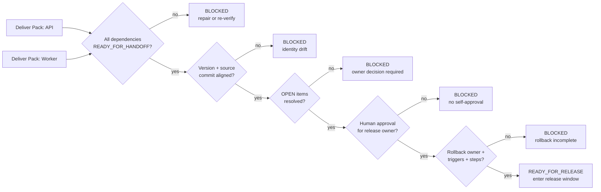
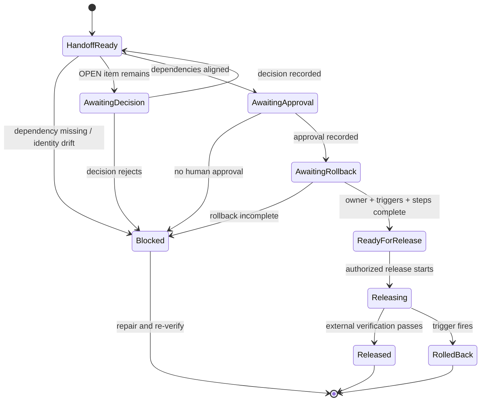

# Day 7｜測試都通過，為什麼還不能發布？用 Release Gate 管好相依性、回滾與最終責任

---

> 本文是 2026 iThome 鐵人賽系列「不只會寫 Code：用 ChatGPT × Codex 打造企業級 AI 開發工作流」第 7 天。前六天從需求、Context、執行邊界、Verify 一路走到 Deliver Pack；今天再往外推一步，處理多個交接包要一起進入發布窗口時的最後判斷。

## 先看一個很容易發生的發布事故

API 的測試通過了，Worker 的測試也通過了，兩個 Agent 都留下了 Deliver Pack。Release Manager 看到所有項目都是綠燈，就按下發布。

幾分鐘後，服務開始出現錯誤。這時才發現：

- API 使用的是新版本，但 Worker 還在讀舊格式。
- 某個 Deliver Pack 還留著沒有決定的 `OPEN` item。
- 沒有人確認「出問題時要由誰按下回滾」。
- 回滾步驟只寫在聊天紀錄裡，沒有可重跑的檢查清單。

這些問題不一定會被單元測試抓到。因為測試通常回答「這個元件自己能不能跑」，而發布還要回答「這一組變更能不能在同一個版本、同一個責任鏈與同一套退回路徑下安全推出」。

今天要加入的是 **Release Gate（發布閘門）**：在真正發布之前，先把相依性、版本身分、人類核准與回滾條件放在同一個可驗證的 Gate 裡。

## Day 6 的 Ready，不等於今天可以發布

Day 6 的 Deliver Pack 解決的是交接問題：下一個人能不能快速知道目前狀態、找到證據、知道下一步。

Release Gate 解決的是發布問題：多個已經可以交接的變更，能不能在同一個發布窗口一起前進。

| 判斷 | 它回答的問題 | 通過後的狀態 |
| --- | --- | --- |
| Verify Matrix | 每個 task 的契約、流程、行為與 Review 是否有證據？ | `VERIFIED` |
| Deliver Pack | 下一個人能不能重建判斷並接手？ | `READY_FOR_HANDOFF` |
| Release Gate | 多個交接包能否以同一版本、同一責任與回滾策略進入發布？ | `READY_FOR_RELEASE` |
| 外部發布驗證 | 公開頁、服務狀態與使用者可見結果是否正確？ | `RELEASED` |

這幾個狀態不能互相代換。把 `READY_FOR_HANDOFF` 直接改寫成 `PUBLISHED`，就會把「資料齊全」誤當成「外部結果已經成功」。

## Release Gate 要檢查哪四件事？

### 1. 相依性真的都在同一條版本線上嗎？

先列出這次發布依賴哪些交接包，例如 `api`、`worker`、`web` 或資料庫 migration。每個 Pack 都要同時符合：

- 狀態是 `READY_FOR_HANDOFF`。
- 版本號和 release plan 一致。
- `source_commit` 和 release plan 一致。
- 產物與 evidence 使用相對路徑，能從交付包重建。

只要其中一個元件仍是上一版，就算各自的測試都通過，也不能直接組成同一個 release。

### 2. 未決問題真的都已經有人決定了嗎？

`OPEN` 不是錯誤，也不是要偷偷刪掉的欄位。它代表還有一個決策沒有完成。

例如：

- migration 要不要和這次版本一起上線？
- 監控告警的門檻由誰確認？
- 如果回滾，新增欄位要不要保留？

Release Gate 不替人類回答這些問題，但它必須確認每個 `OPEN` item 已經變成 `resolved`、`closed` 或 `done`，並保留 owner 與決策證據。沒有決策，就輸出 `BLOCKED`。

### 3. 發布真的有人核准嗎？

Agent 可以整理證據、執行檢查、產生報告，但不能自己把自己的結果核准成發布。

因此範例要求：

- approval 必須指向目前的 `release_id`。
- 核准角色必須是 release plan 指定的 owner。
- `decision` 必須是 `approved`。
- `reviewer` 不可以是 `agent`。

這不是不信任工具，而是把「技術結果」和「外部責任」分開。最後要不要進入發布窗口，仍然是明確的人類決策。

### 4. 回滾不是一句「有問題就退回」

完整的 rollback 至少要有三個欄位：

| 欄位 | 要說清楚什麼 |
| --- | --- |
| `owner` | 誰負責啟動與確認回滾？ |
| `triggers` | 哪些觀測結果會觸發回滾？ |
| `steps` | 停止、恢復、驗證的實際順序是什麼？ |

如果只有「回到上一版」這一句話，遇到 migration、快取或非向後相容的 API 時，團隊還是要在事故現場重新猜一次。

## 把判斷畫成一條可拒絕的流程



> 圖 1｜Release Gate 依序檢查相依性、版本身分、未決項目、人類核准與回滾條件，任一關缺證據就停止。

這條流程的重點不是多一張表，而是每一個失敗都要有明確出口：回到修正、補決策或重新驗證，不把缺口包裝成綠燈。

## 可執行範例：把發布前判斷寫成標準函式庫

我在系列 Repository 新增一個不依賴第三方套件的 Python 範例：[查看 Day 7 Release Gate](https://github.com/rufushsu9987/ithome-ironman-2026-chatgpt-codex/tree/main/day07/example-release-gate)。

它會驗證：

- `api` 和 `worker` 兩個 dependency pack 都是 `READY_FOR_HANDOFF`。
- 兩者版本 `2026.08.10` 與 `source_commit` 都和 release plan 對齊。
- 沒有未處理的 `OPEN` item。
- `release-manager` 已留下 human approval。
- `oncall` 有明確的 rollback owner、trigger 與 steps。
- 所有 artifact path 都是相對路徑。

執行方式：

```bash
cd day07/example-release-gate
python3 -m unittest -v
python3 release_gate.py \
  --plan fixtures/plan.json \
  --packs fixtures/packs.json \
  --approvals fixtures/approvals.json \
  --rollback fixtures/rollback.json \
  --out RELEASE_GATE.md
```

本機實際驗證結果：

```text
Ran 7 tests in 0.001s

OK
RELEASE_GATE_READY id=release-v7 version=2026.08.10 dependencies=2 rollback_owner=oncall
```

測試不只涵蓋成功案例，也刻意驗證五種不能發布的情境：

- 缺少 dependency pack。
- dependency 版本漂移。
- 還有未處理的 `OPEN` item。
- Agent 自我核准。
- rollback trigger 缺失。
- artifact 使用絕對路徑。

在這些情境下，程式會輸出 `RELEASE_GATE_BLOCKED`，並以非零狀態結束。這比印出一段「看起來完成」的摘要更重要，因為排程器、CI 或人工 Review 都可以根據同一個 exit code 停止後續動作。

## Release Gate 不負責替人類發布

Release Gate 的責任要刻意保持小：

```text
它可以驗證：
  相依性、版本、證據、核准、回滾條件

它不可以自行決定：
  是否合併、何時部署、是否對外公開、是否接受商業風險
```

因此，`READY_FOR_RELEASE` 不是「已經發布」，而是「已經具備進入發布窗口的證據」。真正的外部動作仍要經過授權、執行與公開狀態回讀。



> 圖 2｜Release Gate 只把交接包推進到可發布狀態；發布後仍要靠外部驗證判斷 Released 或 Rolled Back。

## 把前七天串成一條責任鏈

```text
Day 2  ChatGPT：需求 → Given／When／Then
  ↓
Day 3  Context Pack：固定 context、版本與 Plan
  ↓
Day 4  Execution Contract：限制 worktree、路徑與停止條件
  ↓
Day 5  Verify Matrix：收斂 Contract、Process、Behavior、Review
  ↓
Day 6  Deliver Pack：讓下一個人能接手並重建判斷
  ↓
Day 7  Release Gate：確認多個交接包能否安全進入發布窗口
  ↓
人類責任人：決定發布、部署、回滾與外部風險
```

這條鏈一路都在做同一件事：不要讓「AI 說完成」直接變成「系統做了外部改變」。每一天增加一個更清楚的邊界，讓下一個階段可以重跑、拒絕、留下證據，也讓人類知道自己真正需要決定的是哪一件事。

## GitHub 專案

本文的 Markdown 來源、可執行範例與圖解原始檔已保存於系列 Repository：

| 資源 | 連結 |
| --- | --- |
| 系列專案 | [ithome-ironman-2026-chatgpt-codex](https://github.com/rufushsu9987/ithome-ironman-2026-chatgpt-codex) |
| Day 7 文章來源 | [day07/article.md](https://github.com/rufushsu9987/ithome-ironman-2026-chatgpt-codex/blob/main/day07/article.md) |
| Release Gate 範例 | [day07/example-release-gate](https://github.com/rufushsu9987/ithome-ironman-2026-chatgpt-codex/tree/main/day07/example-release-gate) |
| 發布閘門流程圖 | [day07/diagrams/release_gate_flow.mmd](https://github.com/rufushsu9987/ithome-ironman-2026-chatgpt-codex/blob/main/day07/diagrams/release_gate_flow.mmd) |
| 發布狀態圖 | [day07/diagrams/release_states.mmd](https://github.com/rufushsu9987/ithome-ironman-2026-chatgpt-codex/blob/main/day07/diagrams/release_states.mmd) |
| 前一天 Day 6 | [Deliver Pack](https://ithelp.ithome.com.tw/articles/10402184) |

## 今日小結

Day 7 的核心不是再增加一個「發布按鈕」，而是在按下按鈕之前先確認：相依性真的一致、未決問題真的有人處理、發布真的有人核准、出事真的知道怎麼退回。

**Release Gate 讓發布變成一個可驗證的決策，而不是一個看見綠燈就往前推的衝動。**
