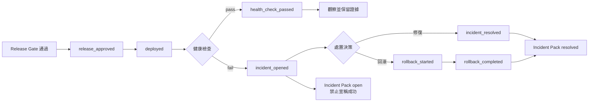

# Day 8｜發布之後才是真正的考驗！用 Audit Trail 與 Incident Pack 讓 AI 變更可追溯、可復原

> 本文是 2026 iThome 鐵人賽系列「不只會寫 Code：用 ChatGPT × Codex 打造企業級 AI 開發工作流」第 8 天。前七天從需求、Context、執行邊界、Verify Matrix、Deliver Pack 一路走到 Release Gate。今天繼續往發布後推進：當服務已經上線，卻在健康檢查或使用者回報中出現異常，我們如何知道發生了什麼、誰可以做決定，以及什麼時候才算真正恢復？

## 影片版

本日影片：

https://www.youtube.com/watch?v=nZ_tF2Hj754

影片使用 Fish Audio `s2.1-pro-free` 產生溫柔女聲旁白，並以 AutoCut 完成剪輯與驗證；繁體中文字幕採用可開關的 YouTube CC，不把字幕燒進畫面。

## 發布成功，不代表事情結束

想像一個很常見的場景：訂單匯出功能通過測試，也通過 Day 7 的 Release Gate，接著部署到正式環境。幾分鐘後，健康檢查開始失敗，客服回報部分租戶無法下載檔案。

團隊的聊天頻道可能出現這些訊息：

```text
09:05 release-bot: deploy completed
09:06 monitor: export health check failed
09:07 engineer: I am checking
09:12 release-bot: rollback completed
```

看起來大家都有做事，但仍然缺少幾個關鍵答案：

- 這次部署對應哪一個變更與 source commit？
- 健康檢查失敗前，最後一個成功狀態是什麼？
- 誰核准發布，誰執行部署，誰決定回滾？
- 回滾真的完成了，還是只有指令送出去？
- 回滾後是否重新驗證？目前可以對外說「恢復」嗎？

如果答案只存在聊天訊息、終端機畫面或某個人的記憶裡，下一次事故仍然要從零開始調查。**發布流程需要一條可重播的事件時間線，而不是一串零散的成功訊息。**

## Audit Trail 與 Incident Pack 分別解決什麼問題？

這兩個名詞看起來相近，但責任不同：

| 產物 | 白話說法 | 解決的問題 | 最小內容 |
| --- | --- | --- | --- |
| Audit Trail | 事件紀錄 | 發生過哪些動作？順序是什麼？ | `event_id`、時間、角色、動作、結果、變更與版本 |
| Incident Pack | 事故交接包 | 現在是否恢復？下一步誰負責？ | 狀態、時間線、證據、處置結果、未決動作 |

Audit Trail 比較像原始帳本，事件寫入後不應被悄悄改寫；Incident Pack 則是從帳本整理出的可讀結論，讓值班人員、Review 者與管理者使用同一份事實。

前者回答「發生了什麼」，後者回答「現在能不能宣稱恢復，以及接下來要做什麼」。

## 一筆事件至少要帶哪些欄位？

事件紀錄不能只寫一句「部署完成」。最小欄位如下：

```json
{
  "event_id": "e2",
  "change_id": "orders-export-20260811",
  "timestamp": "2026-08-11T09:05:00Z",
  "actor": "release-bot",
  "action": "deployed",
  "outcome": "pass",
  "source_commit": "abc1234",
  "evidence": "evidence/e2-deploy.json"
}
```

每個欄位都有用途：

- `event_id`：讓事件可以被其他報告引用，也能阻擋重複追加。
- `change_id`：把發布、事故與回滾綁回同一個變更，不讓不同事件混在一起。
- `timestamp`：讓調查可以重建順序；不要依賴聊天訊息的顯示順序。
- `actor`：記錄是誰或哪個自動化角色執行。
- `action`：使用固定動作名稱，例如 `deployed`、`health_check_failed`、`rollback_completed`。
- `outcome`：明確寫 `pass`、`fail` 或 `info`，不把失敗藏在自由文字裡。
- `source_commit`：知道這次行為對應哪一版程式碼。
- `evidence`：指向可重跑或可核對的輸出，例如健康檢查報告、部署結果與回滾紀錄。

這裡的重點不是欄位越多越好，而是每一個結論都能回到一筆事件與一份證據。

## 把發布後生命週期畫出來



> 圖 1｜發布後從部署、健康檢查到修復或回滾的可追溯生命週期。

這條流程有一個重要原則：**`deployed` 不是終點，`rollback_completed` 也不是自動等於服務恢復。**

如果最後一筆事件是 `health_check_failed` 或 `incident_opened`，Incident Pack 必須保持 `open`；如果回滾已完成，才能把處置結果標成 `resolved`，但實務上仍應再補一筆健康檢查通過事件。工具可以整理證據，不能替人類偷偷把未驗證的狀態改成成功。

## 用固定事件名稱取代自由格式訊息

自由格式訊息很適合即時溝通，卻不適合交付判斷。例如：

```text
「應該已經回滾了，看起來沒問題」
```

這句話無法被可靠地搜尋、測試或交接。固定事件名稱則能直接形成狀態判斷：

| 事件 | 意義 | 可以得出的結論 |
| --- | --- | --- |
| `release_approved` | 有人核准發布 | 只代表允許開始，不代表已部署 |
| `deployed` | 部署命令完成 | 只代表程式送上去，不代表服務健康 |
| `health_check_failed` | 健康檢查失敗 | 必須進入事故處理，不可宣稱成功 |
| `incident_opened` | 事故已建立 | 需要指定處置責任與下一步 |
| `rollback_started` | 已開始回滾 | 還不能說回滾完成 |
| `rollback_completed` | 回滾動作完成 | 可整理為 resolved，但仍應重新驗證 |
| `incident_resolved` | 已完成修復並確認 | 可以結束事故，但仍需保留證據 |

讓狀態由事件推導，而不是讓執行者在報告裡自行填寫 `success: true`，就是 fail-closed 的核心。

## ChatGPT、Codex 與人類各自負責什麼？

發布後的事故處理不應變成「把所有權限交給 AI」。比較安全的分工是：

| 角色 | 負責事項 | 不應自行決定 |
| --- | --- | --- |
| ChatGPT | 整理時間線、比較可能原因、提出補證據問題 | 是否接受風險、是否正式結案 |
| Codex | 在核准範圍內讀取程式與測試、執行既定診斷命令、產生事件資料 | 擴大修改範圍、繞過 Release Gate、擅自回滾 |
| 人類負責人 | 核准修復或回滾、判斷業務影響、確認事故結案 | 把沒有證據的「應該好了」當作恢復 |

因此，AI 的價值不是代替人類按下所有按鈕，而是讓人類面對一份順序正確、欄位完整、能回到原始證據的事故資料。

## 先寫出發布後的驗收條件

同樣可以使用 Day 2 的 Given／When／Then，把「出事後要怎麼辦」寫清楚：

```text
Given 一筆 change_id 尚未有 release_approved，
When 建立 Incident Pack，
Then 拒絕產生結論，不可假設它是正式發布。

Given 事件中缺少 deployed，
When 建立 Incident Pack，
Then 回傳錯誤並指出缺少 deployed 事件。

Given 健康檢查失敗且沒有 rollback_completed 或 incident_resolved，
When 建立 Incident Pack，
Then status 必須是 open，next_action 必須是 rollback_or_fix。

Given 事件含有 rollback_completed，
When 建立 Incident Pack，
Then status 為 resolved、resolution 為 rollback，並保留完整 timeline。

Given audit trail 已存在 event_id，
When 再次追加相同事件，
Then 拒絕寫入，避免事故時間線被重複計算。
```

這些條件把「事故報告」變成可以執行的契約，也讓 Codex 可以在不猜測政策的前提下補上範例程式。

## 搭配 GitHub 實作範例：先保存事件，再產生事故交接包

本日範例放在：

[`day08/example-incident-pack/`](./example-incident-pack/)

它使用 Python 標準函式庫完成三件事：

1. 驗證事件欄位與固定動作名稱。
2. 以 JSONL 形式追加 Audit Trail，拒絕重複 `event_id`。
3. 依照事件時間線產生 Incident Pack；缺少必要事件或混入不同 `change_id` 時直接阻擋。

執行測試：

```bash
cd day08/example-incident-pack
python3 -m unittest -v
```

本日測試覆蓋五個重要行為：回滾後標記 `resolved`、未解決事故維持 `open`、缺少部署事件時阻擋、不同變更不可混合，以及重複事件不可追加。這不是完整的生產事故平台，但它把文章裡最重要的安全邊界做成可以重跑的最小範例。

從 fixture 直接產生報告：

```bash
python3 incident_pack.py fixtures/audit.jsonl orders-export-20260811
```

輸出會包含類似結果：

```json
{
  "change_id": "orders-export-20260811",
  "status": "resolved",
  "resolution": "rollback",
  "next_action": "none",
  "timeline": ["e1", "e2", "e3", "e4", "e5", "e6"],
  "last_event_id": "e6"
}
```

要特別注意：這個 `resolved` 是由最後一筆 `rollback_completed` 事件推導出來的，不是因為某個人手動把 JSON 裡的 `status` 改成成功。

## Incident Pack 最少要能交接什麼？

一份可以交給下一位值班人員的 Incident Pack，至少要回答：

- `change_id`：是哪一個變更？
- `source_commit`：涉及哪個版本？
- `status`：目前是 `healthy`、`open`、`in_progress` 還是 `resolved`？
- `timeline`：事件順序與每一筆證據在哪裡？
- `resolution`：是修復、回滾，還是還沒有結論？
- `next_action`：下一步是觀察、回滾、修復，還是無需動作？
- `last_event_id`：最新狀態可以回到哪一筆事件？

如果這些欄位缺少任何一項，交接者就必須重新翻聊天紀錄、問原作者，或重新猜測現況。那表示交接包還沒有達到可治理的程度。

## 常見錯誤：把可觀測性當成結案證據

### 1. 有監控就代表有 Audit Trail

監控知道「現在失敗」，但不一定知道「哪一個變更造成失敗」。健康檢查與變更事件要用 `change_id`、`source_commit` 串起來。

### 2. 回滾命令成功就代表服務恢復

命令的 exit code 只能證明命令執行完成。仍然要補健康檢查或 `incident_resolved` 事件，才能結束事故。

### 3. 把完整聊天紀錄當成事故報告

聊天紀錄包含上下文，但不保證順序、欄位與責任一致。聊天可以保留，卻不能取代結構化事件。

### 4. 讓 AI 自行修改事件時間線

事故資料屬於證據。AI 可以整理副本、提出摘要，但不應覆寫原始事件；修正應該追加一筆更正事件並保留原始資料。

### 5. 只記錄成功事件

如果只有 `deployed`，沒有 `health_check_failed`、`rollback_started` 與 `rollback_completed`，事後會只剩一個看似漂亮但無法調查的成功故事。

## 把前八天接成一條可治理的責任鏈

到 Day 8，整個流程可以整理成：

```text
Day 2  需求 → Given / When / Then
Day 3  Context → 固定 Repository Context Pack
Day 4  Execute → 最小權限、工作樹隔離、Execution Guard
Day 5  Verify → Contract / Process / Behavior / Review
Day 6  Deliver → 可接手的 Deliver Pack
Day 7  Release → 相依性、核准、回滾與發布 Gate
Day 8  Operate → Audit Trail、Incident Pack、事故後可復原
```

真正成熟的 AI 開發工作流，不是讓 AI 更快地把程式推上線，而是讓每一次變更在上線前有邊界、上線時有判斷、上線後有證據，出問題時有人能接手，恢復時也不需要靠猜。

## GitHub 專案

| 資源 | 連結 |
| --- | --- |
| 系列 Repository | [ithome-ironman-2026-chatgpt-codex](https://github.com/rufushsu9987/ithome-ironman-2026-chatgpt-codex) |
| 本日文章原始檔 | [`day08/article.md`](https://github.com/rufushsu9987/ithome-ironman-2026-chatgpt-codex/blob/main/day08/article.md) |
| 本日可執行範例 | [`day08/example-incident-pack/`](https://github.com/rufushsu9987/ithome-ironman-2026-chatgpt-codex/tree/main/day08/example-incident-pack) |
| 本日流程圖原始檔 | [`day08/diagrams/incident_lifecycle.mmd`](https://github.com/rufushsu9987/ithome-ironman-2026-chatgpt-codex/blob/main/day08/diagrams/incident_lifecycle.mmd) |

## 今日小結

- 發布成功只是生命週期中的一個事件，不是最後結論。
- Audit Trail 保存原始事件；Incident Pack 整理可交接的狀態與下一步。
- `change_id`、`source_commit`、固定 action 與 evidence 讓事件可以回溯。
- 健康檢查失敗後，沒有修復或回滾證據，就必須維持 `open`。
- ChatGPT 可以協助分析，Codex 可以在邊界內執行，但事故核准與結案仍需要人類負責。
- Day 2～8 串起來後，AI 工作流才真正從「能寫 Code」走向「能被治理、能被接手、也能從事故中恢復」。
