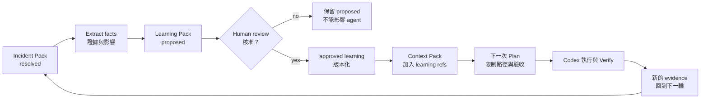
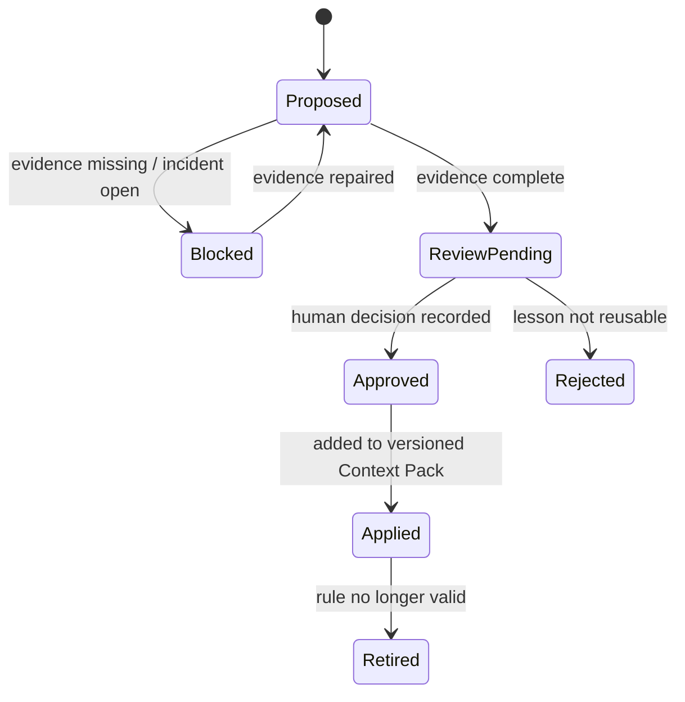

# Day 9｜事故處理完就結束了？用 Learning Pack 把生產證據帶回下一次 AI 變更

> 本文是 2026 iThome 鐵人賽系列「不只會寫 Code：用 ChatGPT × Codex 打造企業級 AI 開發工作流」第 9 天。前一天用 Audit Trail 與 Incident Pack 回答「這次事故發生了什麼、現在是否恢復」；今天再往前一步：事故處理完成後，如何把已確認的事實帶回下一次需求、Context、執行與 Verify，而不是讓團隊下次重新踩同一個坑？

## 影片版

本日影片：[觀看 Day 9 影片](https://www.youtube.com/watch?v=gKLJz1hjh5o)

影片使用 AutoCut HTML deck 與 Fish Audio 旁白製作；繁體中文字幕以可開關的 YouTube `zh-TW` CC 提供，不把字幕燒進畫面。

## 事故結案，不代表團隊學會了

想像 Day 8 的訂單匯出事故已經完成回滾，Incident Pack 也標記成 `resolved`。值班人員交接完成，監控恢復綠燈，大家鬆了一口氣。

兩週後，另一個 agent 要替同一個服務加入批次匯出功能。它拿到的是一般的 Repository Context Pack，只知道目前的 source commit，卻不知道上次事故留下的幾個重要事實：

- 大檔案匯出不能直接在 request thread 執行。
- 回滾後一定要重新跑租戶隔離與健康檢查。
- `exports/**` 的變更需要由 on-call 與資料服務 owner 一起 Review。
- 上一次曾經出現「指令成功，但服務還沒有恢復」的誤判。

如果這些資訊只停在 Incident Pack 的附件裡，下一次 AI 變更仍然可能重複相同的決策。**恢復服務解決的是現在；把證據帶回下一次變更，才是在改善系統。**

## Learning Pack 是什麼？

Learning Pack 不是把事故報告複製一份，也不是讓 AI 自動修改團隊規則。它是一份經過人工確認、可以被下一次 Context Pack 引用的「已驗證學習紀錄」。

| 產物 | 白話說法 | 主要回答的問題 | 是否能直接影響下一次執行 |
| --- | --- | --- | --- |
| Audit Trail | 原始事件帳本 | 發生了哪些動作？順序是什麼？ | 不能，先作為證據 |
| Incident Pack | 本次事故交接包 | 現在是否恢復？誰接手？ | 不能，先保存事故狀態 |
| Learning Pack | 經確認的學習包 | 下次遇到相似變更，哪些規則要提前帶入？ | 只有 `approved` 後可以 |
| Context Pack | 本次工作的受控上下文 | 這次 agent 可以依據哪些事實工作？ | 可以，但必須有版本與範圍 |

這四個產物要分開。Incident Pack 記錄「這次發生了什麼」，Learning Pack 提煉「下次應該記得什麼」，Context Pack 才把已核准的內容帶入一次新的工作。

## 先畫出證據回流路徑



> 圖 1｜Learning Pack 把已解決事故的證據帶回下一次 Context 與 Verify，但必須先經過人工核准。

流程中最重要的不是「有沒有產生一份摘要」，而是 `proposed` 和 `approved` 之間的責任邊界。AI 可以從事件與測試結果提出候選學習；它不能因為自己整理了內容，就把內容升級成團隊政策。

## 一筆學習紀錄至少要能回到哪裡？

一筆可治理的 Learning Pack，不應只有一句「下次要小心」。至少要帶著來源、證據、範圍與決策：

```json
{
  "learning_id": "learn-export-async-001",
  "context_id": "orders-export",
  "incident_id": "inc-20260811-01",
  "change_id": "orders-export-20260811",
  "source_commit": "abc1234",
  "observed_at": "2026-08-11T09:40:00Z",
  "incident_status": "resolved",
  "lesson": "大檔案匯出必須交給背景 worker，不在 request thread 直接產生檔案。",
  "evidence_refs": [
    "incident/e6-rollback-completed.json",
    "tests/exports/test_large_file_timeout.py"
  ],
  "scope": ["services/export/**", "workers/export/**"],
  "status": "approved",
  "owner": "platform-owner",
  "approved_by": "engineering-review",
  "approved_at": "2026-08-12T01:10:00Z"
}
```

這些欄位各自有責任：

- `learning_id`：讓後續 Context 可以精確引用，也能防止同一筆學習重複加入。
- `incident_id`、`change_id`、`source_commit`：把學習綁回原始事故與程式版本。
- `incident_status`：只有已經 `resolved` 的事故，才可以成為下一次工作的穩定前提。
- `lesson`：用一句可操作的規則描述，不寫成無法驗收的口號。
- `evidence_refs`：每個結論都能回到事件、測試或 Review 證據。
- `scope`：限制這條學習適用的路徑，避免一個服務的事故規則污染整個 Repository。
- `status`、`approved_by`、`approved_at`：把候選內容和正式採用的規則分開。

如果沒有 `evidence_refs`，這只是意見；如果沒有 `scope`，這可能變成過度寬廣的規則；如果沒有人工核准，就不應該進入下一次 agent 的有效上下文。

## `proposed` 不等於 `approved`

最容易出現的錯誤，是把 AI 產生的摘要直接寫入共用 Context：

```text
Incident resolved
→ AI summary generated
→ shared-context.md overwritten
→ next agent treats it as policy
```

這條路徑少了兩個問題：摘要是否完整，以及這個結論是否真的適用於下一個變更。更安全的狀態機如下：



| 狀態 | 可以做什麼 | 不可以做什麼 |
| --- | --- | --- |
| `proposed` | 供人類 Review、補證據 | 直接影響 agent 的執行規則 |
| `approved` | 被下一版 Context Pack 引用 | 偷改原始 Incident Pack |
| `applied` | 在指定範圍內約束下一次 Plan | 擴大適用路徑 |
| `rejected` | 保留決策與原因 | 假裝成有效學習 |
| `retired` | 保留歷史與失效時間 | 再加入新的 Context |

這也是 fail-closed 的延伸：不確定時保留 `proposed` 或 `blocked`，不要把「可能有用」包裝成「團隊已核准」。

## 如何判斷一條學習真的值得回流？

不是每一筆事故細節都適合成為永久規則。可以用四個問題先過濾：

| 問題 | 通過的樣子 | 不通過的樣子 |
| --- | --- | --- |
| 是否可回溯？ | 有 incident、change、commit 與 evidence refs | 只有聊天中的印象 |
| 是否可重現？ | 有測試、監控或命令能重跑 | 只有「當時看起來」 |
| 是否有範圍？ | 明確限定服務、路徑或變更類型 | 寫成整個公司的絕對規則 |
| 是否有人負責？ | 有 owner 與 approval | Agent 自己核准自己的摘要 |

例如「09:06 監控曾經變紅」是事故事實，但通常不是可以直接套用的規則；「大型匯出必須使用背景 worker，且合併前要驗證租戶隔離」才是可以帶回下一次 Plan 的學習候選。

## 把學習接回 Day 2～8 的工作流

Learning Pack 的價值，只有在下一次變更真的使用它時才成立。可以把接法固定成下面這條鏈：

```text
Day 8  Incident Pack：確認這次事故已經 resolved
  ↓
Day 9  Learning Pack：提煉可回溯、可驗收、有限範圍的學習
  ↓
人類 Review：核准、拒絕或要求補證據
  ↓
Day 3  Context Pack：加入 approved learning refs 與版本
  ↓
Day 2  Plan：把學習轉成 Given／When／Then 驗收條件
  ↓
Day 4  Execution Contract：限制 agent 可改的路徑與命令
  ↓
Day 5  Verify Matrix：確認學習對應的 acceptance 真的通過
  ↓
Day 6～7 Deliver／Release：把新證據帶到交接與發布
```

這裡有一個很實用的判斷：**Learning Pack 不是新的知識庫分類，而是下一次工作可以引用、可以驗證、可以撤回的變更前提。**

## Given／When／Then：把「學到了」寫成可驗收條件

可以先從三條最小規則開始：

```text
Given Incident Pack 的 status 不是 resolved，
When 建立 Learning Pack，
Then 拒絕產生可套用的 approved learning。

Given Learning Pack 缺少 evidence_refs 或 scope，
When 送交 Review，
Then 保持 blocked，不能進入 Context Pack。

Given Learning Pack 已有人工 approval，
When 同一個 context_id 再次套用它，
Then 只加入一次 learning_id，重試不能造成重複規則。

Given 一筆 approved learning 的 context_id 與目前 Context 不同，
When 套用 Learning Pack，
Then 拒絕寫入，避免跨服務污染上下文。
```

這些條件不需要大型平台才能驗證。先用標準函式庫把邊界寫成可重跑的測試，之後再接 CI、Context service 或 Review bot。

## 搭配 GitHub 實作範例：建立可套用的 Learning Pack

本日範例放在：

[`day09/example-learning-pack/`](./example-learning-pack/)

它使用 Python 標準函式庫完成四件事：

1. 驗證 Learning Pack 是否有完整來源、證據、範圍與 owner。
2. 拒絕從尚未 `resolved` 的事故產生可採用學習。
3. 要求 `approved`／`applied` 狀態一定有人工核准欄位。
4. 將 approved learning 套用到指定 Context，並保證重試不重複加入。

執行方式：

```bash
cd day09/example-learning-pack
python3 -m unittest -v
python3 learning_pack.py fixtures/learning.json context.json
```

本日範例測試成功建立 Learning Pack、拒絕未結案事故、拒絕缺證據紀錄、拒絕沒有人工核准的套用、拒絕跨 Context 套用，以及驗證 idempotent retry。實際測試結果應以同一份 Repository checkout 的執行輸出為準。

## 常見錯誤：把事故摘要當成永久真理

### 1. 事故一結束就自動更新共用規則

事故的修復結果不一定能泛化到所有服務。先建立 `proposed`，經 owner Review 後才進入 `approved`。

### 2. 只保存結論，不保存證據

「下次改用 queue」如果沒有 incident、commit、測試或 Review 連結，下一個人無法判斷這是事實還是偏好。

### 3. 沒有限定適用範圍

單一服務的 timeout 問題，不應變成整個 Repository 都禁止同步呼叫。`scope` 是防止知識污染的最小邊界。

### 4. 重試時重複加入規則

排程器、CI 或 agent 可能重跑同一個 apply。應使用 `learning_id` 做 idempotency key，而不是每次都 append 一段文字。

### 5. 沒有退場機制

技術規則會過期。保留 `retired` 與原因，才能知道為什麼下一版 Context 不再引用它。

## 把前九天串成一條可以回饋的責任鏈

```text
Day 2  ChatGPT：需求 → Given／When／Then
  ↓
Day 3  Context Pack：固定 context、版本與 Plan
  ↓
Day 4  Execution Contract：限制 worktree、路徑與停止條件
  ↓
Day 5  Verify Matrix：收斂 Contract、Process、Behavior、Review
  ↓
Day 6  Deliver Pack：讓下一個人能接手並重建判斷
  ↓
Day 7  Release Gate：確認變更能否進入發布窗口
  ↓
Day 8  Audit Trail／Incident Pack：追溯與復原這次事故
  ↓
Day 9  Learning Pack：把已驗證證據帶回下一次 Context
```

成熟的 AI 開發工作流不是只把成功的 Code 送出去，而是讓失敗也能變成下一次工作的可驗證前提。每一條回流規則都要能回答：從哪裡知道、誰核准、適用哪裡、如何驗收、何時失效。

## GitHub 專案

| 資源 | 連結 |
| --- | --- |
| 系列 Repository | [ithome-ironman-2026-chatgpt-codex](https://github.com/rufushsu9987/ithome-ironman-2026-chatgpt-codex) |
| 本日文章原始檔 | [`day09/article.md`](https://github.com/rufushsu9987/ithome-ironman-2026-chatgpt-codex/blob/main/day09/article.md) |
| Learning Pack 範例 | [`day09/example-learning-pack/`](https://github.com/rufushsu9987/ithome-ironman-2026-chatgpt-codex/tree/main/day09/example-learning-pack) |
| 證據回流圖 | [`day09/diagrams/learning_feedback_loop.mmd`](https://github.com/rufushsu9987/ithome-ironman-2026-chatgpt-codex/blob/main/day09/diagrams/learning_feedback_loop.mmd) |
| 前一天 Day 8 | [Audit Trail 與 Incident Pack](https://ithelp.ithome.com.tw/articles/10402486) |

## 今日小結

- Incident Pack 解決「這次事故現在怎麼辦」；Learning Pack 解決「下次工作要記得什麼」。
- 候選學習先維持 `proposed`，有 evidence、scope、owner 與人工核准後才可 `approved`。
- 只有 approved learning 能進入下一版 Context Pack，而且套用必須 idempotent。
- 每條學習都要能回到 incident、change、source commit 與可重跑證據。
- 技術規則也會過期，應保留 `retired` 狀態與原因。

**事故恢復是終點的一半；把證據帶回下一次變更，才讓團隊真的變得更可靠。**
