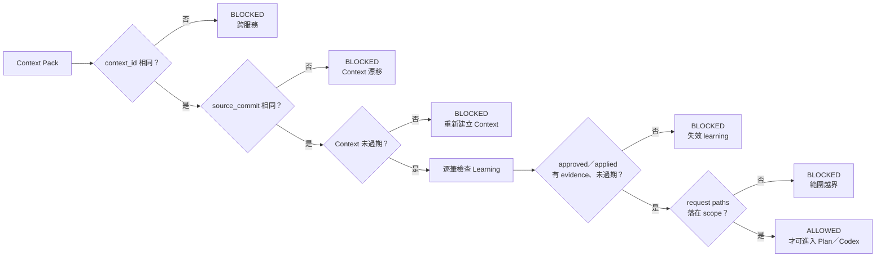
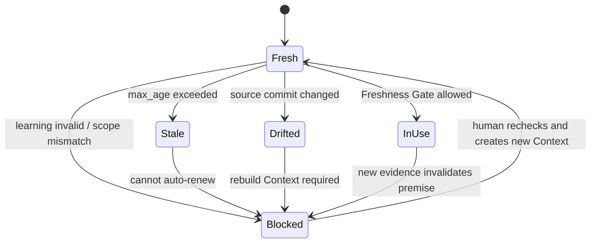

# Day 10｜Learning Pack 放進 Context 就安全了嗎？用 Freshness Gate 擋住過期規則

> 本文是 2026 iThome 鐵人賽系列「不只會寫 Code：用 ChatGPT × Codex 打造企業級 AI 開發工作流」第 10 天。前九天把需求、Context、執行、Verify、Deliver、Release、Incident 與 Learning 串成責任鏈；今天處理一個容易被忽略的問題：已核准，不代表永遠有效。

## 影片版

本日影片：[觀看 Day 10 影片](https://www.youtube.com/watch?v=Jt_6iBtCFjs)

影片使用 AutoCut HTML deck 與 Fish Audio per-scene 旁白製作；繁體中文字幕以可開關的 YouTube `zh-TW` CC 提供，不把字幕燒進畫面。

## 已核准，不代表永遠有效

想像 Day 9 的事故已經結案，團隊也完成了 Learning Pack。裡面寫著：「大檔案匯出必須交給背景 worker，不能在 request thread 直接產生檔案。」這條規則有 incident、source commit、測試證據，也有 owner 核准，看起來很完整。

兩週後，新的 agent 要修改同一個服務。它讀到舊的 Context Pack，卻沒有注意三件事：

- Repository 已經換了 source commit，匯出模組的路徑和行為也改過。
- Context 建立時間超過原本允許的有效期限。
- 這次工作其實是 billing 服務，不是原本 `orders-export` 的範圍。

如果 agent 只看到 `status: approved` 就繼續執行，結果可能是「按照正確的舊規則，對錯的程式碼做出新的變更」。這不是 Learning Pack 本身錯，而是執行前少了一個問題：**這份前提現在還新鮮嗎？**

恢復服務需要 Incident Pack；把已確認的事實帶回下一次工作需要 Learning Pack；而在真正動手前，還需要 Freshness Gate 確認這些前提沒有過期、漂移或越界。

## Freshness Gate 是什麼？

Freshness Gate 可以先理解成「Context 的有效期限檢查」。它不會修改程式、不會自動延長規則，也不會替人類重新核准 Learning Pack。它只讀取 Context、Learning 與本次 request，產生一份可追溯的 `allowed=true/false` 報告。

| 檢查 | 白話問題 | 不通過時的處理 |
| --- | --- | --- |
| `context_id` | 這次工作是不是同一個服務？ | 阻擋，避免跨服務污染 |
| `source_commit` | Context 看到的程式碼是不是目前這一版？ | 阻擋，要求重新建立 Context |
| `max_age_hours` | Context 建立多久了？ | 阻擋，要求重新盤點 Repository |
| learning status／expiry | 每條規則仍是 approved／applied 且未過期嗎？ | 阻擋，列出失效的 `learning_id` |
| evidence／scope | 規則有證據，且本次 paths 在適用範圍內嗎？ | 阻擋，不能擴大規則用途 |

這個 Gate 的重點不是再增加一個漂亮的狀態欄位，而是讓「可以開始修改」必須有一份新的、可重跑的判斷證據。

## 先畫出執行前的檢查路徑



> 圖 1｜Freshness Gate 先核對 Context 身分、程式版本與有效期限，再檢查 Learning 的證據與 scope，最後才允許進入 Plan／Codex。

流程故意是 fail-closed：任何一項無法確認，就回報阻擋。這比「大部分欄位看起來沒問題，所以先跑再說」安全，因為 agent 可能在幾分鐘內修改大量檔案，事後才發現使用了錯的前提。

## 五個檢查點，分別擋住什麼問題？

### 1. `context_id`：不要把一個服務的經驗套到另一個服務

Day 9 的 Learning Pack 來自 `orders-export`。即使它的規則看起來很通用，也不能直接套到 `billing`。不同服務的資料流、權限與風險可能完全不同。

```json
{
  "context_id": "orders-export",
  "request": {
    "context_id": "billing"
  }
}
```

這種情況應該直接 `BLOCKED`，而不是讓 agent 自己判斷「兩個服務應該差不多」。相似不是相同，Context 身分要用欄位比對，而不是靠模型猜測。

### 2. `source_commit`：避免新舊程式碼混在同一個判斷裡

Context Pack 描述的是某一個 Repository 版本。如果 Context 產生時的 commit 是 `abc1234`，本次 checkout 卻是 `def5678`，就不能假設舊的檔案位置、測試結果與依賴仍然成立。

```text
Context source_commit: abc1234
Current source_commit: def5678
→ BLOCKED: source_commit_mismatch
```

這也是 Day 3 Context Pack 的延伸：版本化不只是保存版本號，而是要在執行前再次比對。

### 3. `max_age_hours`：時間過久就重新盤點

即使 source commit 沒有改變，Context 也可能因為外部政策、權限、服務狀態或待決事項而失去新鮮度。因此 Context 可以設定 `max_age_hours`，讓工作在超過期限後重新走一次盤點。

```json
{
  "created_at": "2026-08-10T00:00:00Z",
  "max_age_hours": 24,
  "checked_at": "2026-08-12T06:00:00Z"
}
```

這份 Context 已經超過 24 小時，Freshness Gate 應回報 `context_expired`。它不需要知道「這兩天到底發生了什麼」，只要知道原本設定的有效期限已經過去，就把重新確認的責任交回團隊。

### 4. Learning 的狀態、證據與 expiry

Learning Pack 不是一段永遠有效的 prompt。每筆 learning 都要重新檢查：

- 狀態仍是 `approved` 或已經被安全套用的 `applied`。
- `evidence_refs` 仍然存在於資料中，不能只有一句沒有來源的結論。
- `expires_at` 尚未到期。
- `retired` 的規則不能因為還留在舊 Context 裡就繼續生效。

例如下面這筆資料即使有 `approved`，也應該被擋下來：

```json
{
  "learning_id": "learn-export-async-001",
  "status": "retired",
  "evidence_refs": ["incident/e6-rollback-completed.json"],
  "expires_at": "2026-08-20T00:00:00Z"
}
```

`approved` 只回答「曾經有人核准」；Freshness Gate 要回答「現在這次工作還能不能用」。

### 5. `scope`：規則只能影響它被核准的地方

如果 learning 的 scope 是 `services/export/**`，本次 request 修改 `services/billing/api.py`，就算兩個服務都用 Python，也不能放行。

Scope 是控制規則影響面的最小邊界。它不一定要做到完整的權限系統，但至少要讓越界被看見、被記錄、被拒絕，而不是默默擴大成整個 Repository 的規則。

## Gate 報告要能解釋「為什麼被擋」

只有 `allowed: false` 不夠。下一個人需要知道該補什麼資料，所以報告應該包含穩定的 reason code：

```json
{
  "allowed": false,
  "state": "blocked",
  "reasons": [
    "source_commit_mismatch",
    "learning:learn-export-async-001:expired"
  ],
  "checks": {
    "context_id": true,
    "source_commit": false,
    "context_age_hours": 49.5,
    "max_age_hours": 24,
    "learning_count": 1
  }
}
```

Reason code 比一大段模型摘要更適合放進 CI、Pull Request 或交接包。人類可以依照 `source_commit_mismatch` 重新建立 Context；如果是 `missing_evidence`，則回到 Learning Review 補證據；如果是 `path_out_of_scope`，則重新確認本次變更是否真的屬於這個服務。

## 狀態不是越多越好，而是要有清楚邊界



> 圖 2｜Context 從 Fresh 變成 Stale、Drifted 或 Blocked 後，不應由 agent 自動延長有效期限，而要重新建立並確認新的 Context。

這裡有三個重要限制：

1. **Gate 是唯讀的。** 它只產生報告，不修改 `created_at`、`source_commit` 或 learning 狀態。
2. **Gate 不會自動續期。** 過期不是把時間戳改成現在就能解決的問題，必須重新盤點。
3. **Gate 要 deterministic。** 相同的 Context、request 與 `checked_at`，應該得到相同的報告，方便重試與稽核。

## Given／When／Then：把新鮮度寫成可驗收條件

```text
Given context_id、source_commit、時間與 learning scope 都符合，
When 執行 Freshness Gate，
Then 回報 allowed=true，且 reasons 為空陣列。

Given current source_commit 與 Context 的 source_commit 不同，
When 執行 Freshness Gate，
Then 回報 allowed=false，並包含 source_commit_mismatch。

Given Context 超過 max_age_hours，
When 執行 Freshness Gate，
Then 回報 context_expired，不自動延長 Context 有效期限。

Given learning status 是 retired、已過期或缺少 evidence_refs，
When 執行 Freshness Gate，
Then 回報 allowed=false，並指出具體 learning_id。

Given request 的 context_id 不同或 paths 超出 scope，
When 執行 Freshness Gate，
Then 阻擋本次工作，避免跨服務污染。

Given 相同輸入重試兩次，
When 執行 Freshness Gate，
Then 兩次報告相同，而且 Context 與 request 都沒有被修改。
```

這些條件把「Context 要保持新鮮」變成可以在本機、CI 或 Agent workflow 裡重跑的行為。它也延續 Day 2 的原則：不要只寫「要安全」，要寫出什麼情況下放行、什麼情況下阻擋，以及阻擋後要留下什麼證據。

## 搭配 GitHub 實作範例：唯讀 Freshness Gate

本日範例放在 [`day10/example-freshness-gate/`](https://github.com/rufushsu9987/ithome-ironman-2026-chatgpt-codex/tree/main/day10/example-freshness-gate)。它使用 Python 標準函式庫完成三件事：

1. 以 `context_id`、`source_commit` 與時間檢查 Context 是否仍可使用。
2. 逐筆檢查 learning 的 status、evidence、expiry 與 scope，失敗時產生穩定 reason code。
3. 產生 deterministic、read-only 的 JSON 報告，不在 Gate 內更新任何輸入。

執行完整測試：

```bash
cd day10/example-freshness-gate
python3 -m unittest -v
python3 -m py_compile freshness_gate.py test_freshness_gate.py
python3 freshness_gate.py fixtures/context.json fixtures/request.json
```

本機實際測試包含 6 個測試案例，涵蓋 fresh 放行、source commit 漂移、Context 過期、retired／expired／缺 evidence、跨 Context／scope 越界，以及相同輸入的 deterministic retry。fixture CLI 的成功路徑會輸出 `allowed: true`、`state: fresh` 與空的 `reasons`；退出碼為 0。

這個範例沒有假裝自己是完整的 policy engine。它刻意只做「開始修改前的前提檢查」，不執行 Codex、不改檔、不延長 Context，也不取代人類對風險與政策的判斷。

## ChatGPT、Codex 與人類怎麼分工？

| 角色 | Freshness Gate 前後可以做什麼 | 不應自行決定 |
| --- | --- | --- |
| ChatGPT | 整理過期風險、列出需要重新確認的欄位、提出兩個以上修復選項 | 把舊 Context 說成最新 Context |
| Codex | 讀取 gate 報告，在 `allowed=true` 且 Execution Contract 有效時實作與測試 | 修改 Gate 輸入來取得放行、跨 scope 寫檔 |
| 人類負責人 | 重新確認 source、policy、owner 與 learning 是否仍適用 | 把沒有證據的 `allowed=false` 手動改成 true |
| Freshness Gate | 做一致的身分、版本、時間、證據與範圍比對 | 自動續期、核准 learning、執行部署 |

ChatGPT 的價值是把「可能已經過期」攤開；Codex 的價值是在新鮮且有邊界的前提下執行；人類仍然負責接受風險、重新核准與決定是否繼續。

## 常見錯誤：把新鮮度當成文件欄位

### 1. 只看 `status: approved`

`approved` 是過去的決策，不是現在的環境證明。仍然要比對 source commit、有效期限與當次 request 的 scope。

### 2. Context 過期就偷偷改時間

這會讓稽核看見一份「看起來剛建立」的 Context，卻找不到真正的重新盤點證據。Gate 應該阻擋，讓團隊重新建立 Context。

### 3. 用模型摘要取代 reason code

摘要可以幫忙說明，但執行閘門需要穩定的 `source_commit_mismatch`、`context_expired` 或 `path_out_of_scope`。否則 CI 很難可靠判斷要不要停止。

### 4. 只檢查 Context，不檢查 Learning

Context 可能仍在有效期限內，但裡面的某條 learning 已經 retired 或過期。新鮮度要沿著引用鏈逐筆檢查。

### 5. Gate 直接幫忙修復輸入

如果 Gate 一看到過期就自己改 `created_at`，一看到缺 evidence 就自己補一段摘要，它就不再是驗證器，而變成沒有責任人的政策修改器。

## 把前十天串成一條不靠猜的責任鏈

```text
Day 2  ChatGPT：需求 → Given／When／Then
  ↓
Day 3  Context Pack：固定 context、版本與 Plan
  ↓
Day 4  Execution Contract：限制 worktree、路徑與停止條件
  ↓
Day 5  Verify Matrix：收斂 Contract、Process、Behavior、Review
  ↓
Day 6  Deliver Pack：交接可重建的判斷證據
  ↓
Day 7  Release Gate：確認變更能否進入發布窗口
  ↓
Day 8  Audit Trail／Incident Pack：追溯與復原這次事故
  ↓
Day 9  Learning Pack：把已驗證證據帶回下一次 Context
  ↓
Day 10 Freshness Gate：確認 Context 與 Learning 現在仍然有效
  ↓
Codex：只在新鮮、有限範圍與可追溯的前提下執行
```

企業級 AI 開發工作流的重點，不是把更多資料塞進 prompt，而是讓每個前提都有身分、版本、期限、證據與責任人。`approved` 是一張曾經核准的通行證；Freshness Gate 會在每次出發前確認它是否還屬於這條路。

## GitHub 專案

| 資源 | 連結 |
| --- | --- |
| 系列 Repository | [ithome-ironman-2026-chatgpt-codex](https://github.com/rufushsu9987/ithome-ironman-2026-chatgpt-codex) |
| 本日文章原始檔 | [`day10/article.md`](https://github.com/rufushsu9987/ithome-ironman-2026-chatgpt-codex/blob/main/day10/article.md) |
| Freshness Gate 範例 | [`day10/example-freshness-gate/`](https://github.com/rufushsu9987/ithome-ironman-2026-chatgpt-codex/tree/main/day10/example-freshness-gate) |
| 流程圖原始檔 | [`day10/diagrams/freshness_gate_flow.mmd`](https://github.com/rufushsu9987/ithome-ironman-2026-chatgpt-codex/blob/main/day10/diagrams/freshness_gate_flow.mmd) |
| 狀態圖原始檔 | [`day10/diagrams/freshness_states.mmd`](https://github.com/rufushsu9987/ithome-ironman-2026-chatgpt-codex/blob/main/day10/diagrams/freshness_states.mmd) |
| 前一天 Day 9 | [Learning Pack 與證據回流](https://ithelp.ithome.com.tw/articles/10402613) |

## 今日小結

- Learning Pack 讓已確認的事故證據可以回到下一次 Context，但 `approved` 不代表永久有效。
- Freshness Gate 在 Codex 動手前檢查 context_id、source commit、Context age、learning 狀態、evidence 與 scope。
- source commit 漂移、Context 過期、learning retired／expired、缺少證據或 paths 越界，都要 fail-closed。
- Gate 只產生 deterministic、read-only 的報告，不自動續期、不代替人類核准。
- Freshness 是每次執行前的責任，不是寫在文件裡就永遠成立的標籤。

**已核准的規則值得被記住；在今天仍然適用，才值得被執行。**
