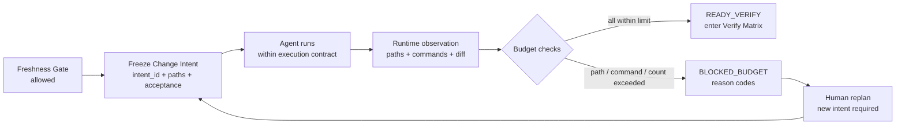
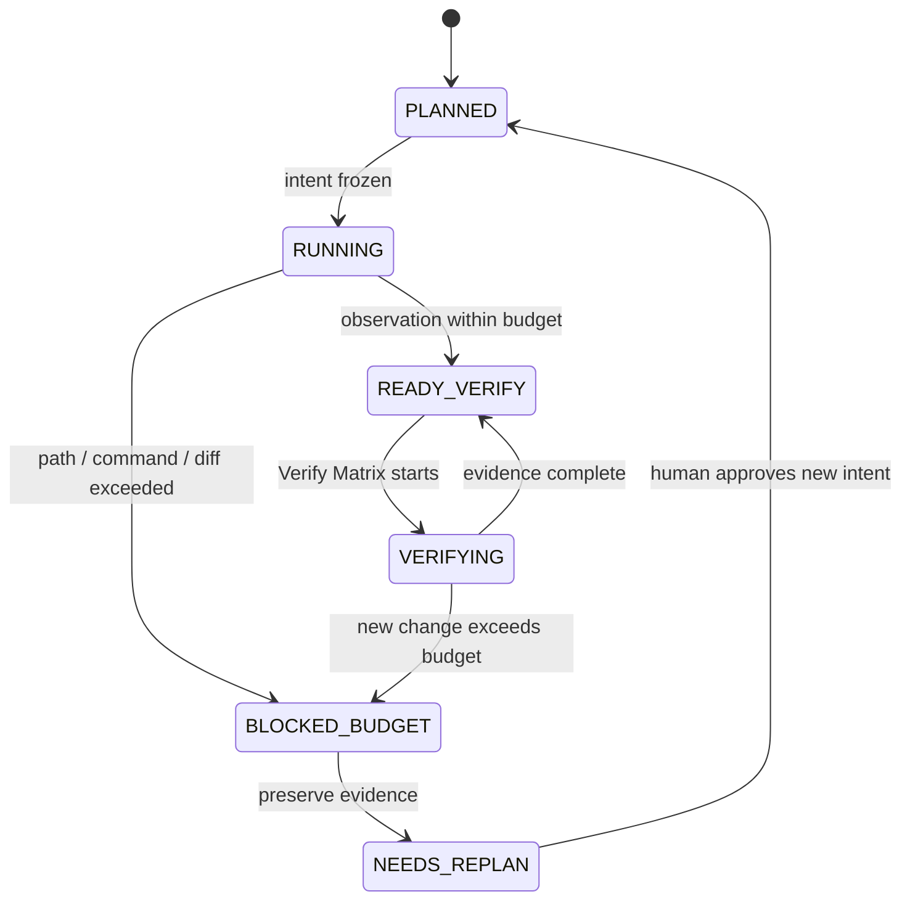

# Day 11｜Freshness Gate 通過就能一路改下去嗎？用 Change Budget 擋住範圍膨脹

> 本文是 2026 iThome 鐵人賽系列「不只會寫 Code：用 ChatGPT × Codex 打造企業級 AI 開發工作流」第 11 天。前十天從需求、Context、執行、Verify、Deliver、Release、Incident、Learning 一路走到 Freshness Gate；今天處理另一個常見缺口：前提是最新的，不代表 agent 執行到最後仍然只做原本核准的事。

## 影片版

[](https://www.youtube.com/watch?v=sWSrKdn0Hr4)

> 圖 1｜Day 11 影片示範如何用 Change Budget 限制路徑、命令、檔案數與 diff，避免小修正一路膨脹成未核准的大改造。

影片使用 AutoCut HTML deck 與 Fish Audio per-scene 旁白製作；繁體中文字幕以可開關的 YouTube `zh-TW` CC 提供，不把字幕燒進畫面。

## Freshness Gate 通過，為什麼還可能失控？

想像團隊要修正訂單匯出的 timeout。開始前，Freshness Gate 已經確認：

- Context 是 `orders-export`，沒有跨到別的服務。
- Repository 的 `source_commit` 與 Context 相同。
- Learning Pack 尚未過期，也有 incident 與測試證據。
- 本次預計修改的路徑在 `services/export/**`。

看起來一切都很安全。可是執行途中，agent 發現測試需要共用設定，於是順手改了 `services/billing/**`；接著為了讓 CI 通過，又改了 `.github/workflows/ci.yml`。最後 diff 從兩個檔案變成十二個檔案，新增 300 行，還執行了一個原本沒有核准的清理指令。

每一個額外動作都可能有合理理由，但合在一起，已經不是原本那個「修正匯出 timeout」的變更。Freshness Gate 證明的是「開始前使用的前提仍然有效」；它沒有證明「執行中的變更沒有膨脹」。

今天要補上的就是這一段責任邊界：**先把要做的事寫成 Change Intent，再用 Change Budget 觀察實際執行是否仍在範圍內。**

## Change Budget 是什麼？

可以把它想成施工前核准的一張小型工作單：不只寫目的，也寫清楚最多能碰哪些路徑、能執行哪些命令、最多改幾個檔案，以及 diff 可以到多大。

Change Budget 不是要預測 agent 的每一行程式，而是把「超出原本承諾」變成可判斷的訊號。它由三個資料組成：

| 資料 | 白話說法 | 例子 |
| --- | --- | --- |
| Change Intent | 這次到底要完成什麼 | `change-export-20260812-001` |
| Budget | 可以改到哪裡、最多改多少 | 3 個檔案、40 行 diff |
| Runtime Observation | 實際執行後發生了什麼 | changed paths、commands、diff 統計 |

Gate 只讀取這些資料並產生報告。它不會偷偷把上限調大、不會替 agent 執行命令，也不會直接刪除超出的修改。超出時，正確處理是保存證據、停止後續動作，重新建立一份經人類確認的 intent。

## 先把允許的變更寫下來

一份最小的 Change Intent 可以長這樣：

```json
{
  "intent_id": "change-export-20260812-001",
  "context_id": "orders-export",
  "source_commit": "abc1234",
  "allowed_paths": ["services/export/**"],
  "forbidden_paths": ["services/billing/**", ".github/**"],
  "allowed_commands": [
    "python3 -m unittest -v",
    "python3 -m py_compile *"
  ],
  "max_files_changed": 3,
  "max_diff_lines": 40,
  "max_commands": 4,
  "acceptance_ids": ["AC-01", "AC-02"]
}
```

這份資料把幾個容易被省略的決定留下來：

- `intent_id`：讓執行證據能回到這一次核准的工作，不把不同嘗試混成一筆。
- `context_id` 與 `source_commit`：延續 Day 10 的身分與版本邊界。
- `allowed_paths`：明確列出可以修改的範圍；沒有列入就不能自行推論「應該也可以」。
- `forbidden_paths`：對高風險區域加上明確拒絕，即使其他規則看似允許也不能通過。
- `allowed_commands`：讓 runner 可以拒絕未經核准的命令，而不是只記錄命令歷史。
- `max_files_changed`、`max_diff_lines`、`max_commands`：用數量限制抓住範圍膨脹。
- `acceptance_ids`：把變更預算連回 Day 2 的 Given／When／Then，避免只剩一串路徑清單。

## 執行中要觀察什麼？

執行器可以在每個安全檢查點產生一份 observation：

```json
{
  "context_id": "orders-export",
  "source_commit": "abc1234",
  "paths_changed": [
    "services/export/api.py",
    "services/export/test_api.py"
  ],
  "diff_added": 18,
  "diff_removed": 7,
  "commands": ["python3 -m unittest -v"],
  "checked_at": "2026-08-12T09:00:00Z"
}
```

這份 observation 不應由模型自己填寫「看起來合理」的摘要，而應由版本控制工具、執行器或受控 wrapper 提供原始事實。Change Budget Gate 的工作很單純：比較 intent 與 observation，留下穩定的 `allowed`、`state`、`reasons` 與檢查數值。

## 執行路徑：通過才進 Verify，超出就重新規劃



> 圖 2｜Freshness 通過後先固定 Change Intent，執行中的路徑、命令與 diff 再經過 Budget 檢查；超出時保留證據並回到重新規劃。

這裡有一個重要順序：**Budget 通過不是發布，也不是測試通過；它只代表可以把這次變更交給 Verify Matrix 繼續檢查。** 如果預算超出，不能跳過 Gate 直接進 Review，因為 Review 看到的已經不是原本核准的工作。

## 四種最小預算

### 1. 路徑預算：不讓相鄰服務被順手修改

`allowed_paths` 是最小影響面。這次要修 `services/export/**`，就不能因為 billing 也使用同一個 framework，便把 billing 的程式一起調整。

如果真的需要跨服務修改，應該建立新的 intent，重新說明兩個服務的相依性、驗收條件與負責人。不要把「改一點看看」當作擴大範圍的授權。

### 2. 命令預算：不讓方便的指令變成未核准副作用

測試、格式檢查與建置命令可以先列入 allowlist。清理檔案、修改權限、推送遠端或改動環境的命令，不能因為 agent 說「為了排除問題」就自動通過。

命令比對最好保留原始字串與執行順序，並把拒絕原因寫成 `command_not_allowed:<command>`。這比只寫「命令有風險」更容易交給 CI 或交接包處理。

### 3. 檔案數預算：抓住「只是多改幾個檔案」

一個小修正若從兩個檔案擴張到二十個檔案，通常已經需要重新拆解。`max_files_changed` 不是品質分數，而是提醒團隊：變更的影響面與最初假設不同了。

### 4. Diff 預算：抓住內容量突然增加

檔案數沒有超過，不代表內容沒有暴增。一個檔案也可能新增數百行。將 `diff_added + diff_removed` 記錄下來，可以在進入 Verify 前先發現這種變化。

數量限制不是取代 code review；它是把 review 前的風險變成早一點、可自動判斷的阻擋條件。

## 超出預算時要留下什麼？



> 圖 3｜Change Budget 把執行狀態分成可驗證的節點；超出路徑、命令或數量時進入 BLOCKED_BUDGET，不由 agent 自行放寬限制。

至少要留下以下資料：

- 原本的 `intent_id`、`context_id` 與 `source_commit`。
- 第一次發現超出的時間與執行階段。
- 完整的 changed paths、命令清單與 diff 統計。
- 穩定 reason code，例如 `path_out_of_scope:services/billing/api.py`。
- 超出之前已完成的測試與驗收證據，避免重試時全部從零猜測。
- 重新規劃的責任人與新的 acceptance ids；不要直接覆蓋舊 intent。

這樣做的好處是，下一個人能分辨「原始工作沒有做完」和「工作已經改變，需要新的核准」，而不是只看到一個模糊的 failed。

## Gate 報告要能回答下一步

成功報告可以很小：

```json
{
  "allowed": true,
  "state": "allowed",
  "reasons": [],
  "checks": {
    "files_changed": 2,
    "max_files_changed": 3,
    "diff_lines": 25,
    "max_diff_lines": 40,
    "commands": 1,
    "max_commands": 4
  }
}
```

阻擋報告則要指出具體原因：

```json
{
  "allowed": false,
  "state": "blocked",
  "reasons": [
    "path_forbidden:.github/workflows/ci.yml",
    "max_diff_lines_exceeded",
    "command_not_allowed:rm -rf services/export"
  ]
}
```

`allowed=false` 只是一個結果；`reasons` 才是下一步的工作清單。它可以直接放進 CI、Pull Request、Deliver Pack 或 Incident evidence，讓人類知道應該縮小變更、補一份 intent，還是先停止調查。

## Given／When／Then：把「不要改太多」變成驗收條件

```text
Given paths、source_commit、commands 與 diff 都在 Change Intent 的預算內，
When 執行 Change Budget Gate，
Then 回報 allowed=true、state=allowed，才進入 Verify Matrix。

Given changed path 不在 allowed_paths 或落在 forbidden_paths，
When 執行 Change Budget Gate，
Then 回報 path_out_of_scope 或 path_forbidden，不能繼續執行。

Given changed files 或 diff lines 超過上限，
When 執行 Change Budget Gate，
Then 回報 max_files_changed_exceeded 或 max_diff_lines_exceeded，不自動放寬預算。

Given runner 執行未列入 allowlist 的 command，
When 執行 Change Budget Gate，
Then 回報 command_not_allowed:<command>，保留原始命令字串。

Given context_id 或 source_commit 與 intent 不同，
When 執行 Change Budget Gate，
Then fail-closed，不能用「差不多」取代精確比對。

Given 相同的 intent 與 observation 重試兩次，
When 執行 Change Budget Gate，
Then 兩次報告相同，且輸入資料沒有被修改。
```

## 搭配 GitHub 實作範例：唯讀 Change Budget Gate

本日範例放在 [`day11/example-change-budget/`](./example-change-budget/)。它使用 Python 標準函式庫完成三件事：

1. 比對 `context_id` 與 `source_commit`，避免把執行證據套到另一個工作。
2. 檢查 paths、forbidden paths、commands、檔案數與 diff 行數。
3. 產生 deterministic、read-only JSON 報告；不執行命令、不修改 git、不替人類建立新的 intent。

執行完整測試：

```bash
cd day11/example-change-budget
python3 -m unittest -v
python3 -m py_compile change_budget.py test_change_budget.py
python3 change_budget.py fixtures/intent.json fixtures/observed.json
```

本機實際測試包含 8 個測試案例，涵蓋符合預算放行、路徑越界、forbidden path、檔案數、diff 行數、命令 allowlist／數量、Context／commit mismatch，以及 deterministic read-only retry。fixture 成功路徑會輸出 `allowed: true`、`state: allowed` 與空的 `reasons`；退出碼為 0。

這個範例刻意不假裝自己是完整的 sandbox 或權限系統。它只示範「執行中的變更是否仍符合原本意圖」這個可獨立驗證的邊界。

## ChatGPT、Codex 與人類怎麼分工？

| 角色 | Change Budget 前後可以做什麼 | 不應自行決定 |
| --- | --- | --- |
| ChatGPT | 把需求拆成 acceptance、建議合理的路徑與預算、整理超出原因 | 把超出的變更說成原本就包含在範圍內 |
| Codex | 在 Freshness 與 Change Intent 有效時執行、回報 observation、遇到 blocked 停止 | 修改 intent 或預算來取得放行 |
| 人類負責人 | 核准 intent、決定是否需要跨服務變更、重新規劃超出部分 | 直接刪掉 blocked 證據或把 false 改成 true |
| Change Budget Gate | 比對事實、產生 reason code、把可控的變更送往 Verify | 執行命令、修復 diff、替人類核准新範圍 |

## 常見錯誤

### 1. 只有 path allowlist，沒有數量上限

即使所有檔案都在同一個目錄，diff 仍然可能暴增。至少要同時記錄檔案數與 diff 行數。

### 2. 只記錄命令，不限制命令

Audit Trail 可以回答「執行過什麼」，但不一定能阻擋危險命令。對能改環境、刪檔或推送遠端的命令，應該在 runner 層先拒絕。

### 3. 超出預算就自動加倍

這會讓預算變成裝飾。若工作真的變大，請建立新的 intent、補上新的 acceptance，並留下人類核准證據。

### 4. 把 blocked 的 diff 直接丟掉

超出部分本身也是決策證據。保留它，下一個人才能知道為什麼原本的估算不足，以及是否需要拆成兩個變更。

### 5. 把 Budget 通過當成完成

Budget 只回答「範圍沒有膨脹」，不回答行為正確、測試完整、review 通過或可以發布。後面仍要接回 Verify Matrix、Deliver Pack 與 Release Gate。

## 把前十一天串成一條不靠猜的責任鏈

```text
Day 2  ChatGPT：需求 → Given／When／Then
  ↓
Day 3  Context Pack：固定 context、版本與 Plan
  ↓
Day 4  Execution Contract：限制 worktree、路徑與停止條件
  ↓
Day 5  Verify Matrix：收斂 Contract、Process、Behavior、Review
  ↓
Day 6  Deliver Pack：讓下一個人能接手並重建判斷
  ↓
Day 7  Release Gate：確認變更能否進入發布窗口
  ↓
Day 8  Audit Trail／Incident Pack：追溯與復原事故
  ↓
Day 9  Learning Pack：把已驗證證據帶回下一次 Context
  ↓
Day 10 Freshness Gate：確認前提仍然新鮮
  ↓
Day 11 Change Budget：確認執行中的變更沒有超出原本意圖
  ↓
Codex：只在新鮮、有限範圍與可追溯的前提下執行
```

企業級 AI 開發工作流不只要防止 agent 使用過期規則，也要防止它在執行途中把小工作變成大改造。Freshness Gate 確認「現在使用的前提」；Change Budget 確認「正在做的事情」；兩者都通過後，才值得把結果交給 Verify。

## GitHub 專案

| 資源 | 連結 |
| --- | --- |
| 系列 Repository | [ithome-ironman-2026-chatgpt-codex](https://github.com/rufushsu9987/ithome-ironman-2026-chatgpt-codex) |
| 本日文章原始檔 | [`day11/article.md`](https://github.com/rufushsu9987/ithome-ironman-2026-chatgpt-codex/blob/main/day11/article.md) |
| Change Budget 範例 | [`day11/example-change-budget/`](https://github.com/rufushsu9987/ithome-ironman-2026-chatgpt-codex/tree/main/day11/example-change-budget) |
| 流程圖原始檔 | [`day11/diagrams/change_budget_flow.mmd`](https://github.com/rufushsu9987/ithome-ironman-2026-chatgpt-codex/blob/main/day11/diagrams/change_budget_flow.mmd) |
| 狀態圖原始檔 | [`day11/diagrams/change_budget_states.mmd`](https://github.com/rufushsu9987/ithome-ironman-2026-chatgpt-codex/blob/main/day11/diagrams/change_budget_states.mmd) |
| 前一天 Day 10 | [Freshness Gate 擋住過期規則](./../day10/article.md) |

## 今日小結

- Freshness Gate 通過，只代表開始前的 Context 與 Learning 仍然有效。
- Change Intent 把本次工作的身分、路徑、命令、數量與 acceptance 固定下來。
- Change Budget 觀察執行中的 paths、commands、檔案數與 diff；超出就 fail-closed。
- `reasons` 必須能指出下一步，不用模型摘要猜測該怎麼修。
- Budget 通過不是測試通過，也不是發布許可；它只是把範圍受控的結果交回 Verify Matrix。

**先確認前提仍然新鮮，再確認正在做的事沒有走樣，AI 才是在邊界內加速。**
