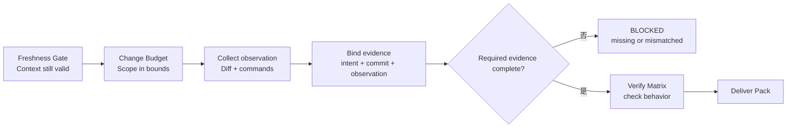
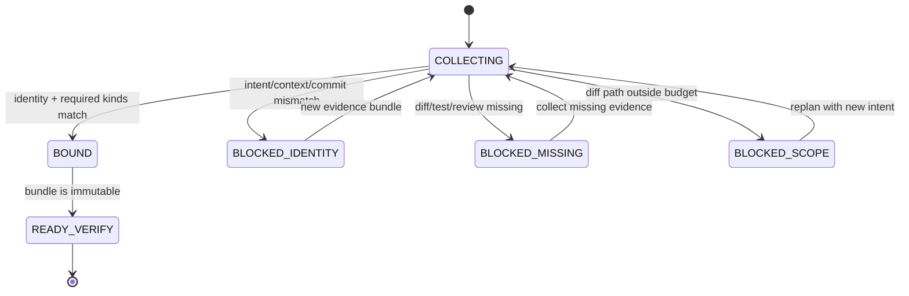

# Day 12｜測試通過就算是這次變更的證據嗎？用 Evidence Binding 綁住 diff、測試與 review

> 本文是 2026 iThome 鐵人賽系列「不只會寫 Code：用 ChatGPT × Codex 打造企業級 AI 開發工作流」第 12 天。前十一天從需求、Context、執行、Verify、Deliver、Release、Incident、Learning，一路走到 Freshness Gate 與 Change Budget；今天處理另一個容易被忽略的問題：證據看起來是真的，不代表它屬於這一次變更。

## 影片版

[](https://www.youtube.com/watch?v=OdeYRhXQWQ8)

> 圖 1｜Day 12 影片以 Evidence Binding 綁定 diff、測試與 review 的 YouTube 縮圖。

影片使用 HTML deck 與 Fish Audio per-scene 旁白製作；繁體中文字幕以獨立 UTF-8 SRT 提供，不把字幕燒進畫面。

## 先從一個很常見的交付場景開始

想像你準備把一個小修正交給團隊。桌上有三份資料：

1. 一份 diff，顯示 `services/export/api.py` 被修改。
2. 一份測試報告，顯示 `python3 -m unittest -v` 是 `passed`。
3. 一個 review，狀態是 `approved`。

看起來很完整，但還有一個問題：這三份資料是不是同一次工作產生的？

測試報告可能來自上一個 source commit，review 可能核准另一個 `intent_id`，diff 也可能是 agent 後來擴大的版本。每一份證據單獨看都像真的，拼在一起卻可能變成一個不存在的「完整交付」。

這就像把今天的考卷、昨天的答案與別人的簽名裝進同一個資料夾，再說「資料都齊了」。問題不是文件數量，而是它們之間沒有綁在同一件事上。

## 先講結論：Evidence Binding 綁的是「屬於誰」

Evidence Binding 可以先理解成「證據綁定」。它不是再跑一次測試，也不是把所有 log 存起來，而是要求每份證據都回答同一組身分問題：

| 欄位 | 白話問題 | 為什麼重要 |
| --- | --- | --- |
| `intent_id` | 這是誰核准的工作？ | 避免把兩次相似需求混成一次 |
| `context_id` | 這次工作針對哪個服務或範圍？ | 避免跨服務借用證據 |
| `source_commit` | 這份證據對應哪個版本？ | 避免拿舊版本的 PASS 支援新版本 |
| `observation_id` | 這一組執行觀測是哪一次？ | 把 diff、命令與結果串成同一輪 |
| `acceptance_ids` | 它要證明哪些驗收條件？ | 避免測試通過卻沒有回答需求 |
| `evidence_id` | 這一包證據本身是哪一包？ | 讓重試、交接與查詢都有穩定索引 |

如果其中一個身分對不上，Gate 不應該猜「應該是同一件事」，而要回報阻擋，讓負責人重新產生或重新綁定證據。

## Day 10、Day 11 還不夠嗎？

Day 10 的 Freshness Gate 處理「開始前的前提現在還有效嗎？」；Day 11 的 Change Budget 處理「執行中有沒有超出原本核准的範圍？」。Evidence Binding 再往後處理「交付時拿來證明結果的資料，真的屬於這次變更嗎？」

| Gate | 它回答的問題 | 它不回答的問題 |
| --- | --- | --- |
| Freshness Gate | Context、source commit 與 Learning 還新鮮嗎？ | 最後的 diff 是否仍屬於這次工作 |
| Change Budget | paths、commands、files、diff 是否在預算內？ | 測試與 review 是否對應同一版本 |
| Evidence Binding | diff、tests、review 是否綁在同一個 intent 與觀測？ | 行為是否符合完整產品需求 |
| Verify Matrix | 測試、檢查與證據是否足以交付？ | 是否已獲得發布核准 |

這幾個 Gate 不是重複檢查，而是沿著責任鏈補不同的缺口。前提正確、範圍沒有膨脹，仍然可能因為證據接錯而做出錯誤決定。

## Evidence Bundle：把證據放在同一個可驗證的包裡

一份最小的 Evidence Bundle 可以長這樣：

```json
{
  "evidence_id": "ev-export-20260812-001",
  "intent_id": "intent-export-20260812-001",
  "context_id": "orders-export",
  "source_commit": "abc1234",
  "observation_id": "obs-20260812-001",
  "captured_at": "2026-08-12T09:30:00Z",
  "diff": {
    "paths": ["services/export/api.py"],
    "added": 12,
    "removed": 3
  },
  "tests": {
    "run_id": "test-20260812-001",
    "command": "python3 -m unittest -v",
    "status": "passed",
    "result_digest": "sha256:example-result"
  },
  "review": {
    "review_id": "review-20260812-001",
    "status": "approved"
  },
  "artifacts": [
    {"kind": "diff", "artifact_id": "diff-001", "source_commit": "abc1234"},
    {"kind": "test-log", "artifact_id": "test-log-001", "source_commit": "abc1234"},
    {"kind": "review", "artifact_id": "review-001", "source_commit": "abc1234"}
  ]
}
```

這不是要求所有團隊採用完全相同的 JSON schema，而是示範最重要的原則：diff、tests、review 不能只靠檔名或時間接在一起，必須帶著共同的身分欄位。`result_digest` 也不是為了炫技，而是讓「測試結果」本身有可回查的固定指紋。

## 圖 1：Evidence Binding 放在責任鏈的哪裡？



> 圖 2｜Freshness Gate 先確認前提，Change Budget 再確認範圍，Evidence Binding 將 diff、測試與 review 綁到同一個 intent 與 observation，最後才交給 Verify Matrix。

流程的重點不是多一個表單，而是把證據檢查放在「準備交付」與「開始發布」之前。若這時才發現測試是舊 commit 的，應該阻擋，而不是讓下一個人自己猜測哪些資料能繼續用。

## 三類證據，三種常見錯接方式

### 1. Diff：改了什麼

Diff 必須符合 Day 11 的 Change Budget：路徑在 allowlist、沒有碰到 forbidden path、檔案數與 diff lines 沒有超過上限。Evidence Binding 再確認這份 diff 的 `source_commit` 和 `observation_id` 與其他證據相同。

只綁檔名不夠，因為同一個 `api.py` 在不同 commit 可能是完全不同的內容。

### 2. Tests：驗了什麼

測試至少要留下 `run_id`、實際 command、`status=passed` 與結果指紋。`passed` 只能說某次測試完成，不代表它驗的是目前這一版。

如果 `source_commit` 不一致，應回報 `source_commit_mismatch`；如果沒有結果指紋，應回報 `test_result_digest_missing`。沒有證據的 PASS，不能當成完整證據。

### 3. Review：誰看過

Review 的 `approved` 必須指向同一個 `intent_id` 與 `source_commit`。`pending`、`changes_requested` 或缺少 review id 都不應被解讀成核准。

Review 是責任確認，不是測試替代品；測試通過也不是 review 替代品。Evidence Bundle 應該讓兩者並列，而不是讓一種證據替另一種證據背書。

## 圖 2：證據綁定的狀態圖



> 圖 3｜Evidence Bundle 只有在身分、必要種類與 Change Budget 都符合時才進入 BOUND，再以不可變的 bundle 交給 Verify；任何阻擋都要重新收集或重新規劃。

這裡特別把 `BLOCKED_SCOPE` 分開，是因為「證據綁得很完整」仍然不能掩蓋變更超出原本範圍。Binding 是必要條件，不是放寬規則的捷徑。

## Given／When／Then：把「這份證據屬於這次」寫清楚

```text
Given diff、tests、review 都帶有相同 intent_id、context_id、source_commit 與 observation_id，
When 執行 Evidence Binding Gate，
Then 回報 allowed=true、state=bound，並列出 3 種 required evidence。

Given test report 的 source_commit 與 intent 不同，
When 執行 Gate，
Then 回報 source_commit_mismatch，即使 test status 是 passed 也不能放行。

Given review status 是 pending，
When 執行 Gate，
Then 回報 review_not_approved，不把待處理當成核准。

Given 相同輸入重試兩次，
When 執行 Gate，
Then 報告完全相同，而且 intent 與 evidence 都沒有被修改。
```

這些條件把「證據要對得起來」變成可以在本機、CI 或 Agent workflow 裡重跑的行為。下一個人不用閱讀整段 log 猜測發生什麼事，只要看穩定的 reason code 和 binding identity，就能決定要補證據、重跑測試，還是建立新的 intent。

## 搭配 GitHub 實作範例：唯讀 Evidence Binding Gate

本日範例放在 [`day12/example-evidence-binding/`](./example-evidence-binding/)。它使用 Python 標準函式庫完成四件事：

1. 驗證 intent、context、source commit 與 observation 是否一致。
2. 確認 diff 路徑仍符合 Change Budget 的 allowlist／forbidden path。
3. 確認 tests 已通過、具有結果指紋，且 review 狀態是 `approved`。
4. 確認 required evidence kinds 與 artifact identity 完整且沒有重複。

在範例目錄執行：

```bash
python3 -m unittest -v
python3 -m py_compile evidence_binding.py test_evidence_binding.py
python3 evidence_binding.py fixtures/intent.json fixtures/evidence.json
```

本機實際驗證結果：8 項 `unittest` 通過、`py_compile` 通過；成功 fixture 輸出 `allowed=true`、`state=bound`、`reasons=[]`。Gate 只輸出報告，不執行測試、不修改 Git，也不替缺少的證據補資料。

## ChatGPT、Codex 與人類怎麼分工？

| 角色 | Evidence Binding 前後可以做什麼 | 不應自行決定 |
| --- | --- | --- |
| ChatGPT | 整理 intent、acceptance 與 evidence 欄位，指出哪些證據可能接錯 | 把相似的 commit 或測試報告說成同一份證據 |
| Codex | 在 `state=bound` 且 Verify Contract 有效時執行檢查與修正 | 修改 evidence 的身分欄位來取得放行 |
| Runner | 產生 observation、diff、test log 與 review metadata | 隱藏失敗測試或省略 source commit |
| 人類負責人 | 決定是否補證據、拆分工作或建立新 intent | 把 `blocked` 手動改成 `bound` |
| Evidence Binding Gate | 做一致的身分、範圍、必要種類與 artifact 比對 | 代替測試、代替 review 或發布 |

這個分工把「誰整理、誰執行、誰產證據、誰承擔風險」分開。AI 可以協助把資料整理成可檢查的格式，但證據的身分不能靠模型的語意相似度補齊。

## 常見錯誤：把證據當成附件清單

### 1. 看到 `PASS` 就直接收下

PASS 只是某次測試的結果。沒有 `source_commit`、`intent_id` 與 `run_id`，就無法知道它支援哪一次變更。

### 2. 用時間戳把不同證據拼在一起

同一分鐘產生的資料不一定屬於同一個 intent。時間可以協助查詢，但不能取代 binding identity。

### 3. 缺少 review 仍然先交付

「之後有人會看」不是 `approved`。如果 review 是 required evidence，就要明確阻擋並留下 `review_not_approved`。

### 4. 讓 Gate 自動修正錯誤欄位

如果 Gate 發現測試 commit 不一致，不能直接把它改成目前 commit。這會破壞原始證據，讓後續的人無法知道真正發生過什麼。

## 把前十二天串成一條不靠猜的責任鏈

```text
Day 2  ChatGPT：需求 → Given／When／Then
  ↓
Day 3  Repository Context Pack：多代理從同一份事實開始
  ↓
Day 4  Execution Contract：Codex 在最小權限與隔離工作樹中執行
  ↓
Day 5  Verify Matrix：測試、Diff 與交付證據分層
  ↓
Day 6  Deliver Pack：下一個人接得上
  ↓
Day 7  Release Gate：相依性、回滾與最終責任
  ↓
Day 8  Audit Trail／Incident Pack：追溯與復原這次事故
  ↓
Day 9  Learning Pack：把已驗證證據帶回下一次 Context
  ↓
Day 10 Freshness Gate：確認 Context 與 Learning 現在仍然有效
  ↓
Day 11 Change Budget：確認執行中的變更沒有範圍膨脹
  ↓
Day 12 Evidence Binding：確認 diff、tests、review 屬於同一個 intent
  ↓
Verify → Deliver → Release
```

企業級 AI 開發工作流的重點，不是收集越多 log 越好，而是每份證據都能回答「它屬於哪一次工作、哪個版本、哪個觀測」。Freshness 讓前提保持新鮮，Budget 讓執行不亂跑，Evidence Binding 讓交付時的證據不接錯。三者都通過，Verify 才有可靠的起點。

## GitHub 專案

| 資源 | 連結 |
| --- | --- |
| 系列 Repository | [ithome-ironman-2026-chatgpt-codex](https://github.com/rufushsu9987/ithome-ironman-2026-chatgpt-codex) |
| 本日文章原始檔 | [`day12/article.md`](https://github.com/rufushsu9987/ithome-ironman-2026-chatgpt-codex/blob/main/day12/article.md) |
| Evidence Binding 範例 | [`day12/example-evidence-binding/`](https://github.com/rufushsu9987/ithome-ironman-2026-chatgpt-codex/tree/main/day12/example-evidence-binding) |
| 流程圖原始檔 | [`day12/diagrams/evidence_binding_flow.mmd`](https://github.com/rufushsu9987/ithome-ironman-2026-chatgpt-codex/blob/main/day12/diagrams/evidence_binding_flow.mmd) |
| 狀態圖原始檔 | [`day12/diagrams/evidence_binding_states.mmd`](https://github.com/rufushsu9987/ithome-ironman-2026-chatgpt-codex/blob/main/day12/diagrams/evidence_binding_states.mmd) |
| 前一天 Day 11 | [Change Budget](./../day11/article.md) |

## 今日小結

- 測試 `passed`、diff 與 review `approved` 各自成立，不代表它們屬於同一次變更。
- Evidence Binding 用 `intent_id`、`context_id`、`source_commit`、`observation_id` 與 `evidence_id` 把證據綁在一起。
- Diff 必須符合 Change Budget；tests 必須有通過狀態與結果指紋；review 必須明確核准。
- 缺少必要 evidence、身分不一致、路徑越界、測試失敗或 review pending，都要 fail-closed。
- Gate 是唯讀的，不修改原始證據、不代替測試、不代替 review，也不等於發布許可。

---

> 本文與範例的驗證命令均可在本機重跑；公開發布、YouTube 字幕與 GitHub 同步由後續 Release lane 依 checkpoint 執行。
