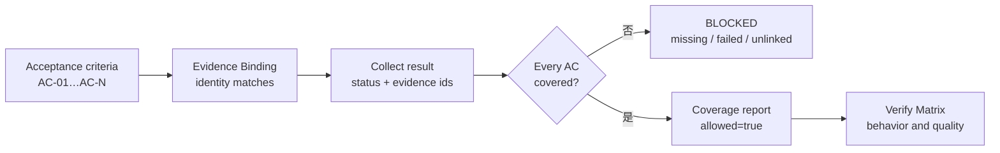
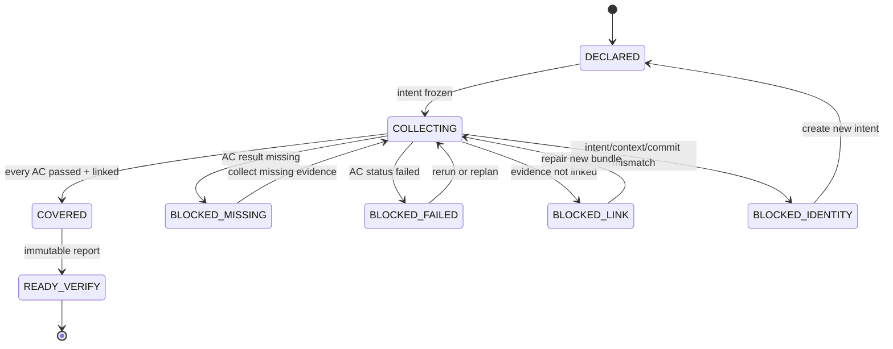

# Day 13｜測試都通過，怎麼知道需求沒有漏掉？用 Acceptance Coverage 補齊驗收證據

> 本文是 2026 iThome 鐵人賽系列「不只會寫 Code：用 ChatGPT × Codex 打造企業級 AI 開發工作流」第 13 天。前十二天從需求、Context、執行、Verify、Deliver、Release、Incident、Learning，一路走到 Freshness Gate、Change Budget 與 Evidence Binding；今天再補一個交付前常被忽略的問題：證據接對了，是否真的覆蓋每一個需求？

## 影片版

[](https://www.youtube.com/watch?v=jEiTypirhQE)

本日影片以可編輯 HTML deck 作為唯一視覺來源，逐頁擷取成 1920×1080 畫面，再組成固定 25 fps 的 clean H.264/AAC MP4。Fish Audio 旁白以每頁實際音訊 duration 產生時間軸；繁體中文字幕是獨立 UTF-8 SRT，不把字幕燒進畫面。

## 測試全綠，為什麼需求還可能漏掉？

想像產品經理提出三個條件：

- AC-01：使用者輸入合法資料時，服務會產生匯出工作。
- AC-02：輸入缺少必要欄位時，服務會拒絕並回報原因。
- AC-03：同一個 request 重試時，不會建立第二個工作。

工程師跑完測試，終端機顯示 `9 tests ... OK`。這個結果很值得高興，但它只回答「這一批測試通過了」。如果測試只驗到 AC-01 和 AC-02，AC-03 沒有任何 evidence，整體仍可能是綠色，需求卻少了一塊。

這就像考卷有三題，老師只改了兩題，最後說「目前看到的答案都對」。答案可以都是對的，但還不能證明整張考卷完成。

Day 12 的 Evidence Binding 解決「diff、tests、review 是不是同一次工作產生的」；Day 13 的 Acceptance Coverage 解決「這一次工作宣告的每個 acceptance 是否都有被證明」。兩個 Gate 要一起看，不能用其中一個代替另一個。

## Acceptance Coverage 是什麼？

可以把它理解成一張需求對證據的對照表。工作開始前，`Change Intent` 先列出本次要完成的 `acceptance_ids`；執行後，runner 為每個 id 回報結果；最後由 Gate 檢查每個結果是否通過，而且能連回一個真正存在的 evidence artifact。

| 資料 | 白話問題 | 例子 |
| --- | --- | --- |
| `acceptance_ids` | 這次到底承諾哪些結果？ | `AC-01`、`AC-02`、`AC-03` |
| `acceptance_results` | 每個結果實際通過了嗎？ | `status: passed` |
| `evidence_ids` | 哪份證據證明這個結果？ | `test-001` |
| artifact 的 `acceptance_ids` | 這份證據反向承認它證明誰嗎？ | `test-001 → AC-01` |
| binding identity | 它是不是同一個 intent／版本？ | `intent_id`、`source_commit` |

Coverage 不是單純計算百分比。若 AC-03 沒有證據，報告應該是 `blocked`，而不是顯示「66% 已完成」後繼續交付。百分比適合儀表板；交付 Gate 需要清楚的放行或阻擋。

## 先把需求編號，才有辦法逐項對照

一份最小的 intent 可以長這樣：

```json
{
  "intent_id": "intent-export-20260813-001",
  "context_id": "orders-export",
  "source_commit": "abc1234",
  "acceptance_ids": ["AC-01", "AC-02", "AC-03"]
}
```

這裡的重點不是 JSON 長什麼樣，而是先固定「本次要交付哪些結果」。如果執行中需求增加 AC-04，不應直接把舊 intent 的陣列改大來讓 Gate 通過；應該建立新的 intent，說明新增的範圍與責任人。

## Coverage Map：每個 acceptance 都要有去處

執行後可以產生一份 coverage map：

```json
{
  "acceptance_results": [
    {"acceptance_id": "AC-01", "status": "passed", "evidence_ids": ["test-001"]},
    {"acceptance_id": "AC-02", "status": "passed", "evidence_ids": ["test-002"]},
    {"acceptance_id": "AC-03", "status": "passed", "evidence_ids": ["review-001"]}
  ],
  "artifacts": [
    {"artifact_id": "test-001", "kind": "test-log", "acceptance_ids": ["AC-01"]},
    {"artifact_id": "test-002", "kind": "test-log", "acceptance_ids": ["AC-02"]},
    {"artifact_id": "review-001", "kind": "review", "acceptance_ids": ["AC-03"]}
  ]
}
```

這裡故意做雙向連結：結果指向 evidence，artifact 也列出它負責證明的 acceptance。只有單向欄位，很容易在整理資料時誤接；雙向檢查可以抓出 `evidence_not_linked`。



> 圖 1｜Acceptance Coverage 先固定要完成的 acceptance，再檢查每個結果與 evidence 的雙向連結；全部覆蓋後才進入 Verify Matrix。

## 四種常見漏法

### 1. 有測試，但沒有對應 acceptance

測試名稱可能叫 `test_export`，卻沒有說明它驗證 AC-01、AC-02 還是 AC-03。測試仍然可以通過，但交付者必須重新補上可追溯的 acceptance id，不能靠名稱相似度猜測。

### 2. Acceptance 有列出，但沒有結果

需求文件寫了 AC-03，runner 卻只回報 AC-01 和 AC-02。這時應回報 `acceptance_missing:AC-03`，不是把缺少的項目當成「沒有問題」。

### 3. 結果是 passed，但 evidence 沒有反向綁定

結果說 `AC-01` 由 `test-001` 證明，但 `test-001` 的 artifact metadata 只寫 `AC-02`。這是資料接錯，不是格式小問題；Gate 應回報 `evidence_not_linked:AC-01:test-001`。

### 4. Evidence 來自另一個版本

就算每個 acceptance 都有 evidence，若 evidence 的 `source_commit` 不同，也不能放行。Day 12 的 identity binding 仍然有效，Coverage 只是把逐項需求覆蓋接上去。

## Coverage Gate 的阻擋理由要能直接行動

成功報告可以很小：

```json
{
  "allowed": true,
  "state": "covered",
  "reasons": [],
  "checks": {
    "acceptance_count": 3,
    "all_acceptances_present": true,
    "all_acceptances_passed": true,
    "all_acceptances_have_linked_evidence": true
  }
}
```

阻擋報告則要指出具體缺口：

```json
{
  "allowed": false,
  "state": "blocked",
  "reasons": [
    "acceptance_missing:AC-03",
    "evidence_not_linked:AC-01:test-002",
    "source_commit_mismatch"
  ]
}
```

`allowed=false` 只是結論；reason code 才是下一步。團隊可以依照 `acceptance_missing` 補測試，依照 `evidence_not_linked` 重新產生 bundle，依照 `source_commit_mismatch` 重新在目前版本執行。Gate 不替人類修改輸入，也不替舊證據換一個新 commit。



> 圖 2｜Coverage Gate 將缺少、失敗、錯綁與版本不一致分成不同阻擋狀態；修復時產生新的證據，不覆寫舊 bundle。

## Given／When／Then：把「不要漏需求」變成驗收條件

```text
Given AC-01、AC-02、AC-03 都宣告在同一個 intent，且每個都有 passed result 與 linked evidence，
When 執行 Acceptance Coverage Gate，
Then 回報 allowed=true、state=covered，才可交給 Verify Matrix。

Given intent 宣告 AC-03，但 evidence 沒有 AC-03 的結果，
When 執行 Gate，
Then 回報 acceptance_missing:AC-03。

Given AC-02 的 status 是 failed，
When 執行 Gate，
Then 回報 acceptance_not_passed:AC-02，不把整體測試綠色當成放行理由。

Given AC-01 指向 test-001，但 test-001 的 artifact 沒有反向列出 AC-01，
When 執行 Gate，
Then 回報 evidence_not_linked:AC-01:test-001。

Given evidence 的 source_commit 與 intent 不同，
When 執行 Gate，
Then 回報 source_commit_mismatch，即使其他 acceptance 都通過也要阻擋。

Given 相同 intent 與 evidence 重試兩次，
When 執行 Gate，
Then 兩次報告相同，而且輸入物件沒有被修改。
```

## 搭配 GitHub 實作範例：唯讀 Acceptance Coverage Gate

本日範例放在 [`day13/example-acceptance-coverage/`](https://github.com/rufushsu9987/ithome-ironman-2026-chatgpt-codex/tree/main/day13/example-acceptance-coverage)。它使用 Python 標準函式庫完成四件事：

1. 驗證 intent、context、source commit 的共同身分。
2. 確認 intent 宣告的每個 acceptance 都有結果。
3. 確認結果是 `passed`，且每個 `evidence_id` 存在、反向綁到同一個 acceptance。
4. 確認 evidence id 唯一，輸出 deterministic、read-only JSON 報告。

在範例目錄執行：

```bash
cd day13/example-acceptance-coverage
python3 -m unittest -v
python3 -m py_compile acceptance_coverage.py test_acceptance_coverage.py
python3 acceptance_coverage.py fixtures/intent.json fixtures/evidence.json
```

本機實際驗證結果：9 項 `unittest` 通過、`py_compile` 通過；成功 fixture 輸出 `allowed: true`、`state: covered`、`reasons: []`，退出碼為 0。若把 AC-03 刪掉、把 AC-02 改成 failed，或把 artifact 反向 link 改錯，Gate 會以非 0 退出並列出具體 reason code。

這個範例不是完整的測試管理平台，也不試圖用一個百分比取代 code review。它示範的是交付前一個很小但重要的邊界：**每個被承諾的結果，都必須能回到一份屬於這次變更的證據。**

## ChatGPT、Codex 與人類怎麼分工？

| 角色 | Acceptance Coverage 前後可以做什麼 | 不應自行決定 |
| --- | --- | --- |
| ChatGPT | 把自然語言需求編成 acceptance ids、整理 coverage map 與缺口 | 把「測試數量多」說成「需求全部覆蓋」 |
| Codex | 依 intent 實作、執行測試並回報每個 acceptance 的 evidence | 修改 acceptance 或 evidence link 來取得放行 |
| Runner | 產生測試、review、檔案與 observation 的原始 evidence | 省略未通過的 acceptance |
| 人類負責人 | 確認 acceptance 是否完整、決定缺口要補證據還是重新規劃 | 把 blocked 手動改成 covered |
| Acceptance Coverage Gate | 做逐項比對、產生 reason code、將完整 bundle 交給 Verify | 代替測試、代替 review 或發布 |

這種分工讓「需求有沒有漏掉」不再依賴最後一個人讀完所有 log。ChatGPT 協助整理，Codex 執行，runner 產生事實，Gate 做一致比對，人類承擔是否繼續的決定。

## 常見錯誤

### 1. 用測試總數代替需求覆蓋

9 個測試不代表 9 個需求；一個 acceptance 可能有多個測試，一個測試也可能只覆蓋需求的一小段。先建立 acceptance id，再把測試與 review 綁回去。

### 2. 用相似文字自動配對

`test_export` 看起來像 AC-01，不代表它真的證明 AC-01。Coverage Gate 要求明確 id 與雙向 link，避免模型自行猜測。

### 3. 缺項目就顯示 N/A

交付 Gate 的 N/A 其實是未知，不是通過。缺 evidence 應該是 blocked，讓責任人補證據或重新規劃。

### 4. 把 coverage 通過當成發布許可

Coverage 只證明每個 acceptance 有通過且綁定的 evidence；仍然要回到 Verify Matrix、Deliver Pack 與 Release Gate。

## 把前十三天串成一條不靠猜的責任鏈

```text
Day 2  ChatGPT：需求 → Given／When／Then
  ↓
Day 3  Repository Context Pack：多代理從同一份事實開始
  ↓
Day 4  Execution Contract：Codex 在最小權限與隔離工作樹中執行
  ↓
Day 5  Verify Matrix：測試、Diff 與交付證據分層
  ↓
Day 6  Deliver Pack：下一個人接得上
  ↓
Day 7  Release Gate：相依性、回滾與最終責任
  ↓
Day 8  Audit Trail／Incident Pack：追溯與復原事故
  ↓
Day 9  Learning Pack：把已驗證證據帶回下一次 Context
  ↓
Day 10 Freshness Gate：確認 Context 與 Learning 現在仍然有效
  ↓
Day 11 Change Budget：確認執行中的變更沒有範圍膨脹
  ↓
Day 12 Evidence Binding：確認證據屬於同一次 intent 與 observation
  ↓
Day 13 Acceptance Coverage：確認每個 acceptance 都有證據
  ↓
Verify → Deliver → Release
```

Evidence Binding 讓證據接對；Acceptance Coverage 讓需求不漏。兩者都通過後，才把 immutable coverage report 交給 Verify Matrix。這樣「測試全綠」不再是模糊的安心感，而是一組可以逐項回查的交付證據。

## GitHub 專案

| 資源 | 連結 |
| --- | --- |
| 系列 Repository | [ithome-ironman-2026-chatgpt-codex](https://github.com/rufushsu9987/ithome-ironman-2026-chatgpt-codex) |
| 本日文章原始檔 | [`day13/article.md`](https://github.com/rufushsu9987/ithome-ironman-2026-chatgpt-codex/blob/main/day13/article.md) |
| Acceptance Coverage 範例 | [`day13/example-acceptance-coverage/`](https://github.com/rufushsu9987/ithome-ironman-2026-chatgpt-codex/tree/main/day13/example-acceptance-coverage) |
| 流程圖原始檔 | [`day13/diagrams/acceptance_coverage_flow.mmd`](https://github.com/rufushsu9987/ithome-ironman-2026-chatgpt-codex/blob/main/day13/diagrams/acceptance_coverage_flow.mmd) |
| 狀態圖原始檔 | [`day13/diagrams/acceptance_coverage_states.mmd`](https://github.com/rufushsu9987/ithome-ironman-2026-chatgpt-codex/blob/main/day13/diagrams/acceptance_coverage_states.mmd) |
| 前一天 Day 12 | [Evidence Binding](./../day12/article.md) |

## 今日小結

- 測試全部通過，只能證明執行過的測試通過；不能自動證明每個需求都被覆蓋。
- Acceptance IDs 先固定承諾，Coverage Result 再逐項回報，artifact 還要反向連回 acceptance。
- 缺少結果、status 不是 passed、evidence 不存在、雙向 link 不一致、id 重複或 source commit 漂移，都要 fail-closed。
- Gate 是唯讀、deterministic 的證據檢查，不代替測試、review、Verify 或發布。
- 每個被承諾的結果，都要能回到一份屬於這次變更的證據。

---

> 本文與範例的驗證命令均可在本機重跑；公開發布、YouTube 字幕與 GitHub 同步由後續 Release lane 依 checkpoint 執行。
