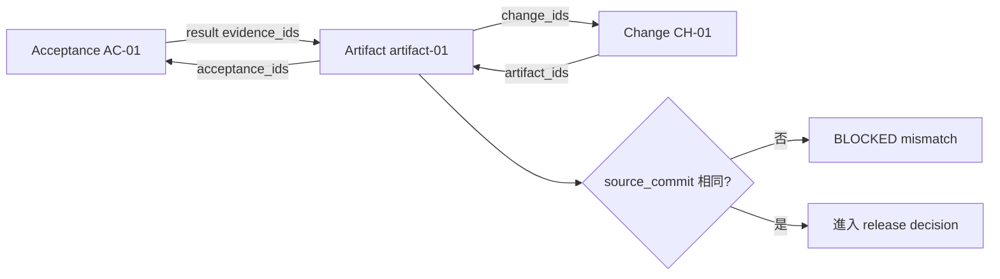
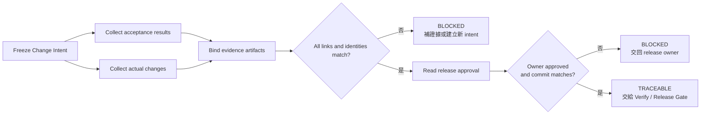

# Day 14｜驗收證據都齊了，真的能交付嗎？用 Traceability Gate 把需求、變更與發布決策串起來

> 本文是 2026 iThome 鐵人賽系列「不只會寫 Code：用 ChatGPT × Codex 打造企業級 AI 開發工作流」第 14 天。前一天的 Acceptance Coverage 已經確認每個 acceptance 都有通過結果與 evidence；今天再往前一步，確認這些 evidence、實際 change 與 release approval，真的屬於同一次工作。

## 影片版

本日影片會以官方 `claude-code-slides` 0.6.0、`claude-editorial` HTML deck 作為唯一視覺來源。每頁先獨立擷取成 1920×1080，再依 Fish Audio 實際旁白 duration 組成固定 25 fps 的 clean H.264/AAC MP4。字幕是獨立 UTF-8 SRT，不燒錄在畫面；影片、字幕與文章發布由後續 Release lane 處理，本機 Producer 不執行外部發布。

## 測試全綠，為什麼還不能直接交付？

想像團隊要發布一個「訂單匯出」功能。產品經理先列出三項 acceptance：

- AC-01：輸入合法資料時，服務會建立匯出工作。
- AC-02：缺少必要欄位時，服務會拒絕並回報原因。
- AC-03：同一個 request 重試時，不會建立第二個工作。

工程師跑完測試，終端機顯示 `11 tests ... OK`。這個結果很重要，但它只回答「這一批測試通過了」。如果準備發布時，才發現：

- AC-01 的測試是在 `abc1234` 執行的。
- AC-02 的 log 來自另一個 commit。
- review 看的是 `CH-02`，但這次 intent 宣告的是 `CH-01`。
- release approval 沒記錄 owner，也沒有 approval id。

每份資料單獨看都可能是真的，放在一起卻不能證明「這一次發布」是完整而且可回查的。這就是今天要補上的缺口。

Day 12 的 Evidence Binding 解決「diff、tests、review 是不是同一次工作產生的」；Day 13 的 Acceptance Coverage 解決「每個被承諾的 acceptance 是否都有 evidence」；Day 14 的 Traceability Gate 再把「需求、實際 change、artifact 與 release decision」串成一條責任鏈。

## Traceability Gate 是什麼？

可以把它想成出貨前的箱單核對：

- `intent` 是訂單，先寫清楚這次承諾什麼。
- `acceptance` 是客戶要求的規格，必須逐項有結果。
- `change` 是實際改了什麼，不能只看測試名稱猜測。
- `artifact` 是測試 log、diff、review 或 observation 等證據。
- `release approval` 是由誰確認可以進入下一個階段。

Traceability Gate 不會替團隊執行測試，也不會替任何人按下發布按鈕。它只做一件事：**把已經產生的資料逐項比對，遇到缺少、錯綁或版本漂移就 fail-closed。**

| 資料 | 白話問題 | 必要連結 |
| --- | --- | --- |
| `intent_id` | 這些資料是不是同一次工作？ | intent ↔ trace |
| `acceptance_ids` | 這次承諾哪些結果？ | intent ↔ acceptance result |
| `change_ids` | 實際變更是哪一件？ | intent ↔ change |
| `artifact_ids` | 哪份證據證明結果？ | result ↔ artifact |
| `source_commit` | 這些資料是不是同一版程式？ | intent ↔ artifact ↔ approval |
| `release_owner` | 誰負責做最後決定？ | intent ↔ approval |

## 先固定 Change Intent，不讓範圍在最後被改大

Traceability 必須從 intent 開始。最小的 intent 可以長這樣：

```json
{
  "intent_id": "intent-export-20260814-001",
  "context_id": "orders-export",
  "source_commit": "abc1234",
  "acceptance_ids": ["AC-01", "AC-02", "AC-03"],
  "change_ids": ["CH-01"],
  "release_owner": "release-owner"
}
```

這份資料先把「這一次要完成什麼」凍結下來。執行途中如果發現還要改 billing，就不能直接把 `CH-02` 偷塞進原本的陣列，讓 Gate 看起來通過；應該建立新的 intent，說明新增的範圍與責任人。

這裡有一個容易被忽略的差別：

- **補證據**：在同一個 intent 內，補上原本已經承諾但尚未產生的 evidence。
- **改承諾**：增加 acceptance、change 或 scope，代表工作內容變了，應建立新 intent。

如果把兩者混在一起，模型很容易為了讓報告變綠而修改輸入資料。Gate 應該只讀取資料，不替人類偷偷重寫承諾。

## 第一層：Acceptance 與 Evidence 要雙向連結

一份 trace bundle 的結果可以這樣表示：

```json
{
  "acceptance_results": [
    {"acceptance_id": "AC-01", "status": "passed", "evidence_ids": ["artifact-01"]},
    {"acceptance_id": "AC-02", "status": "passed", "evidence_ids": ["artifact-02"]},
    {"acceptance_id": "AC-03", "status": "passed", "evidence_ids": ["artifact-03"]}
  ],
  "artifacts": [
    {
      "artifact_id": "artifact-01",
      "kind": "test-log",
      "acceptance_ids": ["AC-01"],
      "change_ids": ["CH-01"]
    }
  ]
}
```

結果指向 artifact，artifact 也反向列出自己證明哪個 acceptance。兩邊都要檢查，才能抓到這種錯誤：

```text
AC-01 → artifact-02
artifact-02 → AC-02
```

如果只看第一條 link，報告可能會說 AC-01 有證據；但第二條 link 告訴我們，這份證據其實宣稱自己只負責 AC-02。這不是小小的欄位錯誤，而是責任鏈斷掉，應該回報：

```text
artifact_not_linked:AC-01:artifact-02
```

## 第二層：Change 與 Artifact 也要雙向連結

Acceptance 只回答「需求有沒有被證明」，還不能回答「這些證據屬於哪一個實際變更」。因此 change 也要有自己的 link：

```json
{
  "changes": [
    {
      "change_id": "CH-01",
      "artifact_ids": ["artifact-01", "artifact-02", "artifact-03"]
    }
  ]
}
```

artifact 的 metadata 則要反向列出：

```json
{
  "artifact_id": "artifact-01",
  "source_commit": "abc1234",
  "acceptance_ids": ["AC-01"],
  "change_ids": ["CH-01"]
}
```

這樣 Gate 才能回答兩個不同的問題：

1. `AC-01` 是否有證據？
2. `CH-01` 是否真的包含這份證據？

只做單向 link 的系統，常見結果是「報告看起來完整，但 review 或 diff 其實屬於另一個 change」。雙向 link 不會消除人為錯誤，但可以讓錯誤在交付前變成明確的 blocked reason。



> 圖 1｜Acceptance 與 Change 都指向同一份 artifact，artifact 再反向列回兩者；commit 不一致時立即阻擋。

## 第三層：Source Commit 是不可省略的身分

「這份測試曾經通過」和「這份測試證明目前這個版本」是兩句不同的話。Traceability Gate 至少要比較：

- intent 的 `source_commit`。
- trace bundle 的 `source_commit`。
- 每個 artifact 的 `source_commit`。
- release approval 的 `source_commit`。

只要其中一個不同，就不能把它包成同一次交付：

```text
source_commit_mismatch
artifact_source_commit_mismatch:artifact-02
release_source_commit_mismatch
```

這也是為什麼不能只用檔案名稱或時間戳配對。`test-log-latest.json` 可能被覆寫，時間也可能因為重跑而更新；commit 是比較接近「這份證據對應哪個程式版本」的身分欄位。

但 commit 也不是萬能。它不能證明環境、資料庫內容或外部服務狀態完全相同，所以它應該和 Day 10 的 Freshness Gate、Day 11 的 Change Budget、Day 12 的 Evidence Binding 一起使用，而不是取代它們。

## 第四層：Release Approval 是決策，不是測試結果

所有 acceptance 都通過，仍然不代表可以自動發布。Release approval 應該是一份明確的決策資料：

```json
{
  "status": "approved",
  "approved_by": "release-owner",
  "approval_id": "approval-20260814-001",
  "source_commit": "abc1234"
}
```

Gate 只檢查：

- `status` 是否為 `approved`。
- `approved_by` 是否等於 intent 宣告的 `release_owner`。
- approval 是否連到同一個 source commit。
- approval 是否有可回查的 `approval_id`。

Gate 不會把 `pending` 改成 `approved`，也不會因為測試全部通過就自動補一個 owner。這是重要的權限邊界：**驗證器可以判斷資料是否完整，但不能創造人類尚未做出的決策。**

## Traceability Gate 的流程



> 圖 2｜Traceability Gate 先檢查需求、變更與 evidence 的雙向關係，再檢查 release owner 的明確核准。

實作上可以分成四個狀態：

| 狀態 | 代表什麼 | 下一步 |
| --- | --- | --- |
| `DECLARED` | intent 已固定，但還沒有完整 trace | 收集 runner evidence |
| `COLLECTING` | 正在收集 acceptance、change 與 approval | 不能宣稱 ready |
| `TRACEABLE` | 所有 link、identity、approval 都通過 | 交給下一個 Gate |
| `BLOCKED_*` | 有明確缺口或 mismatch | 依 reason code 修復或重規劃 |

## 常見阻擋理由要能直接行動

### 1. `acceptance_missing`

intent 宣告 AC-03，但 trace 沒有 AC-03 的結果。下一步是補上屬於同一個 intent 與 commit 的 evidence；不是刪掉 intent 裡的 AC-03。

### 2. `change_missing`

intent 宣告 CH-01，但 trace 沒有這個 change。下一步是從 runner 或版本控制工具取得實際 change；如果工作根本沒有做 CH-01，就要回到人類重新規劃，而不是輸出一份空的 change。

### 3. `artifact_not_linked`

result 指到 artifact，但 artifact 沒有反向列回相同 acceptance。下一步是重建 trace bundle，保留舊資料供稽核，不要只在最後的 JSON 報告上改一個欄位。

### 4. `source_commit_mismatch`

證據和 intent 不是同一版程式。下一步是在目前 commit 重新產生 evidence；不能把舊 log 的 commit 欄位手動改成新 commit。

### 5. `release_not_approved`

資料鏈完整，但 release owner 尚未批准。下一步是等待或取得明確 approval；Traceability Gate 不能替代人類決策。

## Given／When／Then：把責任鏈變成驗收條件

```text
Given intent 宣告 AC-01、AC-02、AC-03 與 CH-01，
And 每個 acceptance 都有 passed result，
And 每份 artifact 都反向列出正確 acceptance 與 change，
And artifact、intent、approval 的 source_commit 都相同，
And release owner 已明確 approved，
When 執行 Traceability Gate，
Then 回報 allowed=true、state=traceable，才可交給 Verify 或 Release Gate。

Given intent 宣告 CH-01，但 trace 沒有該 change，
When 執行 Traceability Gate，
Then 回報 change_missing:CH-01。

Given AC-01 指向 artifact-02，但 artifact-02 只列出 AC-02，
When 執行 Traceability Gate，
Then 回報 artifact_not_linked:AC-01:artifact-02。

Given artifact 的 source_commit 與 intent 不同，
When 執行 Traceability Gate，
Then 回報 artifact_source_commit_mismatch:<artifact_id>。

Given release status 是 pending，
When 執行 Traceability Gate，
Then 回報 release_not_approved，不自行放行。

Given 相同 intent 與 trace bundle 重試兩次，
When 執行 Traceability Gate，
Then 兩次報告相同，輸入物件也不被修改。
```

## 搭配 GitHub 實作範例：唯讀 Traceability Gate

本日範例放在 [`day14/example-traceability-gate/`](https://github.com/rufushsu9987/ithome-ironman-2026-chatgpt-codex/tree/main/day14/example-traceability-gate)。它使用 Python 標準函式庫完成：

1. 驗證 intent、context、source commit 與 release owner 的共同身分。
2. 檢查每個 acceptance 是否有 passed result。
3. 檢查結果與 artifact 的雙向 acceptance link。
4. 檢查 change 與 artifact 的雙向 change link。
5. 檢查所有 artifact 與 release approval 的 commit 是否一致。
6. 以 deterministic reason code 回報缺口，不修改任何輸入。

在範例目錄執行：

```bash
cd day14/example-traceability-gate
python3 -m unittest -v
python3 -m py_compile traceability_gate.py test_traceability.py
python3 traceability_gate.py fixtures/intent.json fixtures/trace.json
```

成功 fixture 會回報：

```json
{
  "allowed": true,
  "state": "traceable",
  "reasons": []
}
```

實際測試結果與 fixture CLI 輸出會在本機 Media／artifact QA 紀錄中保存；這個範例本身不會替任何外部平台發布內容。

## ChatGPT、Codex 與人類怎麼分工？

| 角色 | 可以做什麼 | 不應自行決定 |
| --- | --- | --- |
| ChatGPT | 協助把需求整理成 acceptance、change 與可追溯資料欄位 | 把缺少的 link 猜成存在 |
| Codex | 在 intent 範圍內修改程式、執行測試並產生 evidence | 為了通過 Gate 修改舊 evidence 的 commit |
| Runner | 提供 diff、測試、review 與 observation 的原始資料 | 省略失敗結果或補造 approval |
| Traceability Gate | 做 identity、雙向 link 與 release approval 的一致比對 | 執行發布、替人類核准 |
| Release owner | 確認資料完整、承擔是否發布的責任 | 把沒有 evidence 的項目口頭當成通過 |

## 把前十四天串成一條責任鏈

```text
Day 2  需求 → Given／When／Then
  ↓
Day 3  Repository Context Pack：從同一份事實開始
  ↓
Day 4  Execution Contract：在最小權限與隔離工作樹中執行
  ↓
Day 5  Verify Matrix：測試、Diff 與交付證據分層
  ↓
Day 6  Deliver Pack：下一個人接得上
  ↓
Day 7  Release Gate：相依性、回滾與最終責任
  ↓
Day 8  Audit Trail／Incident Pack：追溯與復原事故
  ↓
Day 9  Learning Pack：把已驗證證據帶回下一次 Context
  ↓
Day 10 Freshness Gate：確認前提現在仍然有效
  ↓
Day 11 Change Budget：確認執行沒有範圍膨脹
  ↓
Day 12 Evidence Binding：確認證據屬於同一次工作
  ↓
Day 13 Acceptance Coverage：確認每個 acceptance 都有 evidence
  ↓
Day 14 Traceability Gate：確認需求、change 與 release decision 串得起來
  ↓
Verify → Deliver → Release
```

Acceptance Coverage 讓需求不漏；Traceability Gate 讓需求、實際變更與最後決策不脫鉤。兩者一起通過，才有資格把 immutable report 交給 Verify Matrix 或 Release Gate。

## GitHub 專案

| 資源 | 連結 |
| --- | --- |
| 系列 Repository | [ithome-ironman-2026-chatgpt-codex](https://github.com/rufushsu9987/ithome-ironman-2026-chatgpt-codex) |
| 本日文章原始檔 | [`day14/article.md`](https://github.com/rufushsu9987/ithome-ironman-2026-chatgpt-codex/blob/main/day14/article.md) |
| Traceability Gate 範例 | [`day14/example-traceability-gate/`](https://github.com/rufushsu9987/ithome-ironman-2026-chatgpt-codex/tree/main/day14/example-traceability-gate) |
| 流程圖原始檔 | [`day14/diagrams/traceability_gate_flow.mmd`](https://github.com/rufushsu9987/ithome-ironman-2026-chatgpt-codex/blob/main/day14/diagrams/traceability_gate_flow.mmd) |
| 狀態圖原始檔 | [`day14/diagrams/traceability_gate_states.mmd`](https://github.com/rufushsu9987/ithome-ironman-2026-chatgpt-codex/blob/main/day14/diagrams/traceability_gate_states.mmd) |
| 前一天 Day 13 | [Acceptance Coverage](./../day13/article.md) |

## 今日小結

- 測試全綠只能證明執行過的測試通過，不能自動證明證據屬於這一次 change。
- Traceability Gate 先固定 intent，再逐項核對 acceptance、change、artifact 與 release approval。
- Acceptance result 與 artifact、change 與 artifact 都要雙向連結，避免單向錯接。
- source commit 是重要的 identity；版本不一致時要重新產生 evidence，不要手改舊證據。
- release approval 是人類決策，Gate 只能驗證，不會自動核准或發布。
- 缺少、失敗、錯綁、commit 漂移與 approval 不完整，都要用具體 reason code fail-closed。

---

> 本文與範例的驗證命令均可在本機重跑；公開發布、YouTube 字幕與 GitHub 同步由後續 Release lane 依 checkpoint 執行。
