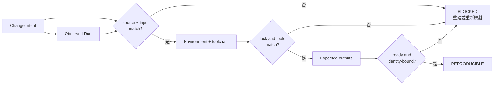
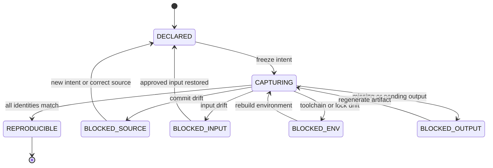

# Day 15｜需求、變更都串起來了，明天還能重現嗎？用 Reproducibility Gate 鎖住環境與輸入

> 本文是 2026 iThome 鐵人賽系列「不只會寫 Code：用 ChatGPT × Codex 打造企業級 AI 開發工作流」第 15 天。前一天的 Traceability Gate 已經把需求、實際變更、證據與發布決策串起來；今天再補上「明天能不能重跑」這一段。

## 影片版

本日影片使用官方 `claude-code-slides` 0.6.0、`claude-editorial` HTML deck 作為唯一視覺來源。每頁先獨立擷取成 1920×1080，再依 Fish Audio 實際旁白 duration 組成固定 25 fps 的 clean H.264/AAC MP4。字幕是獨立 UTF-8 SRT，不燒錄在畫面；影片、字幕與文章發布由後續 Release lane 處理，本機 Producer 不執行外部發布。

## 昨天成功，為什麼今天重跑還是可能失敗？

想像團隊昨天完成一個「訂單匯出」功能：測試全綠、review 通過、release owner 也批准了。今天另一位工程師想重跑同一批檢查，卻遇到：

- 昨天用的是 `abc1234`，今天工作樹已經換到另一個 commit。
- 輸入檔案名稱一樣，但內容已被換成另一批訂單。
- Python 版本不同，某個排序行為改變了。
- dependency lock 沒有被保存，今天安裝到的套件版本不一樣。
- 最後的 report 檔案存在，卻是另一個 run 產出的舊檔案。

每一項都可能只是一個小差異，但它們足以讓「昨天的成功」不能代表「今天可以重現」。

這就像食譜寫著「煮過一鍋湯」，卻沒有留下食材批次、火力、調味比例與鍋具。你知道曾經成功，但不一定能煮出同一鍋。

Day 14 的 Traceability Gate 解決的是「這些需求、change、artifact 與 approval 是否屬於同一條責任鏈」；Day 15 的 Reproducibility Gate 再確認「這條鏈是否能在相同前提下重新走一次」。兩個問題不同，不能互相取代。

## Traceable 和 Reproducible 差在哪裡？

可以先用兩句白話分開：

- **Traceable（可追溯）**：我能回頭說明這份結果從哪個 intent、change、artifact 與 approval 來。
- **Reproducible（可重現）**：我能在被宣告的 source、input 與 environment 下重新取得同樣可驗證的結果。

| 問題 | Traceability Gate | Reproducibility Gate |
| --- | --- | --- |
| 主要追問 | 這些資料是不是同一次工作？ | 明天能不能用同樣前提重跑？ |
| 核心 identity | intent、acceptance、change、artifact、approval | source、input digest、environment、toolchain、lock、output |
| 常見錯誤 | evidence 接錯 change | 版本、輸入或環境漂移 |
| Gate 的動作 | 做責任鏈一致性比對 | 做重現前提與輸出一致性比對 |
| 不會做的事 | 不替人類批准發布 | 不替人類安裝環境或修改輸入 |

Reproducibility Gate 不是把所有環境細節都塞進一個巨大 JSON。它要做的是先固定最會影響結果的身分，再讓 runner 把實際觀察到的資料帶回來。

## 先固定 Change Intent：這次到底要重現什麼？

一份最小 intent 可以先寫下五類資料：

```json
{
  "intent_id": "intent-export-20260815-001",
  "context_id": "orders-export",
  "source_commit": "abc1234",
  "input_digest": "sha256:orders-input-v1",
  "environment_id": "env-python311",
  "toolchain": {
    "python": "3.11",
    "runner": "codex-runner-1"
  },
  "dependencies_lock_digest": "sha256:lock-v3",
  "expected_outputs": ["trace.json", "report.json"]
}
```

這裡的 `input_digest` 是輸入內容的摘要，不是檔名。檔名可以不變，內容卻可能已經改過；摘要不同，就應該視為不同輸入。

`environment_id` 也不是一句「在本機執行」。它應該指向團隊定義過的環境描述，例如 Python 版本、作業系統基線、必要服務與設定來源。它不必把秘密寫進證據，但要能讓下一個人知道應該找哪一個環境定義。

同樣地，`dependencies_lock_digest` 不是把整個 lock file 貼到報告，而是留下可比對的版本身分。沒有 lock，重跑時就可能「自動取得最新版」，結果當然不再是同一個實驗。

## Run record：只看宣告不夠，還要看實際觀察

Intent 是工作開始前的承諾；run record 是執行後的觀察。最少要能回答：

1. 這次 run 對應哪個 intent？
2. 實際用的 source、input、environment、toolchain 與 lock 是什麼？
3. 產出的每一份 artifact 是否屬於同一組 identity？
4. 每一份預期輸出是否真的完成，而不是只留下舊檔案？

例如成功的輸出可以長這樣：

```json
{
  "run_id": "run-export-20260815-001",
  "intent_id": "intent-export-20260815-001",
  "source_commit": "abc1234",
  "input_digest": "sha256:orders-input-v1",
  "environment_id": "env-python311",
  "dependencies_lock_digest": "sha256:lock-v3",
  "outputs": [
    {
      "output_id": "trace.json",
      "status": "ready",
      "source_commit": "abc1234",
      "input_digest": "sha256:orders-input-v1",
      "environment_id": "env-python311",
      "artifact_digest": "sha256:trace-v1"
    },
    {
      "output_id": "report.json",
      "status": "ready",
      "source_commit": "abc1234",
      "input_digest": "sha256:orders-input-v1",
      "environment_id": "env-python311",
      "artifact_digest": "sha256:report-v1"
    }
  ]
}
```

重點不是欄位越多越好，而是每份 output 都要把自己綁回 source、input 與 environment。否則 `report.json` 可能只是資料夾裡剛好留下的舊檔案。

## 第一層：Source 與 input identity 必須相同

最容易發生的錯誤，是把「程式版本一樣」誤當成「重現條件一樣」。至少要同時檢查：

- `intent.source_commit` 與 `run.source_commit`。
- `intent.input_digest` 與 `run.input_digest`。
- 每個 output 的 `source_commit` 與 `input_digest`。

只要其中一個不同，就應該停止，而不是用檔名、時間或「看起來差不多」補配對：

```text
source_commit_mismatch
input_digest_mismatch
output_input_digest_mismatch:report.json
```

這也是為什麼應該在 run 開始時就計算輸入摘要。等到結果出現才想回頭比對，常常已經找不到原始輸入。

> 圖 1｜Reproducibility Gate 先固定工作身分，再逐層比對環境與輸出；任何 identity 漂移都回到 BLOCKED。



## 第二層：Toolchain 與 dependency lock 要逐項比對

「都是 Python」不是足夠的環境描述。小版本、runner 版本、編碼器或資料庫 client 都可能改變結果。範例 Gate 先採取保守規則：intent 宣告的 toolchain key 必須在 run 出現，而且值必須完全相同。

```json
"toolchain": {
  "python": "3.11",
  "runner": "codex-runner-1"
}
```

如果 run 帶回 `python: 3.12`，應回報：

```text
toolchain_mismatch:python
```

依賴版本則用 lock digest 比對。這裡不是說所有 lock 都要永遠不變，而是**每一次 intent 都要清楚知道自己依賴哪一份 lock**。如果要升級套件，應建立新的 intent 或明確更新承諾，不能在同一個 run 裡偷偷換掉環境。

這和 Day 10 的 Freshness Gate 有關：Freshness Gate 問的是 Context 或規則現在還新不新；本日則把「可重跑所需的執行前提」也固定下來。前提變了，就不能把舊結果直接搬過來。

## 第三層：Expected output 必須真的完成

有些流程會先建立空檔案，再慢慢寫入內容。只檢查「檔案存在」不夠，至少要檢查：

- `output_id` 是否在 intent 的 `expected_outputs` 裡。
- `status` 是否為 `ready`，不是 `pending` 或 `failed`。
- artifact digest 是否存在。
- output 的 source、input、environment 是否與 run 一致。
- 是否出現 intent 沒有宣告的未知輸出。

常見阻擋理由可以直接告訴下一個人要做什麼：

| Reason code | 白話意思 | 下一步 |
| --- | --- | --- |
| `output_missing:report.json` | 預期報告沒有回來 | 重新執行產出階段 |
| `output_not_ready:report.json` | 有檔案但尚未完成 | 等待或修復產出流程 |
| `output_unknown:debug.log` | run 帶回未宣告的輸出 | 回到 intent 確認範圍 |
| `output_environment_mismatch:trace.json` | 證據在另一環境產生 | 在宣告環境重新產生 |

Gate 不會因為資料夾裡「有一個 report」就自動選它，也不會為了讓結果變綠而把 output 加進 expected list。這兩個動作都會把責任鏈改掉，應由人類重新規劃。

## 第四層：狀態要能停在明確位置

Reproducibility Gate 可以採用幾個簡單狀態：

| 狀態 | 代表什麼 | 可以做什麼 |
| --- | --- | --- |
| `DECLARED` | intent 已固定 | 開始收集執行證據 |
| `CAPTURING` | runner 正在記錄實際前提 | 不能宣稱可重現 |
| `REPRODUCIBLE` | identity、環境與輸出都一致 | 交給 Traceability／Verify |
| `BLOCKED_SOURCE` | source commit 漂移 | 重新規劃或在正確版本重跑 |
| `BLOCKED_INPUT` | 輸入摘要不同 | 找回核准輸入或建立新 intent |
| `BLOCKED_ENV` | toolchain／lock 不同 | 重建宣告的環境 |
| `BLOCKED_OUTPUT` | output 缺少或未完成 | 重新產生 evidence |

每個 blocked 狀態都應該保留原始觀察，讓下一個人知道為什麼停住。不要只把結果改成 `blocked` 而刪掉 mismatch details；那會讓 Gate 失去可操作性。

> 圖 2｜狀態圖把 source、input、環境與 output 的不同缺口分開，修復時重新收集證據，不覆寫舊 run。



## Runnable example：一個唯讀的 Reproducibility Gate

本日範例放在 [`day15/example-reproducibility-gate/`](https://github.com/rufushsu9987/ithome-ironman-2026-chatgpt-codex/tree/main/day15/example-reproducibility-gate)。它使用 Python 標準函式庫完成五件事：

1. 檢查 intent 與 run 的 context、source、input、environment、toolchain、lock。
2. 檢查每個 expected output 是否存在、ready，且 identity 能反向對上。
3. 回報 `source_commit_mismatch`、`input_digest_mismatch`、`toolchain_mismatch:*`、`output_missing:*` 等 deterministic reason code。
4. 對未知 output 也 fail-closed，不讓資料夾裡多出的檔案被默默納入。
5. 以 deep copy 回傳報告，測試相同輸入重跑時不修改原始物件。

在範例目錄執行：

```bash
cd day15/example-reproducibility-gate
python3 -m unittest -v
python3 -m py_compile reproducibility_gate.py test_reproducibility.py
python3 reproducibility_gate.py fixtures/intent.json fixtures/run.json
```

成功 fixture 會回報：

```json
{
  "allowed": true,
  "state": "reproducible",
  "reasons": []
}
```

若把 Python 版本改成 `3.12`，Gate 不會猜測「應該沒差」，而會明確回報 `toolchain_mismatch:python`。若刪掉 `report.json`，則回報 `output_missing:report.json`。這些 reason code 才是下一步的工作清單。

## Given／When／Then：把「明天能重跑」變成驗收條件

```text
Given intent 與 run 的 source、input、environment、toolchain、lock 都一致，
And 每個 expected output 都是 ready 且帶回相同 identity，
When 執行 Reproducibility Gate，
Then 回報 allowed=true、state=reproducible。

Given run 使用另一個 source commit，
When 執行 Reproducibility Gate，
Then 回報 source_commit_mismatch，不把舊 evidence 當成新版本結果。

Given input digest 不同，
When 執行 Reproducibility Gate，
Then 回報 input_digest_mismatch，不以檔名相同代替內容相同。

Given toolchain 或 dependency lock 不同，
When 執行 Reproducibility Gate，
Then 回報對應 mismatch reason，要求在宣告環境重跑。

Given expected output 缺少、狀態不是 ready，或出現未宣告 output，
When 執行 Reproducibility Gate，
Then 回報 output_missing、output_not_ready 或 output_unknown。

Given相同 intent 與 run 重試兩次，
When執行 Reproducibility Gate，
Then兩次報告相同，而且輸入物件沒有被修改。
```

## ChatGPT、Codex 與人類怎麼分工？

| 角色 | 可以做什麼 | 不應自行決定 |
| --- | --- | --- |
| ChatGPT | 把「明天能不能重跑」拆成 source、input、environment 與 output acceptance | 把沒有保存的環境細節猜成已存在 |
| Codex | 在 intent 範圍內修改程式、鎖定依賴、執行測試並收集 run evidence | 為了通過 Gate 手改 digest 或舊報告 |
| Runner | 回報實際 commit、輸入摘要、toolchain、lock 與 artifact | 省略失敗的 output 或自行擴大 expected list |
| Reproducibility Gate | 做前提與輸出一致性比對，產生 deterministic reason code | 安裝環境、修改輸入、替人類批准 |
| Release owner | 判斷 evidence 是否足以進入下一個交付階段 | 把 blocked 口頭當成 reproducible |

## 把 Day 10–15 串成可回查的執行鏈

```text
Day 10 Freshness Gate：前提與規則現在仍然有效
  ↓
Day 11 Change Budget：執行範圍沒有膨脹
  ↓
Day 12 Evidence Binding：證據屬於同一次 intent 與 observation
  ↓
Day 13 Acceptance Coverage：每個 acceptance 都有 evidence
  ↓
Day 14 Traceability Gate：需求、change 與 release decision 串得起來
  ↓
Day 15 Reproducibility Gate：source、input、環境與 output 明天仍能重跑
  ↓
Verify → Deliver → Release
```

這條鏈不是要求每個專案都建立大型平台，而是要求每一次交付都能回答幾個基本問題：

- 我現在驗證的是哪一版程式？
- 我用的是哪一批輸入？
- 我在哪一個環境和 dependency lock 下執行？
- 產出的每份 artifact 是否真的屬於這次 run？
- 如果失敗，下一個人要補哪一份證據？

回答得出來，才是可以交接的自動化；回答不出來，就算終端機曾經顯示綠色，也只是一次無法重建的偶然成功。

## GitHub 專案

| 資源 | 連結 |
| --- | --- |
| 系列 Repository | [ithome-ironman-2026-chatgpt-codex](https://github.com/rufushsu9987/ithome-ironman-2026-chatgpt-codex) |
| 本日文章原始檔 | [`day15/article.md`](https://github.com/rufushsu9987/ithome-ironman-2026-chatgpt-codex/blob/main/day15/article.md) |
| Reproducibility Gate 範例 | [`day15/example-reproducibility-gate/`](https://github.com/rufushsu9987/ithome-ironman-2026-chatgpt-codex/tree/main/day15/example-reproducibility-gate) |
| 流程圖原始檔 | [`day15/diagrams/reproducibility_gate_flow.mmd`](https://github.com/rufushsu9987/ithome-ironman-2026-chatgpt-codex/blob/main/day15/diagrams/reproducibility_gate_flow.mmd) |
| 狀態圖原始檔 | [`day15/diagrams/reproducibility_states.mmd`](https://github.com/rufushsu9987/ithome-ironman-2026-chatgpt-codex/blob/main/day15/diagrams/reproducibility_states.mmd) |
| 前一天 Day 14 | [Traceability Gate](./../day14/article.md) |

## 今日小結

- Traceability Gate 說明證據的責任鏈；Reproducibility Gate 說明同一組前提能否重新得到可驗證結果。
- source commit、input digest、environment、toolchain 與 dependency lock 都是重現身分的一部分。
- 每個 expected output 都要 ready，並反向帶回相同 identity；資料夾裡剛好存在的舊檔案不能算證據。
- Gate 是唯讀、deterministic、fail-closed 的檢查器，不安裝環境、不修改輸入、不替人類批准。
- reason code 應該直接告訴下一個人要補哪一份證據、在哪一個環境重跑，或是否要建立新的 intent。

---

> 本文與範例的驗證命令均可在本機重跑；公開發布、YouTube 字幕與 GitHub 同步由後續 Release lane 依 checkpoint 執行。
