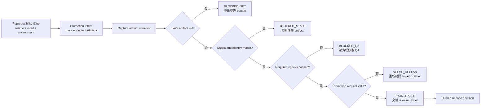
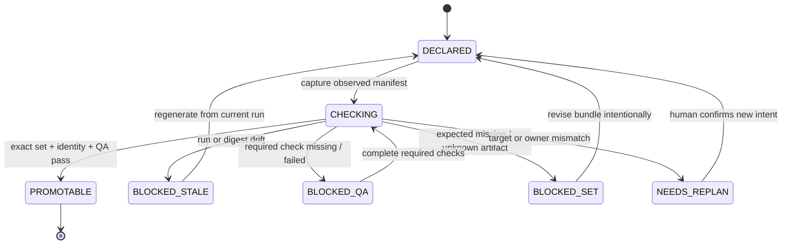

# Day 16｜重現成功就能直接交付嗎？用 Artifact Promotion Gate 擋住錯誤產物

> 本文是 2026 iThome 鐵人賽系列「不只會寫 Code：用 ChatGPT × Codex 打造企業級 AI 開發工作流」第 16 天。前一天的 Reproducibility Gate 已經確認同一組前提可以重跑；今天再補上「這批產物能不能安全送進下一階段」。

## 影片版

本日影片使用官方 `claude-code-slides` 0.6.0、`claude-editorial` HTML deck 作為唯一視覺來源。每頁先獨立擷取成 1920×1080，再依 Fish Audio 實際旁白 duration 組成固定 25 fps 的 clean H.264/AAC MP4。字幕是獨立 UTF-8 SRT，不燒錄在畫面；影片、字幕與文章發布由後續 Release lane 處理，本機 Producer 不執行外部發布。

## Reproducible，為什麼還不能直接交付？

想像團隊昨天完成一個「訂單匯出」功能。測試全綠、review 通過，Reproducibility Gate 也確認同一個 source commit、輸入摘要、Python 版本與 dependency lock 可以重新跑一次。

今天準備把結果送到 `release-candidate` 時，工程師在輸出資料夾看到兩份檔案：

- `export-bundle.tgz` 是這次 run 產生的，但只完成基本完整性檢查。
- `verification-report.json` 看起來名稱正確，實際上卻是前一次 run 留下的舊檔案。

如果流程只檢查「檔案存在」或「測試曾經通過」，這兩份檔案可能被一起往前推。結果不是同一個 run 的完整交付物，卻被包裝成一個 bundle。

這就是本日要處理的問題：**重現成功，證明的是前提可以重新走一次；Artifact Promotion Gate 要再確認，準備晉級的每一份產物都屬於同一個 run，且必要檢查真的完成。**

## Promotion 不是複製檔案，而是一次可驗證的提案

「Promotion」可以先理解成把一批已驗證產物，交給下一個交付階段使用。它不必等同於部署，也不一定代表公開發布。這一層先做的是安全檢查：

| 問題 | 只看檔案存在 | Artifact Promotion Gate |
| --- | --- | --- |
| 這份檔案是哪次 run 產生？ | 通常不知道 | `produced_by_run` 必須對上 |
| 檔案內容是否是宣告的版本？ | 只看名稱很容易誤判 | 比對 `artifact_digest` |
| 必要 QA 是否完成？ | 可能把 `pending` 當完成 | 每個 required check 都要是 `passed` |
| bundle 是否剛好是這次宣告的集合？ | 從資料夾猜測 | 缺少或多出都阻擋 |
| 是否已經發布？ | 容易誤解 | Gate 只回報可晉級，不執行 promotion |

這裡有一個重要的責任邊界：Gate 是驗證器，不是搬檔工具，也不是發布按鈕。它可以回報 `allowed=true`，但最後仍由 release owner 決定是否進入下一階段。

## 先建立 Promotion Intent：這次準備送什麼？

在 runner 開始收集產物前，先建立一份小而明確的 `Promotion Intent`。它至少要固定：

- `intent_id`：這次工作的身分。
- `run_id`：預期產生這批 artifact 的 run。
- `source_commit`：程式版本。
- `input_digest`：輸入內容摘要，而不是輸入檔名。
- `environment_id`：產生結果的環境身分。
- `target`：準備送往哪個階段，例如 `release-candidate`。
- `owner`：負責做 promotion decision 的人或團隊。
- `expected_artifacts`：預期有哪些 artifact，以及每一份需要完成哪些檢查。

一份最小宣告可以長這樣：

```json
{
  "intent_id": "intent-export-20260816-001",
  "run_id": "run-export-20260816-001",
  "source_commit": "abc1234",
  "input_digest": "sha256:orders-input-v1",
  "environment_id": "env-python311",
  "target": "release-candidate",
  "owner": "release-owner",
  "expected_artifacts": [
    {
      "artifact_id": "export-bundle.tgz",
      "artifact_digest": "sha256:bundle-v1",
      "required_checks": ["integrity", "compatibility"]
    },
    {
      "artifact_id": "verification-report.json",
      "artifact_digest": "sha256:report-v1",
      "required_checks": ["schema", "source_match"]
    }
  ]
}
```

這份 Intent 不需要把整個 artifact 內容塞進 JSON。它要固定的是「哪一批東西」、「來自哪次 run」、「應該長什麼身分」，讓 runner 回報時能逐項比對。

## Artifact Identity：不要相信檔名，要相信身分

每一份觀察到的 artifact，都應該帶回至少六種資料：

```json
{
  "artifact_id": "verification-report.json",
  "status": "ready",
  "artifact_digest": "sha256:report-v1",
  "produced_by_run": "run-export-20260816-001",
  "source_commit": "abc1234",
  "input_digest": "sha256:orders-input-v1",
  "environment_id": "env-python311"
}
```

這裡的 `artifact_digest` 是內容身分，`produced_by_run` 是來源身分。兩者缺一不可：

- 只有 digest，可能拿到另一個 run 產生、但內容剛好相同的檔案。
- 只有 run，可能產生過同一個檔名的多個版本，卻不知道現在指的是哪一個內容。
- source、input 或 environment 不同，即使檔名與格式一樣，也不能直接當成同一份 evidence。

因此 Gate 不會在資料夾裡搜尋最接近的檔案，也不會按照時間選最新檔案。找不到精確對應的 identity，就停下來。

## Exact Set：缺一份或多一份都要說清楚

Artifact bundle 需要「精確集合」概念。Intent 宣告兩份輸出，觀察結果就必須：

1. 兩份都存在。
2. 兩份都在 `ready` 狀態。
3. 兩份的 identity 都與目前 run 相同。
4. 沒有多出未宣告的 artifact。

為什麼多一份也要擋？因為多出的 `debug.log`、臨時報告或上一輪產物，可能在後續流程被誤當成正式交付物。未知輸出不一定是惡意資料，但它代表目前的 Intent 沒有涵蓋真實 bundle，應該回到規劃階段確認。

這個判斷可以用流程表示：



> 圖 1｜Artifact Promotion Gate 依序檢查產物集合、identity、必要 QA 與 promotion request，通過後只交給 release owner，不直接發布。

## Required Checks：Skipped 不是通過

每一份 artifact 都可以有自己的檢查清單。例如：

| Artifact | Required check | `passed` 代表什麼 |
| --- | --- | --- |
| `export-bundle.tgz` | `integrity` | 壓縮檔與內容摘要可讀且一致 |
| `export-bundle.tgz` | `compatibility` | 目標環境能讀取這個 bundle |
| `verification-report.json` | `schema` | 報告符合既定資料結構 |
| `verification-report.json` | `source_match` | 報告指向目前宣告的 source commit |

Gate 只接受 `passed`。以下狀態都要阻擋：

- `pending`：檢查還沒完成。
- `failed`：檢查明確失敗。
- `skipped`：有人沒有執行檢查。
- 缺少欄位：runner 沒有回報這一項。

這個規則看起來保守，但它避免「整批大多數檢查通過，所以先送出去」的模糊判斷。對下一個交付階段來說，缺一個必要檢查，就不能宣稱整批產物可晉級。

## Runnable example：一個唯讀的 Promotion Gate

本日範例放在 [`day16/example-artifact-promotion-gate/`](https://github.com/rufushsu9987/ithome-ironman-2026-chatgpt-codex/tree/main/day16/example-artifact-promotion-gate)。它使用 Python 標準函式庫完成幾件事：

1. 檢查 intent 與 observation 的 `intent_id`、`run_id`、source、input 與 environment。
2. 檢查 expected artifact 是否完整，拒絕缺少或未知的輸出。
3. 檢查每份 artifact 的 digest 與 `produced_by_run`。
4. 逐項檢查 required checks，只接受 `passed`。
5. 檢查 promotion target 與 owner，不替人類補填或放寬。
6. 回傳 deterministic reason code，而且不修改輸入物件。

在範例目錄執行：

```bash
cd day16/example-artifact-promotion-gate
python3 -m unittest -v
python3 -m py_compile artifact_promotion_gate.py test_artifact_promotion.py
python3 artifact_promotion_gate.py fixtures/intent.json fixtures/observation.json
```

成功 fixture 會回報：

```json
{
  "allowed": true,
  "state": "promotable",
  "reasons": []
}
```

如果把 `produced_by_run` 換成舊 run，會得到：

```text
artifact_run_mismatch:export-bundle.tgz
```

如果把 compatibility 改成 `skipped`，會得到：

```text
artifact_check_not_passed:export-bundle.tgz:compatibility
```

這些 reason code 不是給人看的裝飾，而是下一步的工作清單：重新產生哪一份 artifact、補哪一項 check，或回到 Intent 重新確認集合。

## 狀態設計：Promotion Gate 要能停在正確位置

Artifact Promotion Gate 可以採用幾個簡單狀態：

| 狀態 | 代表什麼 | 下一步 |
| --- | --- | --- |
| `DECLARED` | promotion intent 已固定 | 開始收集 observation |
| `CHECKING` | 正在逐項比對 bundle | 不能宣稱可晉級 |
| `PROMOTABLE` | 精確集合、identity、QA 與 request 都通過 | 交給 release owner |
| `BLOCKED_STALE` | run、digest 或版本漂移 | 從正確 run 重新產生 |
| `BLOCKED_QA` | 必要檢查缺少、失敗或 skipped | 補齊檢查後重新驗證 |
| `BLOCKED_SET` | 缺少或多出 artifact | 重新整理 bundle 或建立新 intent |
| `NEEDS_REPLAN` | target 或 owner 不符合宣告 | 由人類確認新的 promotion intent |



> 圖 2｜狀態圖把「版本舊了」、「QA 不完整」、「集合不符」與「需要重新規劃」分開，讓修復動作不會被一句模糊的 blocked 蓋掉。

每個 blocked 狀態都應該保留原始 observation。不要為了讓報告變乾淨而刪掉 mismatch details，也不要直接修改舊 run 的 digest。修復應該產生新的 observation 或新的 intent，保留前一次判斷的歷史。

## ChatGPT、Codex 與人類怎麼分工？

| 角色 | 可以做什麼 | 不應自行決定 |
| --- | --- | --- |
| ChatGPT | 把「能不能晉級」拆成 identity、exact set、QA 與 owner 條件 | 把資料夾裡的舊檔案猜成這次產物 |
| Codex | 在 intent 範圍內實作、測試、產生 artifact 與 observation | 為了放行而手改 digest、狀態或 expected list |
| Runner | 回報真實 run、artifact identity 與檢查結果 | 省略 failed／skipped check 或自行擴大 bundle |
| Artifact Promotion Gate | 唯讀比對 bundle，產生 deterministic reason code | 複製檔案、修改輸出、替人類發布 |
| Release owner | 判斷 `promotable` bundle 是否要進入下一階段 | 把 blocked 口頭改稱為 ready |

這個分工讓「檢查通過」與「執行發布」保持距離。即使 Gate 回報 `allowed=true`，下一步仍然是把完整 evidence 交給負責人，而不是讓驗證器偷偷取得寫入權限。

## 把 Day 10–16 串成一條證據鏈

到 Day 15 為止，我們確認了「前提新鮮、範圍受控、證據綁定、需求覆蓋、責任鏈完整，而且可以重現」。Day 16 再加上「準備晉級的 artifact bundle 沒有混入錯誤產物」：

```text
Day 10 Freshness Gate：前提與規則現在仍然有效
  ↓
Day 11 Change Budget：執行範圍沒有膨脹
  ↓
Day 12 Evidence Binding：證據屬於同一次 intent 與 observation
  ↓
Day 13 Acceptance Coverage：每個 acceptance 都有 evidence
  ↓
Day 14 Traceability Gate：需求、change 與 release decision 串得起來
  ↓
Day 15 Reproducibility Gate：source、input、環境與 output 明天仍能重跑
  ↓
Day 16 Artifact Promotion Gate：準備晉級的 bundle 精確、完整、屬於同一個 run
  ↓
Verify → Deliver → Human Release Decision
```

這條鏈不是要求每個團隊立刻建造大型平台，而是要求每一次交付都能回答：

- 我現在驗證的是哪一次 run？
- 這批 artifact 是否剛好是 Intent 宣告的集合？
- 每份 artifact 的內容與來源身分是否一致？
- 必要 QA 是否真的完成，而不是 skipped？
- `promotable` 之後，誰負責做最後 decision？

如果回答不出來，就算上一個 Gate 曾經回報成功，也不應把產物自動送往下一站。

## GitHub 專案

| 資源 | 連結 |
| --- | --- |
| 系列 Repository | [ithome-ironman-2026-chatgpt-codex](https://github.com/rufushsu9987/ithome-ironman-2026-chatgpt-codex) |
| 本日文章原始檔 | [`day16/article.md`](https://github.com/rufushsu9987/ithome-ironman-2026-chatgpt-codex/blob/main/day16/article.md) |
| Artifact Promotion Gate 範例 | [`day16/example-artifact-promotion-gate/`](https://github.com/rufushsu9987/ithome-ironman-2026-chatgpt-codex/tree/main/day16/example-artifact-promotion-gate) |
| 流程圖原始檔 | [`day16/diagrams/artifact_promotion_flow.mmd`](https://github.com/rufushsu9987/ithome-ironman-2026-chatgpt-codex/blob/main/day16/diagrams/artifact_promotion_flow.mmd) |
| 狀態圖原始檔 | [`day16/diagrams/artifact_promotion_states.mmd`](https://github.com/rufushsu9987/ithome-ironman-2026-chatgpt-codex/blob/main/day16/diagrams/artifact_promotion_states.mmd) |
| 前一天 Day 15 | [Reproducibility Gate](./../day15/article.md) |

## 今日小結

- Reproducibility Gate 證明同一組前提可以重跑；Artifact Promotion Gate 再證明準備晉級的 bundle 沒有混入舊或未知產物。
- `run_id`、source commit、input digest、environment、artifact digest 與 required checks 要一起比對。
- expected artifact 缺少、未知、pending、failed 或 skipped，都要 fail-closed。
- Gate 是唯讀、deterministic 的檢查器，不複製檔案、不修改 digest、不替人類發布。
- `promotable` 只代表可以交給 release owner，並不代表已經 promotion、部署或公開上線。

---

> 本文與範例的驗證命令均可在本機重跑；公開發布、YouTube 字幕與 GitHub 同步由後續 Release lane 依 checkpoint 執行。
