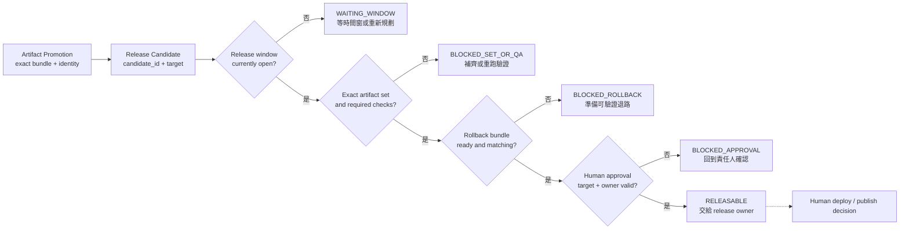
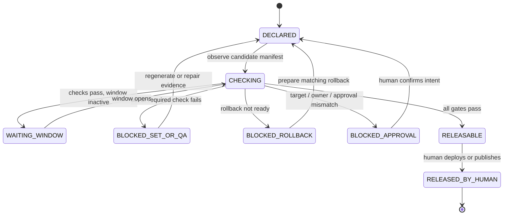

# Day 17｜Artifact 可以晉級，真的能安全發布嗎？用 Release Candidate Gate 鎖住最後一哩

> 本文是 2026 iThome 鐵人賽系列「不只會寫 Code：用 ChatGPT × Codex 打造企業級 AI 開發工作流」第 17 天。前一天的 Artifact Promotion Gate 已經確認 bundle 精確、完整，而且屬於同一個 run；今天再往前補上「發布前還要確認什麼」。

## 影片版

本日影片使用官方 `claude-code-slides` 0.6.0、`claude-editorial` HTML deck 作為唯一視覺來源。每張投影片先獨立擷取成 1920×1080，再依 Fish Audio 實際旁白 duration 組成固定 25 fps 的 clean H.264/AAC MP4。字幕是獨立 UTF-8 SRT，不燒錄在畫面；影片、字幕與文章發布由後續 Release lane 處理，本機 Producer 不執行外部發布。

## Bundle 都 ready 了，為什麼還不能發布？

想像一個很常見的情境：團隊剛完成訂單匯出服務，昨天用 Artifact Promotion Gate 檢查過，bundle 裡的檔案都屬於同一個 run，digest 也完全一致。大家看著綠色結果，很自然地說：「那就發布吧。」

但 release owner 打開發布清單後，還會問幾個不同的問題：

- 這個 candidate 要送到 staging、production，還是另一個 target？
- 現在是不是核准的 release window？如果時間窗已經關閉，是否要重新取得批准？
- smoke test、相容性檢查與 migration dry run 都真的完成了嗎？
- 發布失敗時，rollback bundle 是否存在，而且跟這次 candidate 配對？
- 這次由哪一位 release owner 對哪一個 target 做最後決定？

如果只看「artifact 都 ready」，就可能把正確的檔案送到錯誤的環境，或在沒有退路的情況下切換流量。**Artifact Promotion 解決的是「這批產物能不能往前交接」；Release Candidate Gate 解決的是「這個 candidate 是否具備進入發布決策的條件」。**

## Promotion 和 Release Candidate 是兩個不同閘門

可以先用白話分開：

- **Artifact Promotion Gate**：確認一批 artifact 的集合、來源、digest、狀態與必要檢查都對得上。
- **Release Candidate Gate**：確認這批已驗證 artifact 要送往哪裡、何時送、如何退回，以及誰有最後核准權。

| 問題 | Artifact Promotion Gate | Release Candidate Gate |
| --- | --- | --- |
| 主要追問 | 這批 artifact 是不是同一個 run 的完整集合？ | 這個 candidate 現在是否具備發布決策條件？ |
| 核心 identity | run、source、input、environment、artifact digest | candidate、target、release window、rollback、approval |
| 主要風險 | 混入舊檔、未知檔案或未完成 QA | 發錯環境、錯過時間窗、沒有退路或責任不清 |
| Gate 結果 | `promotable` 或 `blocked` | `releasable` 或 `blocked` |
| 不會做的事 | 不複製檔案、不發布 | 不部署、不切流量、不替人類按下發布 |

這個分層很重要。若把所有事情塞進一個巨大 Gate，最後很難知道是 artifact 本身有問題，還是發布決策的前提沒有準備好。小而清楚的 Gate，才能把失敗原因交給正確的人處理。

## 先固定 Release Candidate 的身分

Release Candidate 不是資料夾名稱，也不是某個「最新」檔案。它應該有一份小型的 intent，先固定這次要判斷的身分：

```json
{
  "intent_id": "intent-release-20260817-001",
  "run_id": "run-release-20260817-001",
  "candidate_id": "rc-orders-20260817.1",
  "source_commit": "abc1234",
  "input_digest": "sha256:orders-input-v2",
  "environment_id": "env-python311",
  "target": "staging",
  "owner": "release-owner@example.invalid",
  "release_window": {
    "start": "2026-08-17T10:00:00Z",
    "end": "2026-08-17T11:00:00Z"
  }
}
```

這份 intent 有三個效果。

第一，它把「這次要送到哪裡」寫清楚。`staging` 和 `production` 不是可以互換的字串，Gate 不應該看見 observed target 不符時自動幫忙修正。

第二，它把 candidate 綁回產生它的 run。即使兩個 run 產出相同檔名，只要 `run_id` 或 source identity 不同，就應該視為不同 candidate。

第三，它把時間窗與責任人列入判斷。發布不是只有技術檔案正確，也包含「現在是否可以做」與「誰做最後決定」。

## Exact Set：不要從資料夾挑最新版

Release Candidate 至少應該宣告三份 artifact：

1. `release-bundle.tgz`：要交給下一個環境的主 bundle。
2. `release-manifest.json`：描述版本、來源與檢查結果的 manifest。
3. `rollback-bundle.tgz`：發生問題時可以退回的 bundle。

每份 artifact 都要帶回同一組 identity：

```json
{
  "artifact_id": "release-bundle.tgz",
  "status": "ready",
  "artifact_digest": "sha256:release-v1",
  "produced_by_run": "run-release-20260817-001",
  "source_commit": "abc1234",
  "input_digest": "sha256:orders-input-v2",
  "environment_id": "env-python311",
  "target": "staging"
}
```

Gate 不應該使用「資料夾裡最後修改的檔案」或「檔名最接近的檔案」來補缺口。少了 expected artifact，就回報 `artifact_missing:<id>`；多出未宣告的檔案，就回報 `artifact_unknown:<id>`。這種保守規則可以擋住最難追的錯誤：看起來有檔案，但其實不是這次要發布的那一份。

> 圖 1｜Release Candidate Gate 依序檢查 candidate、時間窗、artifact 集合、必要檢查、rollback 與人類核准，通過後只交給 release owner。



## Required Checks：Skipped 不是通過

發布前的 checks 不一定全部是單元測試。它們可能包含：

- **smoke**：服務啟動、健康檢查與最小請求真的可以完成。
- **compatibility**：bundle 與目標環境的版本、設定或 API 相容。
- **migration dry run**：資料結構變更可以在不寫入正式資料的情況下走完。

每個 check 都應該是明確結果。`passed` 代表有證據；`pending` 代表尚未完成；`failed` 代表已知失敗；`skipped` 代表有人沒有執行。對發布 Gate 來說，後三者都不能冒充通過。

```json
{
  "checks": {
    "smoke": "passed",
    "compatibility": "passed",
    "migration_dry_run": "passed"
  }
}
```

只要少一個 required check，Gate 就應該回報 `check_missing:<name>`；如果結果不是 `passed`，就回報 `check_not_passed:<name>`。reason code 不是裝飾，而是下一個工程動作：補跑哪一項、重新產生哪一份 evidence，或把 candidate 退回前一個階段。

## Release Window：時間也是輸入

很多團隊會把時間窗留在人的記憶裡：「今天早上可以發」。但只要 pipeline 延遲、跨時區，或核准時間改變，這句話就不夠可靠。

Release Candidate 可以把時間窗寫成：

```text
start: 2026-08-17T10:00:00Z
end:   2026-08-17T11:00:00Z
now:   2026-08-17T10:30:00Z
```

`now` 早於 start，回報 `release_window_not_open`；`now` 等於或晚於 end，回報 `release_window_expired`。這不是要讓 Gate 自己安排發布，而是把「現在能不能做」變成可重跑、可檢查的輸入。

時間窗過期時，不能只把 observed 的時間改成看起來合理。正確做法是由 release owner 重新確認是否要開新的 window，並建立新的 candidate 或新的 approval。Gate 只負責把事實說清楚。

## Rollback：沒有退路就不能叫可發布

只有前進路徑的 pipeline 很危險。Rollback bundle 至少要同時符合三件事：

1. `ready=true`，不是只宣告「之後會準備」。
2. `artifact_id` 對上 intent 宣告的 rollback artifact。
3. digest 與 intent 期待的 rollback digest 相同。

```json
{
  "rollback": {
    "artifact_id": "rollback-bundle.tgz",
    "artifact_digest": "sha256:rollback-v1",
    "ready": true
  }
}
```

如果 rollback 不存在、狀態不是 ready 或 digest 漂移，就回報 `rollback_not_ready`、`rollback_artifact_mismatch` 或 `rollback_digest_mismatch`。這讓團隊在發布前就面對退路問題，而不是發生事故後才發現「備份檔其實來自另一個 run」。

## Approval：Gate 通過不是自動發布

即使所有機器檢查都通過，最後仍然需要人類確認 target 與 owner。範例中的 approval 可以長這樣：

```json
{
  "requested": true,
  "granted": true,
  "target": "staging",
  "owner": "release-owner@example.invalid"
}
```

`requested` 表示有人提出這次發布決策；`granted` 表示責任人已確認；`target` 與 `owner` 則必須和 intent 完全一致。這裡刻意保留人工邊界：Gate 可以回報 `releasable`，但不會執行 deploy、改變流量、建立外部文章或上傳影片。

> 圖 2｜Release Candidate 從 DECLARED 進入 CHECKING；時間窗、artifact、QA、rollback 或 approval 任一不符，就停在可定位的 blocked 狀態。



## Runnable example：唯讀的 Release Candidate Gate

本日範例放在 [`day17/example-release-candidate-gate/`](https://github.com/rufushsu9987/ithome-ironman-2026-chatgpt-codex/tree/main/day17/example-release-candidate-gate)。它使用 Python 標準函式庫完成以下工作：

- 比對 intent 與 observed 的 candidate、run、source、input、environment、target。
- 驗證 expected artifact 的 exact set、ready 狀態、digest 與產出 run。
- 驗證 release window 是否開放。
- 驗證 smoke、compatibility 與 migration dry run 的 required checks。
- 驗證 rollback bundle 與 approval 的 identity。
- 產生穩定的 `releasable`、`blocked` 與 reason code。

在範例資料中，成功執行的結果是：

```json
{
  "allowed": true,
  "state": "releasable",
  "reasons": []
}
```

測試另外故意製造舊 run、pending artifact、未知檔案、digest 漂移、skipped check、時間窗過期、rollback 未 ready、approval 不符與 identity 漂移，確認這些狀況都會 fail-closed。相同輸入重試兩次時，報告一致，而且輸入物件不會被修改。

### 搭配 GitHub 實作範例

本日可以直接執行：

```bash
cd day17/example-release-candidate-gate
python3 -m unittest -v
python3 release_candidate_gate.py fixtures/intent.json fixtures/observation.json
```

驗收重點不是只看成功 fixture。發布前 Gate 更重要的價值，是讓「不能發布」變成一組可以補救的具體理由，而不是一個模糊的紅燈。

## Day 10 到 Day 17：從新鮮 Context 走到發布決策

把這幾天串起來，可以看到一條逐步收斂的證據鏈：

```text
Day 10 Freshness Gate
  ↓ Context 與規則還有效嗎？
Day 11 Change Budget
  ↓ 這次修改有沒有超出範圍？
Day 12 Evidence Binding
  ↓ diff、tests、review 是否屬於同一個 intent？
Day 13 Acceptance Coverage
  ↓ 每個驗收條件都有證據嗎？
Day 14 Traceability Gate
  ↓ 需求、change、artifact 與決策能串起來嗎？
Day 15 Reproducibility Gate
  ↓ source、input、environment 明天能重跑嗎？
Day 16 Artifact Promotion Gate
  ↓ 要交接的 bundle 精確、完整、屬於同一個 run 嗎？
Day 17 Release Candidate Gate
  ↓ 現在有正確 target、時間窗、退路與核准嗎？
  ↓
Verify → Deliver → Human Release Decision
```

每一層都只回答一個範圍明確的問題。這樣做的好處是，AI 可以在清楚的邊界內協助整理 evidence、執行唯讀檢查與產生報告；最後的部署與發布仍然保留給真正擁有責任的人。

## 角色邊界

| 角色 | 可以做什麼 | 不應該做什麼 |
| --- | --- | --- |
| Codex | 在 intent 範圍內產生 candidate、artifact、checks 與 observation | 為了放行而修改 digest、時間或 approval |
| Runner | 回報真實 run、artifact identity、check 與 rollback 狀態 | 用舊檔案補缺口、把 skipped 寫成 passed |
| Release Candidate Gate | 唯讀比對 candidate，產生 deterministic reason code | deploy、切流量、建立外部發布 |
| Release owner | 決定是否將 `releasable` candidate 送入下一步 | 把 blocked 口頭改稱為 ready |

這個分工也回答了「AI 可以自動化到哪裡」。AI 可以幫忙把資料收齊、把規則跑一遍、把缺口列出來；但 Gate 通過不等於 AI 擁有發布權限。權限邊界應該跟證據邊界一起設計。

## 實作時的三個提醒

### 1. 不要把「最新」當成 identity

檔案修改時間、資料夾順序與檔名都不是可靠的身分。使用 `run_id`、`candidate_id`、source commit、input digest 與 artifact digest，才能知道這份東西從哪裡來。

### 2. 不要把時間窗藏在流程外

時間窗是發布條件的一部分，應該進入 intent 與 observation。這樣測試可以重現，失敗也能回報 `release_window_not_open` 或 `release_window_expired`。

### 3. 不要讓 Gate 變成發布腳本

Gate 的輸出是決策證據，不是 deploy command。把檢查、批准與執行拆開，才能讓 blocked 狀態真的停得住，也才能保留 rollback 與人工覆核的空間。

## 今日小結

- Artifact Promotion Gate 證明一批 artifact 可以安全交接；Release Candidate Gate 再確認它是否具備發布決策的完整前提。
- candidate、target、release window、required checks、rollback 與 approval 都是可驗證的輸入，不應只靠口頭約定。
- `skipped`、`pending`、`failed`、unknown artifact、digest 漂移與時間窗過期都要 fail-closed。
- `releasable` 代表可以交給 release owner，不代表已部署、已切流或已公開發布。

## 相關程式與圖解

| 資源 | 連結 |
| --- | --- |
| 系列 Repository | [ithome-ironman-2026-chatgpt-codex](https://github.com/rufushsu9987/ithome-ironman-2026-chatgpt-codex) |
| 本日文章原始檔 | [`day17/article.md`](https://github.com/rufushsu9987/ithome-ironman-2026-chatgpt-codex/blob/main/day17/article.md) |
| Release Candidate Gate 範例 | [`day17/example-release-candidate-gate/`](https://github.com/rufushsu9987/ithome-ironman-2026-chatgpt-codex/tree/main/day17/example-release-candidate-gate) |
| 流程圖原始檔 | [`day17/diagrams/release_candidate_gate_flow.mmd`](https://github.com/rufushsu9987/ithome-ironman-2026-chatgpt-codex/blob/main/day17/diagrams/release_candidate_gate_flow.mmd) |
| 狀態圖原始檔 | [`day17/diagrams/release_candidate_states.mmd`](https://github.com/rufushsu9987/ithome-ironman-2026-chatgpt-codex/blob/main/day17/diagrams/release_candidate_states.mmd) |

> 圖 3｜Day 10 到 Day 17 的驗證鏈，從新鮮度、範圍與證據一路收斂到發布前的 target、時間窗、rollback 與人工決策。
