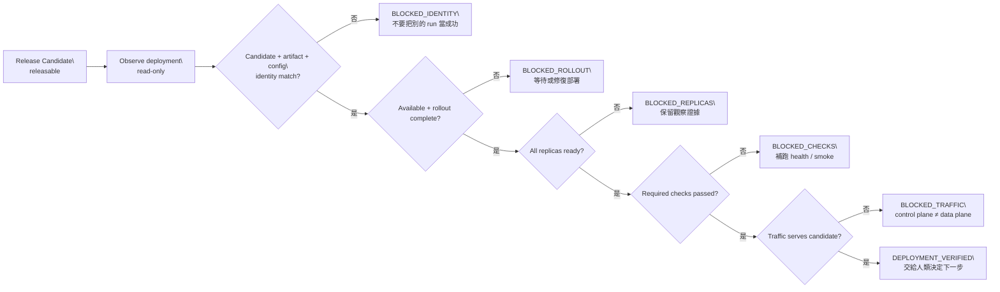
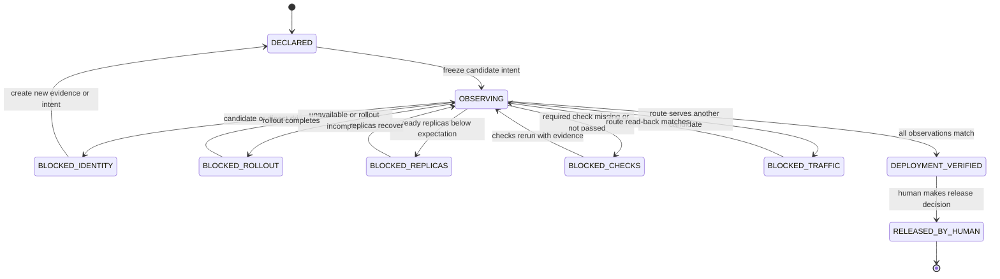

# Day 18｜Release Candidate 通過就真的上線了嗎？用 Deployment Verification Gate 核對實際狀態

## 本日定位

Day 17 的 Release Candidate Gate 已經確認 candidate 有正確的 target、release window、required checks、rollback 與人工核准。但 `releasable` 仍然只是「可以交給 release owner 做發布決策」；它不是部署完成的證明。

本日引入 Deployment Verification Gate。它接在部署動作之後，唯讀比對實際觀察到的 deployment、rollout、replica、health、smoke 與 traffic serving 狀態，並確認所有狀態仍然屬於同一個 candidate、artifact digest、config digest 與 run。Gate 只回報 `deployment_verified` 或具體的 `blocked` reason，不部署、不切流量、不替人類宣稱服務已上線。

## 文章主線

1. 從「Release Candidate 已放行，但使用者看到的還是舊版本」開始。
2. 分開說明 release decision 與 deployment verification 的責任。
3. 固定 candidate、artifact、config、source、input、environment 與 target identity。
4. 檢查 rollout 是否完成、deployment 是否 available、所有 replica 是否 ready。
5. 把 health、smoke 與 traffic serving 當成明確的 required checks；`skipped` 不算通過。
6. 驗證實際 serving candidate，避免 control plane 綠燈但 route 仍導向舊版本。
7. 以唯讀、deterministic、fail-closed 的 Python Gate 示範 reason code。
8. 把 Day 10–18 串成從 Context 新鮮度到「實際服務狀態」的證據鏈。

## Given／When／Then 驗收條件

1. Given observed deployment 是 `available`、rollout 是 `complete`，And candidate、artifact digest、version、config digest、target 與 intent 完全一致，And replicas 全部 ready，And required checks 都是 `passed`，And traffic 正在服務同一個 candidate，When 執行 Deployment Verification Gate，Then 回報 `allowed=true`、`state=deployment_verified`、`reasons=[]`。
2. Given deployment 的 candidate 與 intent 不同，When 執行 Gate，Then 回報 `deployment_candidate_mismatch`，不可因 version 或檔名相似而放行。
3. Given實際部署使用另一個 artifact digest、version 或 config digest，When執行 Gate，Then fail-closed 並指出對應 identity drift。
4. Given rollout 仍是 `in_progress`、deployment 不是 `available`，When 執行 Gate，Then 回報 `rollout_not_complete` 或 `deployment_not_available`。
5. Given預期 3 個 replica 但只有 2 個 ready，When執行 Gate，Then 回報 `replica_shortfall`。
6. Given required check 缺少、結果為 `skipped`、`pending` 或 `failed`，When 執行 Gate，Then 回報 `check_missing:<name>` 或 `check_not_passed:<name>`。
7. Given control plane 顯示新 candidate，但 traffic route 仍服務舊 candidate，When 執行 Gate，Then 回報 `serving_candidate_mismatch`，不可把 deployment row 當成實際流量證據。
8. Given traffic route 不是 `serving`，When 執行 Gate，Then 回報 `traffic_not_serving`。
9. Given intent 與 observation 的 source、input、environment、run 或 target 漂移，When 執行 Gate，Then fail-closed。
10. Given相同 intent 與 observation 重試兩次，When執行 Gate，Then兩次 JSON 報告一致且輸入物件沒有被修改。

## Runnable example

`example-deployment-verification-gate/` 使用 Python 標準函式庫實作唯讀 `evaluate_deployment(intent, observed)`：

- 驗證 intent 與 observation 的 intent、run、candidate、source、input、environment 與 target。
- 驗證 deployment 的 availability、rollout、artifact digest、version、config digest 與 replica health。
- 驗證 required checks；`passed` 以外的結果一律 fail-closed。
- 驗證 traffic 實際服務的 candidate 與 route state。
- 以 deterministic reason code 讓下一步可以直接定位缺口。
- 不部署、不更新 route、不修改輸入，也不把結果寫回外部平台。

## 圖解與影片場景

- `diagrams/deployment_verification_gate_flow.mmd`：從 Release Candidate Gate 進入部署後觀察，再檢查 rollout、identity、replica、checks 與 traffic 的流程。
- `diagrams/deployment_verification_states.mmd`：DECLARED、OBSERVING、BLOCKED_ROLLOUT、BLOCKED_IDENTITY、BLOCKED_TRAFFIC、DEPLOYMENT_VERIFIED 與 RELEASED_BY_HUMAN 狀態。
- HTML deck 10 張：問題、releasable 不等於 serving、identity、rollout、replica、required checks、traffic、唯讀範例、Day 10–18 證據鏈與收束。

## Release Candidate 通過，不代表服務已經對使用者生效

把上一天的輸出和今天的觀察放在一起看：

| 階段 | 它能證明什麼 | 它不能證明什麼 |
| --- | --- | --- |
| Artifact Promotion | 這批 artifact 集合完整、digest 與 run 對得上 | 已經部署到目標環境 |
| Release Candidate Gate | candidate 有正確 target、時間窗、rollback 與 approval | 使用者請求真的走到新 candidate |
| Deployment Verification Gate | 實際部署、replica、checks 與 traffic 都服務同一個 candidate | 由 AI 自行決定要不要發布或改變流量 |

最容易忽略的差異是：部署平台的 control plane 可能顯示「新版本已建立」，但 data plane 的實際 route 可能還在服務舊版本。也可能 rollout 只完成一半，健康檢查仍未通過，或新 pod 雖然存在卻沒有 ready。

所以今天的 Gate 不是再做一次 Release Candidate Gate，而是回答另一個問題：**「我們宣告要發布的 candidate，現在真的在目標環境健康地服務嗎？」**

## 先固定這次要觀察的 deployment identity

Deployment Verification 不能從「最新 deployment」或「目前看起來綠色的 row」開始。它需要把觀察目標寫成 intent：

```json
{
  "intent_id": "intent-orders-20260818-001",
  "run_id": "run-orders-20260818-001",
  "candidate_id": "rc-orders-20260818.1",
  "source_commit": "abc1234",
  "input_digest": "sha256:orders-input-v3",
  "environment_id": "env-python311",
  "target": "staging",
  "required_checks": ["rollout", "health", "smoke", "traffic"],
  "expected_deployment": {
    "artifact_digest": "sha256:orders-release-v3",
    "version": "2026.08.18.1",
    "config_digest": "sha256:orders-config-v7",
    "replicas": 3
  }
}
```

這份 intent 不是部署指令，而是觀察合約。它先固定「我要驗證哪一個 candidate、哪一個 artifact、哪一個 target」，讓 runner 回傳的 observed data 可以被精確比對。

如果只寫 `service=orders-api`，Gate 很容易把另一個 run 的 deployment 當成這次結果。`candidate_id`、artifact digest、config digest 與 run identity 要一起出現，才能把「這次部署」和「某個也叫 orders-api 的服務」分開。

## Rollout 完成只是第一個訊號

部署狀態可以先拆成三個問題：

1. **Deployment 是否存在且 available？** 有一筆 deployment row，不代表它已經可服務。
2. **Rollout 是否完成？** `in_progress`、`degraded` 或 `failed` 都不能當成完成。
3. **Replica 是否真的 ready？** 預期 3 個，只 ready 2 個時，服務可能看似有回應，卻沒有達到這次發布的容量與健康條件。

一個簡單的 observed deployment 可以長這樣：

```json
{
  "deployment": {
    "status": "available",
    "rollout_state": "complete",
    "candidate_id": "rc-orders-20260818.1",
    "artifact_digest": "sha256:orders-release-v3",
    "version": "2026.08.18.1",
    "config_digest": "sha256:orders-config-v7",
    "replicas_expected": 3,
    "replicas_ready": 3
  }
}
```

Gate 不會看到 `replicas_ready=2` 就替人類猜測「先上線也沒關係」。它只回報 `replica_shortfall`，由 release owner 或值班工程師決定要等待、修復、rollback，或建立新的 candidate。

> 圖 1｜Deployment Verification Gate 先綁定 candidate identity，再確認 rollout、replica、checks 與實際 traffic 都指向同一個版本。



## Required Checks：部署成功不是所有檢查都成功

Deployment Verification 通常會接到不同系統的檢查結果：

- `rollout`：更新是否依照預期完成。
- `health`：服務健康檢查是否通過。
- `smoke`：最小真實請求是否得到預期結果。
- `traffic`：route 或 service mesh 是否把流量導向這個 candidate。

每一個 check 都要有可回讀的結果。`passed` 才代表這一項有證據；`pending`、`failed`、`skipped` 或缺少欄位，都應該讓 Gate 停下來。

```json
{
  "checks": {
    "rollout": "passed",
    "health": "passed",
    "smoke": "passed",
    "traffic": "passed"
  }
}
```

這裡的重點不是把所有檢查都塞進 Python。Gate 可以只接收 runner 已經收集好的 observation；它的責任是保守比對，不是為了放行而替某個 check 補上「看起來應該 passed」的值。

如果需要重跑 smoke test，應該產生新的 observation 或新的 run evidence，再重新執行 Gate。不要直接修改舊的 JSON，因為那會讓報告失去「當時實際觀察到什麼」的意義。

## Traffic Serving：真正的證據在 data plane

假設 deployment row 已經顯示新版本，rollout 也完成，但實際 traffic observation 回報：

```json
{
  "traffic": {
    "serving_candidate_id": "rc-orders-20260817.1",
    "route_state": "serving"
  }
}
```

這代表 route 還在服務昨天的 candidate。可能原因包括：

- service selector 沒有更新。
- canary route 還沒有切換。
- gateway cache 或 service mesh policy 還沒同步。
- 新 deployment 有建立，但仍然被舊 backend 接住。

不論原因是哪一個，Deployment Verification Gate 都不應自行改 route。它應該回報 `serving_candidate_mismatch`，保留這次看到的 deployment 與 traffic identity，讓擁有變更權限的人處理。

這也是「會部署」和「真的上線」的差別：前者是 control plane 的狀態，後者需要 data plane 的實際證據。

> 圖 2｜State machine 把部署觀察和實際服務分開；任何 rollout、identity 或 traffic 缺口都停在可定位的 blocked 狀態。



## Runnable example：唯讀的 Deployment Verification Gate

本日範例放在 [`day18/example-deployment-verification-gate/`](https://github.com/rufushsu9987/ithome-ironman-2026-chatgpt-codex/tree/main/day18/example-deployment-verification-gate)。它使用 Python 標準函式庫完成以下工作：

- 比對 intent 與 observation 的 intent、run、candidate、source、input、environment、target。
- 驗證 deployment availability、rollout、artifact digest、version、config digest 與 replica 數量。
- 驗證 rollout、health、smoke、traffic 四個 required checks。
- 驗證 traffic serving candidate 與 route state。
- 產生 deterministic 的 `deployment_verified`、`blocked` 與 reason code。

成功 fixture 的執行結果是：

```json
{
  "allowed": true,
  "state": "deployment_verified",
  "reasons": []
}
```

範例測試故意製造 candidate 不同、artifact digest 漂移、rollout 未完成、replica 不足、skipped check、缺少 check、舊版本 traffic、source identity 漂移與 config digest 漂移，確認 Gate 都會 fail-closed。相同輸入重試兩次時，報告一致，而且輸入物件不會被修改。

### 搭配 GitHub 實作範例

本日可以直接執行：

```bash
cd day18/example-deployment-verification-gate
python3 -m unittest -v
python3 -m py_compile deployment_verification_gate.py test_deployment_verification.py
python3 deployment_verification_gate.py fixtures/intent.json fixtures/observation.json
```

驗收重點不是只有成功 fixture。最有價值的是當 deployment row 顯示完成、但實際 route 仍是舊 candidate 時，Gate 能明確回報 `serving_candidate_mismatch`，而不是讓人誤以為「新版本已經上線」。

## Deployment Verification Gate 和前一天的關係

可以把 Day 17 與 Day 18 分成兩個時間點：

```text
Day 17 Release Candidate Gate
  ↓
  candidate 有正確 target、window、rollback、required checks 與 approval
  ↓ 人類決定執行部署
Day 18 Deployment Verification Gate
  ↓
  實際 deployment、rollout、replica、checks、traffic 都回讀成功
  ↓
  deployment_verified，交給人類做下一步決定
```

Day 17 是「做這件事的前提是否齊全」；Day 18 是「做完後，實際狀態是否符合前提」。如果兩者混在一起，release owner 很難知道到底是還沒批准、部署未完成，還是 route 根本沒有切到新版本。

## Day 10 到 Day 18：從新鮮 Context 走到實際服務狀態

```text
Day 10 Freshness Gate
  ↓ Context 與規則還有效嗎？
Day 11 Change Budget
  ↓ 這次修改有沒有超出範圍？
Day 12 Evidence Binding
  ↓ diff、tests、review 是否屬於同一個 intent？
Day 13 Acceptance Coverage
  ↓ 每個驗收條件都有 evidence 嗎？
Day 14 Traceability Gate
  ↓ 需求、change、artifact 與決策能串起來嗎？
Day 15 Reproducibility Gate
  ↓ source、input、environment 明天能重跑嗎？
Day 16 Artifact Promotion Gate
  ↓ 要交接的 bundle 精確、完整、屬於同一個 run 嗎？
Day 17 Release Candidate Gate
  ↓ target、時間窗、rollback 與 approval 齊了嗎？
Day 18 Deployment Verification Gate
  ↓ 實際 rollout 與 traffic 真的服務同一個 candidate 嗎？
  ↓
Verify → Deliver → Human Release Decision
```

這條鏈的最後一段很重要：即使機器回報 `deployment_verified`，也不代表 AI 自動取得部署、切流量或公開發布的權限。Gate 只把觀察到的事實整理成可驗證證據，下一個不可逆動作仍應由擁有責任的人決定。

## 角色邊界

| 角色 | 可以做什麼 | 不應該做什麼 |
| --- | --- | --- |
| ChatGPT | 把「真的上線了嗎」拆成 deployment、replica、checks 與 traffic evidence | 把 control plane 的綠燈猜成使用者已經看到新版本 |
| Codex | 在 intent 範圍內產生部署、測試與 observation | 為了放行而手改 candidate、digest 或 traffic 結果 |
| Runner | 回報實際 deployment、rollout、replica、health 與 route 狀態 | 把缺少的 check 補成 passed、用舊 observation 充數 |
| Deployment Verification Gate | 唯讀比對實際狀態，產生 deterministic reason code | deploy、切 route、刪除舊版本或替人類宣稱發布 |
| Release owner | 決定 verified 狀態是否足以進入下一個不可逆動作 | 把 blocked 口頭改稱 verified |

## 實作時的三個提醒

### 1. 不要只看 deployment row

Deployment row 是重要訊號，但它通常屬於 control plane。要確認服務真的對外提供新版本，還需要 traffic serving candidate 或 data-plane read-back。

### 2. 不要把 rolling update 當成完成

`in_progress`、`degraded` 或 ready replica 不足，都表示觀察還沒完成。把「目前有回應」誤當成「這次 rollout 已經達標」，會把半成品交給下一個階段。

### 3. 不要讓 verification gate 變成 deploy script

Gate 的輸出是決策證據，不是 `kubectl apply`、route mutation 或發布 API。把觀察、批准與執行拆開，blocked 狀態才真的能停住，audit trail 也才保留得住。

## 今日小結

- Release Candidate Gate 證明 candidate 具備進入發布決策的前提；Deployment Verification Gate 再確認實際部署狀態符合這個 candidate。
- deployment、rollout、replica、required checks、artifact／config digest 與 traffic serving 都是可驗證的觀察，不應只看一個綠色狀態。
- `skipped`、`pending`、`failed`、identity 漂移、replica 不足與舊 candidate serving 都要 fail-closed。
- `deployment_verified` 代表觀察結果一致，不代表 AI 可以自行 deploy、切流或公開發布。

## GitHub 專案

| 資源 | 連結 |
| --- | --- |
| 系列 Repository | [ithome-ironman-2026-chatgpt-codex](https://github.com/rufushsu9987/ithome-ironman-2026-chatgpt-codex) |
| 本日文章原始檔 | [`day18/article.md`](https://github.com/rufushsu9987/ithome-ironman-2026-chatgpt-codex/blob/main/day18/article.md) |
| Deployment Verification Gate 範例 | [`day18/example-deployment-verification-gate/`](https://github.com/rufushsu9987/ithome-ironman-2026-chatgpt-codex/tree/main/day18/example-deployment-verification-gate) |
| 流程圖原始檔 | [`day18/diagrams/deployment_verification_gate_flow.mmd`](https://github.com/rufushsu9987/ithome-ironman-2026-chatgpt-codex/blob/main/day18/diagrams/deployment_verification_gate_flow.mmd) |
| 狀態圖原始檔 | [`day18/diagrams/deployment_verification_states.mmd`](https://github.com/rufushsu9987/ithome-ironman-2026-chatgpt-codex/blob/main/day18/diagrams/deployment_verification_states.mmd) |
| 前一天 Day 17 | [Release Candidate Gate](./../day17/article.md) |

---

> 本文與範例的驗證命令均可在本機重跑；公開發布、YouTube 字幕與 GitHub 同步由後續 Release lane 依 checkpoint 執行。
