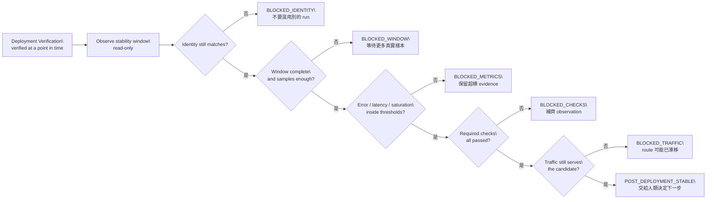
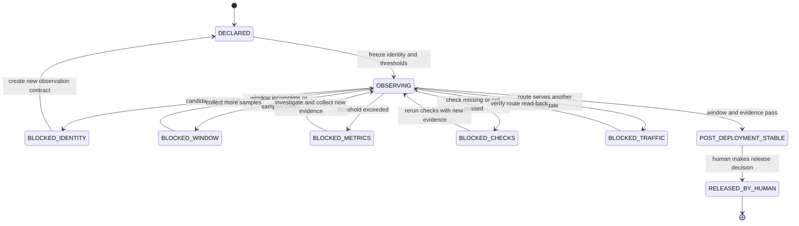

# Day 19｜Deployment Verified 就穩定了嗎？用 Post-Deployment Stability Gate 觀察真實流量

## 本日定位

Day 18 的 Deployment Verification Gate 已經確認 deployment、rollout、replica、required checks 與 traffic 在某個觀察時點一致。但「這一刻看起來健康」仍不等於「服務在一段時間內穩定」。

想像一個訂單服務剛完成 rollout。dashboard 顯示 deployment available，三個 replica 也都 ready，最小 smoke request 還成功。大家準備把這次發布標成完成；結果五分鐘後，錯誤率開始上升，p95 latency 也變慢。問題不是 Day 18 的檢查錯了，而是它回答的是「現在部署的是不是這個 candidate」，沒有回答「這個 candidate 在真實流量下能不能持續健康」。

本日引入 Post-Deployment Stability Gate。它接在 Deployment Verification Gate 之後，唯讀檢查一段 observation window 是否完整、樣本是否足夠、error rate／p95 latency／saturation 是否在門檻內，以及 traffic 是否持續服務同一個 candidate。Gate 只回報 `post_deployment_stable` 或具體的 `blocked` reason，不調整 autoscaling、不切 traffic、不 rollback，也不替 release owner 宣稱發布成功。

## 影片版

本日影片使用官方 `claude-code-slides` 0.6.0、`claude-editorial` HTML deck 作為唯一視覺來源。每張投影片先獨立擷取成 1920×1080，再依 Fish Audio 實際旁白 duration 組成固定 25 fps 的 clean H.264/AAC MP4。字幕是獨立 UTF-8 SRT，不燒錄在畫面；影片、字幕與文章發布由後續 Release lane 處理，本機 Producer 不執行外部發布。

## Deployment Verified 和 Post-Deployment Stable 是兩件事

可以先用白話分開：

- **Deployment Verification Gate**：確認這個時間點看到的 deployment、replica、checks 與 traffic，確實屬於這個 candidate。
- **Post-Deployment Stability Gate**：確認一段時間內的 observation、metrics、required checks 與 traffic，都持續符合這個 candidate 的條件。

| 問題 | Deployment Verification | Post-Deployment Stability |
| --- | --- | --- |
| 主要追問 | 現在部署的是不是這個 candidate？ | 這個 candidate 在一段流量期間穩定嗎？ |
| 觀察形狀 | 某個時間點的 deployment state | 完整 window、樣本與 metrics |
| 核心證據 | available、rollout、replica、traffic | window、sample、error rate、latency、saturation、traffic |
| 失敗例子 | rollout 未完成、serving 舊 candidate | window 太短、error rate 超標、route 漂移 |
| 不會做的事 | 不部署、不切 route | 不調容量、不 rollback、不公開發布 |

這個分層不是把同一件事重複做兩次。它是在時間軸上補足兩個不同風險：Day 18 擋住「部署對象不對」，Day 19 擋住「部署對了，但運作一段時間後開始不健康」。

## 先固定這次觀察的 identity

Stability Gate 不能從「目前最新的 dashboard」或「看起來最綠的服務」開始。它要先固定一份 observation intent：

```json
{
  "intent_id": "intent-orders-20260819-001",
  "run_id": "run-orders-20260819-001",
  "candidate_id": "rc-orders-20260819.1",
  "source_commit": "abc1234",
  "input_digest": "sha256:orders-input-v4",
  "environment_id": "env-python311",
  "target": "staging",
  "observation_window": {
    "minimum_seconds": 300,
    "minimum_samples": 5
  },
  "thresholds": {
    "max_error_rate": 0.02,
    "max_p95_latency_ms": 350,
    "max_saturation_percent": 80
  }
}
```

這份 intent 不是告訴平台怎麼部署，也不是叫 AI 自動調整服務。它是觀察合約，先寫清楚：要看哪一次 run、哪個 candidate、哪個環境、至少觀察多久、至少收集多少樣本，以及什麼數值算超標。

如果只寫 `service=orders-api`，Gate 很容易把另一個 run 的 metrics 當成這次結果。`candidate_id`、`run_id`、source commit、input digest、environment 與 target 要一起比對，才能避免把漂亮但不相關的數字拿來放行。

## Observation Window：不要只挑一筆成功請求

剛部署完成時，最容易看到的是一筆成功的 smoke request。但真實流量有尖峰、不同 payload、快取未命中、慢查詢與外部相依服務。單筆成功只能證明「這一筆成功」，不能證明「整段時間都穩定」。

因此 intent 要宣告 observation window：

- `minimum_seconds`：至少觀察多久。
- `minimum_samples`：至少要有多少個可回讀樣本。
- observation 的 `state`：是否已經從 `collecting` 變成 `complete`。

```json
{
  "observation_window": {
    "state": "complete",
    "duration_seconds": 420,
    "samples": 7
  }
}
```

如果 window 還在收集，Gate 回報 `observation_window_incomplete`。如果只觀察 120 秒，但 intent 要求 300 秒，回報 `observation_window_too_short`。樣本只有 2 筆，回報 `sample_count_shortfall`。

Gate 不會因為目前的 metrics 很低就忽略時間與樣本不足。這是 fail-closed 的重點：證據不夠時，狀態是「還不能判斷」，不是「大概沒問題」。

> 圖 1｜Post-Deployment Stability Gate 先綁定 candidate identity，再確認 window、樣本、metrics、checks 與 traffic 都持續符合條件。



## 三個 Metrics：錯誤、速度與資源壓力

穩定性不能只看「服務有沒有回應」。至少要把三個容易互相掩蓋的訊號分開：

1. **Error rate**：請求失敗比例。服務可能大多數請求成功，但某種 payload 全部失敗。
2. **p95 latency**：95% 請求在多久內完成。平均值正常，不代表尾端慢請求沒有惡化。
3. **Saturation**：CPU、connection pool、queue 或其他資源壓力的彙總指標。錯誤率尚未上升時，資源可能已經接近上限。

一份 observation 可以是：

```json
{
  "metrics": {
    "error_rate": 0.004,
    "p95_latency_ms": 210,
    "saturation_percent": 61
  }
}
```

Gate 將它和 intent 的 thresholds 比對：

| 指標 | Intent 門檻 | Observation | 結果 |
| --- | ---: | ---: | --- |
| error rate | <= 0.02 | 0.004 | passed |
| p95 latency | <= 350 ms | 210 ms | passed |
| saturation | <= 80% | 61% | passed |

如果 error rate 變成 `0.08`，回報 `metric_error_rate_exceeded`；p95 latency 變成 `480`，回報 `metric_p95_latency_exceeded`；saturation 變成 `91`，回報 `metric_saturation_exceeded`。Gate 不會把超標值改回門檻內，也不會挑另一個時間窗來替換原始 observation。

## Required Checks：Skipped 不是穩定

除了 metrics，還要把檢查結果列出來。範例中的 required checks 包含：

- `window_complete`：觀察窗真的完成。
- `health`：健康檢查持續通過。
- `errors`：錯誤率觀察已完成且在門檻內。
- `latency`：尾端延遲觀察已完成且在門檻內。
- `saturation`：資源壓力觀察已完成且在門檻內。
- `traffic`：route 仍服務同一 candidate。

```json
{
  "checks": {
    "window_complete": "passed",
    "health": "passed",
    "errors": "passed",
    "latency": "passed",
    "saturation": "passed",
    "traffic": "passed"
  }
}
```

只有 `passed` 才算有證據。`pending` 代表還沒完成，`failed` 代表已知失敗，`skipped` 代表有人沒有執行，而缺少欄位代表 observation contract 沒有填完整。它們都不能冒充穩定。

這也讓下一步更清楚：`check_not_passed:latency` 表示要補看 latency，不必把整個發布流程重新猜一遍；`check_missing:traffic` 則表示目前沒有足夠的 data-plane read-back。

## Traffic：驗證之後仍可能漂移

Day 18 已經檢查過 traffic，為什麼 Day 19 還要再檢查？因為 verification 與穩定性觀察之間有時間差。這段時間可能發生：

- canary route 自動切換。
- service selector 指向另一組 replica。
- gateway 或 service mesh policy 更新。
- 另一個 release run 被部署到同一個 target。

如果 observation 回報：

```json
{
  "traffic": {
    "serving_candidate_id": "rc-orders-20260818.1",
    "route_state": "serving"
  }
}
```

但 intent 的 candidate 是 `rc-orders-20260819.1`，Gate 回報 `serving_candidate_mismatch`。如果 route state 是 `draining` 或 `unknown`，回報 `traffic_not_serving`。

這裡仍然維持權限邊界：Stability Gate 只讀取 route 狀態，不執行切換。真正擁有權限的人可以依 evidence 決定等待、修復、rollback 或建立新的 candidate。

> 圖 2｜State machine 把穩定性觀察與人類發布決策分開；window、metrics、checks 或 traffic 任一缺口，都停在可定位的 blocked 狀態。



## Runnable example：唯讀的 Post-Deployment Stability Gate

本日範例放在 [`day19/example-post-deployment-stability-gate/`](https://github.com/rufushsu9987/ithome-ironman-2026-chatgpt-codex/tree/main/day19/example-post-deployment-stability-gate)。它使用 Python 標準函式庫完成以下工作：

- 比對 intent 與 observation 的 intent、run、candidate、source、input、environment 與 target。
- 驗證 observation window 的完成狀態、持續時間與樣本數。
- 驗證 error rate、p95 latency 與 saturation 是否在 thresholds 內。
- 驗證 required checks 與 traffic serving identity。
- 產生 deterministic 的 `post_deployment_stable`、`blocked` 與 reason code。

成功 fixture 的執行結果是：

```json
{
  "allowed": true,
  "state": "post_deployment_stable",
  "reasons": []
}
```

範例測試故意製造 window 未完成、觀察時間不足、樣本不足、三項 metrics 超標、skipped check、缺少 check、舊 candidate traffic、source identity 漂移與非 serving route，確認這些狀況都會 fail-closed。相同輸入重試兩次時，報告一致，而且輸入物件不會被修改。

### 搭配 GitHub 實作範例

本日可以直接執行：

```bash
cd day19/example-post-deployment-stability-gate
python3 -m unittest -v
python3 -m py_compile post_deployment_stability_gate.py test_post_deployment_stability.py
python3 post_deployment_stability_gate.py fixtures/intent.json fixtures/observation.json
```

驗收重點不是只看成功 fixture，而是讓「deployment verified 之後，真實流量是否持續健康」變成可以重跑的判斷。Gate 的輸出是證據，不是調整容量、切流或 rollback 的命令。

## Day 18 和 Day 19：從部署狀態走到穩定性

```text
Day 17 Release Candidate Gate
  ↓ candidate 有正確 target、window、rollback 與 approval
Day 18 Deployment Verification Gate
  ↓ 實際 deployment、rollout、replica、checks、traffic 對得上
Day 19 Post-Deployment Stability Gate
  ↓ 一段時間內的 window、samples、metrics、checks、traffic 仍然健康
  ↓
Post-Deployment Stable → Human Release Decision
```

Day 18 的 `deployment_verified` 是一個重要里程碑，但它不應該被解讀成永久有效。只要服務會接收持續流量，就要把「當下狀態」和「一段時間的表現」分開保存。這樣後續如果發生事故，也能知道是 rollout 沒完成、route 漂移、metrics 超標，還是 observation 根本不足。

## Day 10 到 Day 19：從新鮮 Context 走到持續健康

```text
Day 10 Freshness Gate
  ↓ Context 與規則還有效嗎？
Day 11 Change Budget
  ↓ 這次修改有沒有超出範圍？
Day 12 Evidence Binding
  ↓ diff、tests、review 是否屬於同一個 intent？
Day 13 Acceptance Coverage
  ↓ 每個驗收條件都有 evidence 嗎？
Day 14 Traceability Gate
  ↓ 需求、change、artifact 與決策能串起來嗎？
Day 15 Reproducibility Gate
  ↓ source、input、environment 明天能重跑嗎？
Day 16 Artifact Promotion Gate
  ↓ 要交接的 bundle 精確、完整、屬於同一個 run 嗎？
Day 17 Release Candidate Gate
  ↓ target、時間窗、rollback 與 approval 齊了嗎？
Day 18 Deployment Verification Gate
  ↓ 實際 deployment 與 traffic 真的服務同一個 candidate 嗎？
Day 19 Post-Deployment Stability Gate
  ↓ 這個 candidate 在一段真實流量期間持續健康嗎？
  ↓
Verify → Observe → Deliver → Human Release Decision
```

這條鏈的最後一段提醒我們：AI 可以協助整理 observation、執行唯讀規則與列出缺口，但不能因為某個 metrics 暫時漂亮，就自行調整服務或宣告發布。證據的時間範圍和權限的時間範圍，都要清楚寫進流程。

## 角色邊界

| 角色 | 可以做什麼 | 不應該做什麼 |
| --- | --- | --- |
| ChatGPT | 把「穩定嗎」拆成 window、samples、metrics、checks 與 traffic evidence | 把一筆成功 request 猜成長時間穩定 |
| Codex | 在 intent 範圍內產生 observation schema、測試與報告 | 為了放行而改 threshold、sample 或 metrics |
| Runner | 回報真實 window、樣本、metrics 與 route 狀態 | 用舊 window 補缺口、把 skipped 寫成 passed |
| Post-Deployment Stability Gate | 唯讀比對 sustained evidence，產生 deterministic reason code | 調整容量、切 route、rollback 或公開發布 |
| Release owner | 依 stable／blocked evidence 決定下一個不可逆動作 | 把 blocked 口頭改稱 stable |

## 實作時的三個提醒

### 1. 不要只看平均值或單點

平均 latency 可能很好看，但 p95 已經惡化；某一筆 smoke request 成功，也不能代表尖峰流量正常。把 observation window、樣本與多個 metrics 一起驗證，才不會只挑漂亮數字。

### 2. Threshold 必須來自 intent

如果 Gate 看到超標才臨時改門檻，報告就失去可重現性。先在 intent 宣告 threshold，再把觀察值與它比對；要改門檻，就建立新的 observation contract 與清楚的決策紀錄。

### 3. Stability Gate 仍然不是自動修復器

Gate 的輸出是 `post_deployment_stable` 或具體 blocked reasons，不是 autoscaling、route mutation 或 rollback command。把觀察、決策與執行拆開，才能知道誰看過 evidence，也才能保留人類覆核的空間。

## 今日小結

- `deployment_verified` 只代表某個時間點的部署狀態一致；`post_deployment_stable` 才代表一段 observation window 的 evidence 符合 intent。
- window 完整度、樣本數、error rate、p95 latency、saturation、required checks 與 traffic 都要一起檢查。
- `skipped`、`pending`、`failed`、樣本不足、metrics 超標、identity 漂移與舊 candidate serving 都要 fail-closed。
- Stability Gate 是唯讀證據層，不是調容量、切流量、rollback 或公開發布的許可。

## GitHub 專案

| 資源 | 連結 |
| --- | --- |
| 系列 Repository | [ithome-ironman-2026-chatgpt-codex](https://github.com/rufushsu9987/ithome-ironman-2026-chatgpt-codex) |
| 本日文章原始檔 | [`day19/article.md`](https://github.com/rufushsu9987/ithome-ironman-2026-chatgpt-codex/blob/main/day19/article.md) |
| Post-Deployment Stability Gate 範例 | [`day19/example-post-deployment-stability-gate/`](https://github.com/rufushsu9987/ithome-ironman-2026-chatgpt-codex/tree/main/day19/example-post-deployment-stability-gate) |
| 流程圖原始檔 | [`day19/diagrams/stability_gate_flow.mmd`](https://github.com/rufushsu9987/ithome-ironman-2026-chatgpt-codex/blob/main/day19/diagrams/stability_gate_flow.mmd) |
| 狀態圖原始檔 | [`day19/diagrams/stability_gate_states.mmd`](https://github.com/rufushsu9987/ithome-ironman-2026-chatgpt-codex/blob/main/day19/diagrams/stability_gate_states.mmd) |
| 前一天 Day 18 | [Deployment Verification Gate](./../day18/article.md) |

---

> 本文與範例的驗證命令均可在本機重跑；公開發布、YouTube 字幕與 GitHub 同步由後續 Release lane 依 checkpoint 執行。
