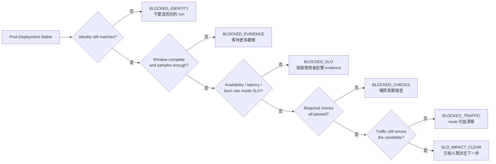
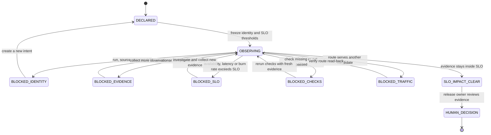

# Day 20｜Stability 通過，使用者真的沒受影響嗎？用 SLO Impact Gate 看真實可靠性

## 先講結論：服務穩定，不代表使用者沒有受傷

想像一個訂單服務剛完成 rollout。Deployment Verification 通過，replica 都是 ready，health check 也全綠。接著又觀察了幾分鐘，error rate 沒有明顯上升，Post-Deployment Stability Gate 也回報 stable。

團隊準備把這次變更標成完成。

但客服開始收到另一種回報：結帳頁偶爾轉圈，部分請求比平常慢很多。服務端看起來沒有掛掉，使用者卻已經感覺到變差。

這不是前一天的 Stability Gate 做錯了，而是它回答的問題不同：

- Deployment Verification Gate：現在部署的是不是這個 candidate？
- Post-Deployment Stability Gate：這個 candidate 在一段時間內是否持續健康？
- 本日的 SLO Impact Gate：使用者真正感受到的可靠性，是否仍在我們承諾的範圍內？

本日要補上的不是另一個漂亮的 dashboard，而是一個保守、唯讀、可重跑的判斷層。它把 availability、p95 latency、error budget burn rate、required checks 和 serving identity 綁在同一份 observation 裡，讓團隊能清楚回答「這次變更有沒有傷害使用者」。

## 影片版

本日影片使用官方 `claude-code-slides` 0.6.0、`claude-editorial` HTML deck 作為唯一視覺來源。每張投影片先獨立擷取成 1920×1080，再依 Fish Audio 實際旁白 duration 組成固定 25 fps 的 clean H.264/AAC MP4。字幕是獨立 UTF-8 SRT，不燒錄在畫面；影片、字幕與文章發布由後續 Release lane 處理，本機 Producer 不執行外部發布。

## Stable、Verified 和 SLO Impact Clear 的差別

先用白話把三個狀態分開：

| 狀態 | 它回答的問題 | 主要證據 | 不代表什麼 |
| --- | --- | --- | --- |
| `deployment_verified` | 現在部署的是不是預期 candidate？ | deployment、rollout、replica、traffic | 不代表持續健康 |
| `post_deployment_stable` | 這個 candidate 在 observation window 內是否持續健康？ | window、samples、health、metrics、traffic | 不代表使用者體驗沒有變差 |
| `slo_impact_clear` | 使用者可靠性是否仍在宣告的 SLO 門檻內？ | availability、p95 latency、burn rate、checks、traffic | 不代表可以自動發布或修復 |

這三個 Gate 不是把同一件事做三次，而是沿著風險往前追：

1. 先確認「部署了誰」。
2. 再確認「它是否持續跑得健康」。
3. 最後確認「使用者受到的結果是否仍可接受」。

如果只停在第一層，部署對象可能正確，但服務後來開始不穩。如果只停在第二層，服務可能仍然回應健康檢查，但尾端 latency 已經影響使用者。SLO Impact Gate 的責任，就是不要把「服務還活著」誤說成「使用者沒有受影響」。

## 先固定這次判斷的 identity

SLO Impact Gate 不能直接讀取「目前最新的 dashboard row」。它要先固定一份 observation intent，說清楚這次要判斷的是哪一個 run、哪一個 candidate、哪一個環境。

```json
{
  "intent_id": "intent-orders-current",
  "run_id": "run-orders-current",
  "candidate_id": "candidate-orders-current",
  "source_commit": "commit-current",
  "input_digest": "sha256:orders-input-current",
  "environment_id": "env-staging-current",
  "target": "staging",
  "observation_window": {
    "minimum_seconds": 300,
    "minimum_samples": 10
  },
  "slo": {
    "minimum_availability": 0.995,
    "max_p95_latency_ms": 350,
    "max_error_budget_burn_rate": 1.0
  }
}
```

這裡的欄位不是裝飾：

- `intent_id`：這次判斷的合約識別。
- `run_id`：哪一次執行產生這份 evidence。
- `candidate_id`：實際被觀察的版本。
- `source_commit`：對應哪一版程式碼。
- `input_digest`：輸入資料是否相同。
- `environment_id`：在哪個環境觀察。
- `target`：例如 staging 或 production。

如果 observation 的 source commit 或 candidate 和 intent 不同，就算 availability 很漂亮，也不能把那份數字拿來代表這次變更。這是避免「把別人的好成績套到自己的 release」的第一道防線。

## Observation Window：不要只挑一筆成功請求

剛部署完成時，最容易看到一筆成功的 smoke request。它很適合確認基本路徑有通，但只能證明「這一筆成功」，不能證明「一段時間都沒有影響」。

因此 intent 要宣告兩個最低條件：

- `minimum_seconds`：至少觀察多久。
- `minimum_samples`：至少收集多少筆可回讀樣本。

Observation 則要回報實際狀態：

```json
{
  "observation_window": {
    "state": "complete",
    "duration_seconds": 420,
    "samples": 25
  }
}
```

以下狀況都不能直接放行：

- `state` 還是 `collecting`：觀察尚未完成。
- 實際時間小於 intent 要求：`observation_window_too_short`。
- 樣本數不足：`sample_count_shortfall`。

Gate 不會因為目前三個 metrics 都很低，就忽略時間和樣本不足。證據不夠時，正確狀態是「還不能判斷」，不是「大概沒問題」。



> 圖 1｜SLO Impact Gate 先綁定 candidate identity，再確認 observation、SLO 指標、checks 與 traffic 都足夠。

## 三個 SLO 指標：可用、變慢、預算消耗

### 1. Availability：服務能不能用

Availability 是使用者最直接感受到的結果。服務可能大多數時間都有回應，但某一條重要路徑的失敗率已經讓使用者無法完成任務。

本例設定最低 availability 為 `0.995`。觀察值如果是 `0.999`，代表目前仍在門檻內；如果下降到 `0.97`，Gate 回報：

```text
metric_availability_below_target
```

Gate 不會把 `0.97` 四捨五入成可以接受，也不會用另一段較漂亮的時間窗覆蓋它。

### 2. p95 latency：尾端使用者是不是變慢

平均 latency 看起來正常，不代表所有人都正常。p95 latency 會提醒我們：最慢的那一批請求是不是已經明顯變差。

本例的上限是 `350ms`。如果 observation 回報 `480ms`，Gate 產生：

```text
metric_p95_latency_exceeded
```

這個 reason code 比「效能有問題」更有用，因為它把判斷依據和下一步調查方向留了下來。

### 3. Error budget burn rate：可靠性預算消耗是不是過快

SLO 不只是一個成功率數字。它也可以告訴團隊：如果目前的失敗速度持續下去，原本允許的失敗空間會不會被過快用完。

本例把 `max_error_budget_burn_rate` 設為 `1.0`。觀察值 `0.4` 仍在門檻內；如果變成 `1.8`，回報：

```text
metric_error_budget_burn_exceeded
```

這裡的重點不是把 burn rate 當成唯一真相，而是先把「可靠性正在被消耗」變成可驗證、可討論的 evidence。要改門檻，應該建立新的 intent 和清楚的決策紀錄，而不是在 Gate 裡偷偷放寬。

| 指標 | Intent 門檻 | 成功 observation | 結果 |
| --- | ---: | ---: | --- |
| availability | >= 99.5% | 99.9% | passed |
| p95 latency | <= 350 ms | 220 ms | passed |
| error budget burn rate | <= 1.0× | 0.4× | passed |

> 圖 2｜SLO Impact Gate 同時看 availability、p95 latency 與 error budget burn rate，避免只挑一個好看的數字。

## Required Checks：Skipped 不是證據

除了 metrics，還要把必要檢查列出來。成功 fixture 的 required checks 是：

- `window_complete`：觀察窗真的完成。
- `availability`：可用性已完成觀察且在門檻內。
- `latency`：p95 latency 已完成觀察且在門檻內。
- `error_budget`：burn rate 已完成觀察且在門檻內。
- `traffic`：route 仍服務同一個 candidate。

只有 `passed` 才算有證據。以下值都不能冒充通過：

- `pending`：還沒有結果。
- `skipped`：有人沒有執行。
- `failed`：已知失敗。
- 缺少欄位：observation contract 不完整。

例如 latency check 是 `skipped`，Gate 會回報：

```text
check_not_passed:latency
```

如果 traffic 欄位整個不見，會回報：

```text
check_missing:traffic
```

這些 reason code 讓下一個人知道要補哪一份 evidence，而不是只看到一個沒有方向的 `false`。

## Traffic：驗證之後仍可能漂移

即使 Day 18 看到正確 candidate，從 deployment verification 到 SLO observation 完成之間仍可能發生變化：

- canary route 自動切換。
- service selector 指向另一組 replica。
- gateway 或 service mesh policy 更新。
- 另一個 release run 被部署到同一個 target。

因此 observation 要重新讀回：

```json
{
  "traffic": {
    "serving_candidate_id": "candidate-orders-current",
    "route_state": "serving"
  }
}
```

只要 serving candidate 不同，回報：

```text
serving_candidate_mismatch
```

如果 route state 是 `draining`、`unknown` 或其他非 `serving` 狀態，回報：

```text
traffic_not_serving
```

Gate 只讀取 route 狀態，不執行切換。真正擁有權限的人可以依 evidence 決定等待、修復、rollback 或建立新的 candidate。



> 圖 3｜狀態圖把 SLO evidence 與人類決策分開；任何 identity、window、SLO、checks 或 traffic 缺口都會停在 blocked。

## Runnable example：唯讀的 SLO Impact Gate

本日範例放在 [`day20/example-slo-impact-gate/`](./example-slo-impact-gate/)。它使用 Python 標準函式庫完成以下工作：

- 比對 intent 與 observation 的 intent、run、candidate、source、input、environment 與 target。
- 驗證 observation window 的完成狀態、持續時間與樣本數。
- 驗證 availability、p95 latency 與 error budget burn rate。
- 驗證 required checks 與 traffic serving identity。
- 產生 deterministic 的 `slo_impact_clear`、`blocked` 與 reason code。

成功 fixture 的執行命令：

```bash
cd day20/example-slo-impact-gate
python3 -m unittest -v
python3 -m py_compile slo_impact_gate.py test_slo_impact_gate.py
python3 slo_impact_gate.py fixtures/intent.json fixtures/observation.json
```

成功結果的核心欄位是：

```json
{
  "allowed": true,
  "state": "slo_impact_clear",
  "reasons": []
}
```

本例的測試也故意製造 window 未完成、時間不足、樣本不足、availability 下降、p95 超標、burn rate 超標、skipped check、缺少 check、candidate 漂移、非 serving route、identity 漂移與 duplicate required checks，確認這些情況都 fail-closed。相同輸入重試兩次時，報告一致，而且輸入物件不會被修改。

### 搭配 GitHub 實作範例

這個範例只使用 Python standard library，不需要安裝第三方套件。測試與 fixture 都放在本日目錄，方便讀者把「使用者可靠性」的規則換成自己的 service schema。

| 資源 | 路徑 |
| --- | --- |
| runnable example | [`day20/example-slo-impact-gate/`](./example-slo-impact-gate/) |
| intent fixture | [`day20/example-slo-impact-gate/fixtures/intent.json`](./example-slo-impact-gate/fixtures/intent.json) |
| observation fixture | [`day20/example-slo-impact-gate/fixtures/observation.json`](./example-slo-impact-gate/fixtures/observation.json) |
| flow diagram | [`day20/diagrams/slo_impact_gate_flow.mmd`](./diagrams/slo_impact_gate_flow.mmd) |
| state diagram | [`day20/diagrams/slo_impact_states.mmd`](./diagrams/slo_impact_states.mmd) |

## Day 19 和 Day 20：從穩定走到使用者可靠性

```text
Day 17 Release Candidate Gate
  ↓ candidate 有正確 target、時間窗、rollback 與 approval
Day 18 Deployment Verification Gate
  ↓ 實際 deployment、rollout、replica、checks、traffic 對得上
Day 19 Post-Deployment Stability Gate
  ↓ 一段時間內的 window、samples、metrics、checks、traffic 仍然健康
Day 20 SLO Impact Gate
  ↓ availability、p95 latency、error budget 與 user path 仍在 intent 門檻內
  ↓
SLO Impact Clear → Human Release Decision
```

Day 19 的 `post_deployment_stable` 是必要里程碑，但不應該被解讀成永久有效。服務端的健康訊號和使用者端的可靠性訊號要分開保存，後續才能知道問題是 rollout 沒完成、route 漂移、metrics 超標，還是 SLO 真的被變更消耗。

## Day 10 到 Day 20：從新鮮 Context 走到使用者結果

```text
Day 10 Freshness Gate
  ↓ Context 與規則還有效嗎？
Day 11 Change Budget
  ↓ 這次修改有沒有超出範圍？
Day 12 Evidence Binding
  ↓ diff、tests、review 是否屬於同一個 intent？
Day 13 Acceptance Coverage
  ↓ 每個驗收條件都有 evidence 嗎？
Day 14 Traceability Gate
  ↓ 需求、change、artifact 與決策能串起來嗎？
Day 15 Reproducibility Gate
  ↓ source、input、environment 明天能重跑嗎？
Day 16 Artifact Promotion Gate
  ↓ 要交接的 bundle 精確、完整、屬於同一個 run 嗎？
Day 17 Release Candidate Gate
  ↓ target、時間窗、rollback 與 approval 齊了嗎？
Day 18 Deployment Verification Gate
  ↓ 實際 deployment 與 traffic 真的服務同一個 candidate 嗎？
Day 19 Post-Deployment Stability Gate
  ↓ 這個 candidate 在一段真實流量期間持續健康嗎？
Day 20 SLO Impact Gate
  ↓ 這些健康結果是否真的沒有傷害使用者可靠性？
  ↓
Verify → Observe → Deliver → Measure Impact → Human Decision
```

這條鏈的最後一段提醒我們：AI 可以協助整理 observation、執行唯讀規則與列出缺口，但不能因為服務端暫時全綠，就自行把使用者影響判定為零。證據的 identity、時間範圍、使用者指標和權限邊界，都要寫進流程。

## 角色邊界

| 角色 | 可以做什麼 | 不應該做什麼 |
| --- | --- | --- |
| ChatGPT | 把「使用者有沒有受影響」拆成 SLO、window、checks 與 traffic evidence | 把服務全綠猜成使用者零影響 |
| Codex | 在 intent 範圍內產生 schema、測試與 deterministic 報告 | 為了放行而改 threshold、metrics 或 candidate |
| Runner | 回報真實 window、樣本、SLO metrics 與 route 狀態 | 用舊 window 補缺口、把 skipped 寫成 passed |
| SLO Impact Gate | 唯讀比對 user-facing evidence，產生 reason code | 改 threshold、調容量、切 route、rollback 或公開發布 |
| Release owner | 依 clear／blocked evidence 決定下一個不可逆動作 | 把 blocked 口頭改稱 clear |

## 實作時的三個提醒

### 1. Stable 不是 No Impact

服務還能回應，不代表所有使用者都能順利完成任務。要把系統健康和 user-facing SLO 分開看，尤其要保留 p95 等尾端指標。

### 2. Threshold 必須來自 intent

如果 Gate 看到超標才臨時改門檻，報告就失去可重現性。要改門檻，就建立新的 intent，並讓決策留下可回讀的紀錄。

### 3. SLO Impact Gate 仍然不是自動修復器

Gate 的輸出是 `slo_impact_clear` 或具體 blocked reasons，不是 autoscaling、route mutation、rollback command 或公開發布許可。把觀察、決策與執行拆開，才能知道誰看過 evidence，也才能保留人類覆核空間。

## 今日小結

- `deployment_verified` 只代表某個時間點的部署狀態一致。
- `post_deployment_stable` 代表一段 observation window 的服務 evidence 符合條件。
- `slo_impact_clear` 再往前確認 availability、p95 latency、error budget、checks 與 traffic 是否仍在 intent 門檻內。
- `skipped`、`pending`、`failed`、樣本不足、SLO 超標、identity 漂移與舊 candidate serving 都要 fail-closed。
- SLO Impact Gate 是唯讀證據層，不是調容量、切流量、rollback 或公開發布的許可。

## GitHub 專案

| 資源 | 連結 |
| --- | --- |
| 系列 Repository | [ithome-ironman-2026-chatgpt-codex](https://github.com/rufushsu9987/ithome-ironman-2026-chatgpt-codex) |
| 本日文章原始檔 | [`day20/article.md`](https://github.com/rufushsu9987/ithome-ironman-2026-chatgpt-codex/blob/main/day20/article.md) |
| SLO Impact Gate 範例 | [`day20/example-slo-impact-gate/`](https://github.com/rufushsu9987/ithome-ironman-2026-chatgpt-codex/tree/main/day20/example-slo-impact-gate) |
| 流程圖原始檔 | [`day20/diagrams/slo_impact_gate_flow.mmd`](https://github.com/rufushsu9987/ithome-ironman-2026-chatgpt-codex/blob/main/day20/diagrams/slo_impact_gate_flow.mmd) |
| 狀態圖原始檔 | [`day20/diagrams/slo_impact_states.mmd`](https://github.com/rufushsu9987/ithome-ironman-2026-chatgpt-codex/blob/main/day20/diagrams/slo_impact_states.mmd) |
| 前一天 Day 19 | [Post-Deployment Stability Gate](./../day19/article.md) |

---

> 本文與範例的驗證命令均可在本機重跑；公開發布、YouTube 字幕與 GitHub 同步由後續 Release lane 依 checkpoint 執行。
