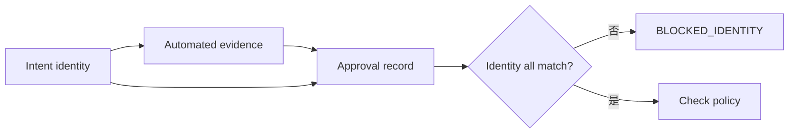
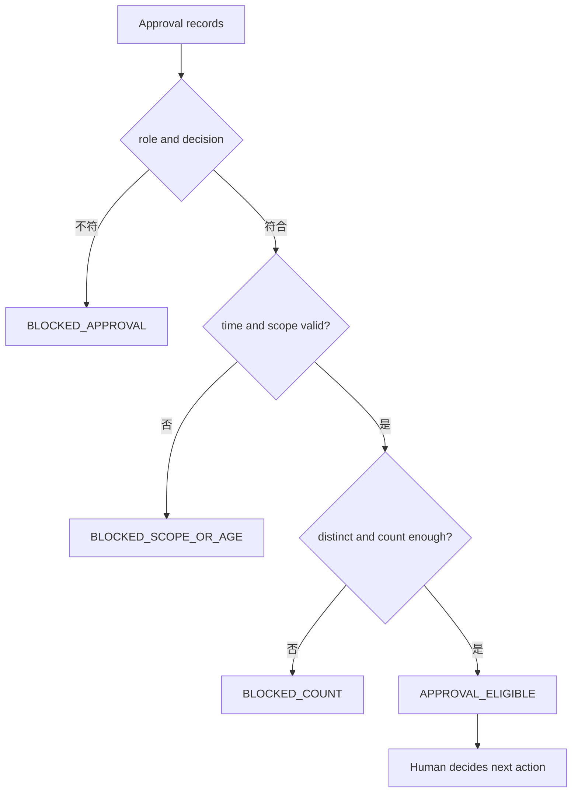
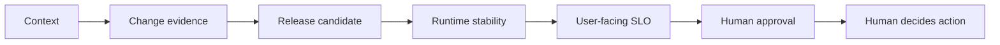

# Day 21｜證據都通過就能發布嗎？用 Human Approval Gate 把不可逆動作交回人類

## 本日定位

前一天我們用 SLO Impact Gate 確認：這次變更目前沒有超過使用者可靠性門檻。

但還有一個更現實的問題：**所有 dashboard 都綠了，就能直接按下發布嗎？**

如果這個動作會公開服務、修改資料、切換流量或改變權限，按下去之後可能很難回復。自動化證據可以告訴我們「目前看起來符合條件」，卻不能代替真正有責任的人做最後授權。

本日加入 Human Approval Gate。它是一個唯讀的核准驗證層，檢查核准是否真的屬於這一次變更、是否由正確角色給出、是否仍在有效期限內，以及是否達到團隊宣告的最少人數。它只輸出可供下一步使用的證據，不會自己部署、發布、切 traffic 或 rollback。

## 先用生活情境理解

想像你要把一個付款流程切到新版：

- Deployment Verification 說：目前部署的確實是這個 candidate。
- Post-Deployment Stability 說：它在觀察期間持續健康。
- SLO Impact 說：availability、p95 latency 和 error budget 沒超標。
- 但這仍然不能證明「現在就應該公開給所有使用者」。

最後一步需要知道：**誰看過這些證據？他核准的是哪一個 candidate？核准是否還有效？**

如果拿到的是昨天另一個 run 的核准，或是同一個 proposer 自己核准自己的變更，數字再漂亮都不應該放行。

## Automated evidence clear，不等於 human authorization

這兩件事回答不同問題：

| 判斷層 | 它回答的問題 | 可以做什麼 | 不可以假裝做什麼 |
| --- | --- | --- | --- |
| Deployment／Stability／SLO | 系統與使用者結果是否符合門檻？ | 整理可回讀 evidence | 代替責任人核准 |
| Human Approval Gate | 核准是否屬於這次變更且仍有效？ | 驗證核准適用性 | 自動按下發布或部署 |
| Release owner | 依 evidence 與核准做最後決定 | 執行已授權的下一步 | 把缺少核准說成已授權 |

所以 `slo_impact_clear` 是必要 evidence，卻不是 `approval_eligible` 的同義詞。

## 第一關：先固定 change identity

核准不是一張可以到處重用的貼紙。它至少要綁住下列 identity：

- `intent_id`：這次變更的判斷意圖。
- `run_id`：產生這批 evidence 的執行批次。
- `candidate_id`：實際準備被推進的版本。
- `source_commit`：來源程式版本。
- `input_digest`：輸入資料或設定的摘要。
- `environment_id`：執行環境。
- `target`：例如 `staging` 或 `production`。

只要 observation 和 intent 有一個欄位不同，就應該回報 `*_mismatch`。不要因為 approver 名字正確，就把它套到另一個 candidate。



> 圖 1｜Human Approval Gate 先把 automated evidence 與 approval record 綁到同一組變更 identity。

## 第二關：必要 evidence 要對得上

Intent 不只宣告「需要有人核准」，還要宣告核准前一定要看到哪些 evidence。例如：

```json
{
  "required_evidence": [
    {
      "name": "slo_impact",
      "state": "slo_impact_clear",
      "digest": "sha256:slo-evidence-current"
    },
    {
      "name": "release_candidate",
      "state": "release_candidate_ready",
      "digest": "sha256:candidate-evidence-current"
    }
  ]
}
```

這裡的 digest 不是裝飾。它讓核准人看到的 evidence 與 Gate 驗證的 evidence 可以被連回同一份內容。

以下情況都應該停止：

- `slo_impact` 缺少：`evidence_missing:slo_impact`。
- state 變成 `blocked`：`evidence_state_mismatch:slo_impact`。
- digest 換成另一份：`evidence_digest_mismatch:slo_impact`。

即使核准紀錄本身看起來完整，必要 evidence 不完整仍然不能交給不可逆動作。

## 第三關：approval policy 要可驗收

「請主管看一下」不是可執行的 policy。至少要把以下規則寫清楚：

| Policy | 例子 | 為什麼重要 |
| --- | --- | --- |
| `minimum_approvals` | 至少 2 人 | 一個人離線或看漏時仍有交叉檢查 |
| `required_role` | `release_owner` | 確保核准人具備相應責任 |
| `max_age_seconds` | 900 秒 | 避免沿用過期判斷 |
| `require_distinct_approvers` | `true` | 避免同一人重複填兩筆 |
| `forbid_self_approval` | `true` | 變更提出者不能單獨核准自己的變更 |

Policy 是 intent 的一部分，不要在檢查時臨時放寬。若團隊要調整門檻，應建立新的 intent 與新的 evidence，而不是修改舊報告讓它變綠。

## Approval record 也要有 scope

每筆核准至少要包含：

```json
{
  "approver_id": "approver-alice",
  "role": "release_owner",
  "decision": "approved",
  "approved_at_epoch": 1000,
  "scope": "staging/candidate-orders-current"
}
```

`scope` 把 target 和 candidate 放在一起，避免「核准 staging」被誤套到 production，或「核准 current candidate」被誤套到 previous candidate。

核准有效不是只看 decision：

1. decision 必須是 `approved`。
2. role 必須符合 policy。
3. approved time 不能在觀察時間之後，也不能超過 max age。
4. scope 必須等於這次 intent 的 target／candidate。
5. approver 不能是 proposer。
6. 通過的 approver 必須達到最少人數且彼此不同。



> 圖 2｜核准紀錄要同時通過角色、時間、範圍、distinct 與人數檢查。

## 為什麼 rejected、expired 不能「先算了」

這幾個 reason code 是為了讓停止原因可以被人讀懂，也能被後續工具穩定處理：

- `approval_not_approved:<approver>`：核准人拒絕或沒有給 approved。
- `approval_expired:<approver>`：核准太舊，不能代表現在的狀態。
- `approver_role_mismatch:<approver>`：角色不符合 policy。
- `approval_scope_mismatch:<approver>`：核准的 candidate 或 target 不同。
- `self_approval:<approver>`：提出變更的人核准自己。
- `approver_not_distinct`：核准人不是真正不同的人。
- `approval_count_shortfall`：有效核准數不足。

不要只回傳 `false`。具體原因才讓 release owner 知道下一步是補 evidence、重新找 approver，還是建立新的 intent。

## Runnable example：唯讀核准判斷

`example-human-approval-gate/` 是一個不需要第三方套件的 Python 範例：

```bash
cd day21/example-human-approval-gate
python3 -m unittest -v
python3 -m py_compile human_approval_gate.py test_human_approval_gate.py
python3 human_approval_gate.py fixtures/intent.json fixtures/observation.json
```

成功 fixture 會輸出：

```json
{
  "allowed": true,
  "state": "approval_eligible",
  "reasons": []
}
```

這裡的 `allowed=true` 只代表核准證據符合 policy。它不是「已發布」，也不是「已部署」。CLI 的成功輸出仍然需要交給真正的 release owner。

程式刻意維持三個界線：

1. 輸入只讀：重試不會修改 intent 或 observation。
2. 結果 deterministic：同一組輸入得到同一份 reason code。
3. 動作分離：不呼叫 deployment、publish、rollback 或權限 API。

## Day 10 到 Day 21 的證據鏈

前面的每一層都在縮小「AI 可以猜」的空間：

- Day 10–13：Context freshness、change scope、evidence binding 與 acceptance coverage。
- Day 14–16：Traceability、reproducibility 與 artifact promotion。
- Day 17–19：Release candidate、deployment verification 與 post-deployment stability。
- Day 20：把穩定性連到 availability、p95 latency 與 error budget 的使用者結果。
- Day 21：把 automated evidence 連到有範圍、有效期與責任角色的人類核准。



> 圖 3｜證據鏈從 Context 逐層走到人類授權，但每層都不會自動越過下一個責任邊界。

## 結論：自動化可以整理證據，不能偷走責任

Human Approval Gate 的重點不是增加一個按鈕，而是把「誰核准、核准什麼、核准多久、核准到哪裡」變成可驗收的 evidence。

請記住三句話：

1. `slo_impact_clear` 不等於 `approval_eligible`。
2. 核准必須綁定同一個 identity、evidence digest 與 scope。
3. `approval_eligible` 也不等於已發布；最後的不可逆動作仍由人類決定並負責。

## GitHub 專案

- 系列 repository：[ChatGPT × Codex 企業級 AI 開發工作流](../)
- 本日文章來源：[`day21/article.md`](./article.md)
- Runnable example：[`example-human-approval-gate/`](./example-human-approval-gate/)
- 流程圖：[`diagrams/human_approval_gate_flow.mmd`](./diagrams/human_approval_gate_flow.mmd)
- 狀態圖：[`diagrams/human_approval_states.mmd`](./diagrams/human_approval_states.mmd)

目前 iThome 與 YouTube 仍為待後續 Release lane 處理；本 Producer 僅產製與驗證本機內容，沒有執行外部發布。
