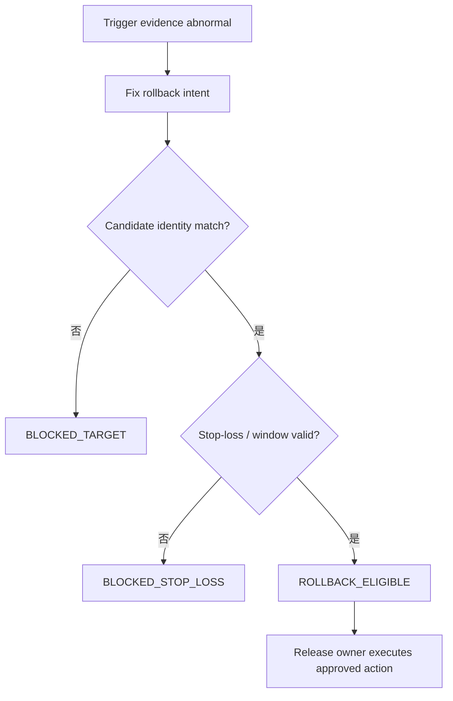
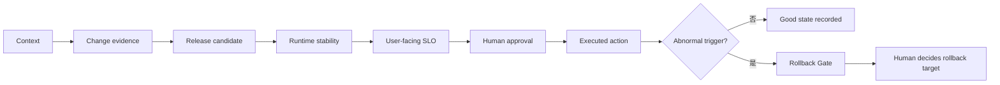

# Day 22｜出問題要回滾，但誰來決定回滾到哪？用 Rollback Gate 把風險寫成可驗收的 evidence

## 本日定位

Day 21 的 Human Approval Gate 確認「這份核准屬於這次變更，而且現在仍然有效」。但發布或部署之後，系統還是可能出現異常：指標漂移、錯誤率上升、資料損壞，或實際使用者和監控看到的結果不同。

這時候最關鍵的問題不是「趕快rollback」，而是「**回滾到哪一個 candidate、根據什麼 evidence、由誰決定、要不要停止進一步損害**」。今天加入 Rollback Gate，把回滾前的判斷也變成唯讀、可回讀、可稽核的 evidence。

## 先用生活情境理解

想像你把一個結帳流程推到 production：

- Deployment Verification 說：目前 running 的是這個 candidate。
- Post-Deployment Stability 說：它在 observation window 持續健康。
- SLO Impact 說：availability、p95 latency 和 error budget 沒超標。
- Human Approval 說：release owner 已經針對這個 candidate 與 target 核准。

但上線 20 分鐘後，退款成功率從 99.97% 掉到 99.80%，而且 payment webhook 連續 timeout。這時候團隊會本能地想 rollback，但如果沒先固定 evidence，很容易發生：

- rollback 到昨天的 candidate，但今天是因為新的 input 資料格式造成錯誤。
- 只看到平均错误率，沒看到特定 tenant 或 region 已經超標。
- 有人手動rollback，卻沒有記錄 stop-loss 條件、負責人與時間。
- 回滾後又立刻重推同一個 candidate，因為「只是短暫抖動」。

Rollback Gate 要回答的是：**現在是否具備足夠證據支持這次 rollback，以及目標 candidate 是否真的是 last known good**。

## Rollback 不是退貨，是狀態遷移的證據

很多人把 rollback 想成「回到上一個版本」。實際上它更像是：

- 確認 serving candidate 已經不是預期狀態，或 observation 已經異常。
- 固定 rollback intent、run、source candidate、target candidate、environment 與 trigger evidence。
- 驗證 target candidate 確實是 intent 宣告的 last known good，不是隨便挑一個舊版本。
- 確認 stop-loss 條件：是否已經達到某個 threshold，必須停止進一步損害。
- 輸出 deterministic reason code：是 `rollback_eligible`、`blocked_evidence`、`blocked_target`，還是 `blocked_stop_loss`。



> 圖 1｜Rollback Gate 檢查回滾目標、觸發證據與 stop-loss 條件，只輸出 rollback eligible 的證據。

## 第一關：先固定 rollback identity

Rollback intent 至少要包含：

- `run_id`：這次異常觀察的執行批次。
- `source_candidate_id`：目前 serving 且被判定異常的 candidate。
- `target_candidate_id`：準備 rollback 回去的 candidate。
- `source_commit`、`input_digest`、`environment_id`、`target`。
- `trigger_evidence`：哪些 observation 觸發這次 rollback 判斷。

只要 observation 和 intent 的 identity 有任何一个欄位不同，就回報 `*_mismatch`。不要因為「大概都是 production」就把另一份 run 的 rollback 判斷套過來。

## 第二關：target candidate 必須是 last known good

Rollback target 不能是「某個舊 commit」或「看起來比較穩的版本」。Intent 必須明確宣告：

- `target_candidate_id` 對應的是哪一個 candidate。
- `last_known_good_evidence` 的名稱與 digest。

Gate 會比對 observation 裡的 candidate state 和 digest。如果 target candidate 已經不是 intent 宣告的 last known good，或者 serving state 已經改變，就停止在 `BLOCKED_TARGET`。

常見錯誤：
- 把未經驗證的候選版本當成安全版本。
- 用 production 目前的 serving candidate 自己 rollback 到自己。
- 只靠 branch 名稱或 image tag，沒有 evidence digest。

## 第三關：stop-loss 與 observation window

Rollback 通常伴隨 stop-loss：一旦觸發，就要避免繼續擴大傷害。Intent 至少要寫清楚：

- `stop_loss_condition`：例如「錯誤率連續 3 個 window 超標」或「特定 queue depth 超過上限」。
- `observation_window_min_seconds`：要觀察多久才能確認異常不是短暫抖動。
- `max_rollback_wait_seconds`：超過多久即使還在觀察，也必須進入下一個決策點。

如果 observation window 還不够、stop-loss 條件還沒明確觸發，就輸出 `BLOCKED_STOP_LOSS`，不讓團隊在恐慌中 rollback。

## 第四關：trigger evidence 也要完整

Rollback 不是只憑感覺。Intent 要預先宣告觸發 rollback 需要哪些 evidence，例如：

```json
{
  "trigger_evidence": [
    {"name": "payment_failure_rate", "state": "above_threshold", "window_minutes": 20},
    {"name": "webhook_timeout_rate", "state": "above_threshold", "window_minutes": 20}
  ]
}
```

Gate 會檢查每份 evidence 是否存在、state 是否符合、digest 是否與 intent 一致。任何一項缺失、state 錯誤或 digest 不同，都不能進入 `ROLLBACK_ELIGIBLE`。

## 第五關：reason code 要能 drives next action

Rollback Gate 的輸出不是 `true/false`，而是帶有 deterministic reason code 的報告：

- `ROLLBACK_ELIGIBLE`：目標 candidate、evidence、stop-loss 都符合。
- `BLOCKED_IDENTITY`：source/target/run/environment 有漂移。
- `BLOCKED_TARGET`：target candidate 不是 last known good。
- `BLOCKED_EVIDENCE`：trigger evidence 缺少、state 錯誤或 digest 不一致。
- `BLOCKED_STOP_LOSS`：stop-loss 條件未明確觸發，或 window 還不够。
- `BLOCKED_POLICY`：同一筆 change 已經觸發過最大 rollback 次數，或 requester 無權決定 rollback。

這些 reason code 讓 release owner 知道下一步是補齊 evidence、切換 target candidate、延長觀察，還是直接交給 incident commander 處理。

## Runnable example：唯讀 Rollback Gate

`example-rollback-gate/` 是一個 Python 唯讀範例，只讀取 intent 與 observation，不修改系統狀態：

```bash
cd day22/example-rollback-gate
python3 -m unittest -v
python3 -m py_compile rollback_gate.py test_rollback_gate.py
python3 rollback_gate.py fixtures/intent.json fixtures/observation.json
```

成功時輸出：

```json
{
  "allowed": true,
  "state": "rollback_eligible",
  "reasons": []
}
```

範例刻意保持三個界線：
1. 唯讀：重試不會修改 intent、observation 或 serving state。
2. deterministic：同一組輸入永遠得到同一份 reason code。
3. 分離：不呼叫 deployment、publish、rollback、權限 API，也不自動變更流量。

## Day 10 到 Day 22 的證據鏈

從 context 新鮮度開始，我們逐層把「AI 可以猜」的空間壓到最小：

- Day 10–13：context、scope、evidence binding、acceptance coverage。
- Day 14–16：traceability、reproducibility、artifact promotion。
- Day 17–19：release candidate、deployment verification、post-deployment stability。
- Day 20：把穩定性連到 availability、p95 latency、error budget 的使用者結果。
- Day 21：把 automated evidence 連到有角色、有期限、有 scope 的人類核准。
- Day 22：萬一真的異常，先問 rollback candidate 是否 still good、evidence 是否 still bound、stop-loss 是否明確。



> 圖 2｜證據鏈走到授權執行之後，仍然保留 rollback evidence 的出口，但每一次狀態改變都需要新的 intent 與新的 evidence。

## 結論：回滾也是一種需要被核准的狀態改變

Rollback Gate 的核心不是阻止 rollback，而是阻止「慌張中的 rollback」。它要求團隊在異常發生前就寫明：

- 回滾到哪一個 candidate。
- 需要哪些 evidence 才承認異常。
- 誰有權決定 rollback。
- rollback 後要不要停止進一步動作。

請記住三句話：

1. `deployed` 不等於 `safe to keep`；異常時需要新的 rollback intent。
2. rollback target 必須是 intent 宣告的 last known good，不是隨便挑一個舊版本。
3. `rollback_eligible` 只代表 rollback evidence 成立；真正回滾仍由人類決定並負責。
