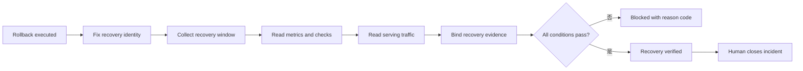

# Day 23｜回滾成功就算恢復了嗎？用 Recovery Verification Gate 確認系統真的回到安全狀態

## 本日定位

Day 22 的 Rollback Gate 解決了一個很急的問題：服務出現異常時，現在是否有足夠證據支持回滾，而且準備回去的版本是不是 `last known good`。

但回滾指令回傳成功，事情還沒有結束。流量可能還在舊的 route，資料修復可能還沒完成，錯誤率也可能只是短暫下降。這時候不能只看一行 `rollback completed`，就把 incident 標成恢復。

今天加入 Recovery Verification Gate。它是一個唯讀驗證層，回答的問題是：

> rollback 之後，系統是否真的回到宣告的 target candidate，而且在一段完整觀察期間維持健康？

它不切 traffic、不修資料、不重跑 deployment，也不自動關閉 incident。它只把「恢復」需要的 evidence 固定下來，交給負責人做最後 closeout。

## 先用生活情境理解

想像你在電商平台上線新的付款流程。上線後 webhook timeout 增加，團隊依照 Day 22 的 Rollback Gate 回到上一個 candidate。rollback command 顯示成功，但使用者回報仍然刷不過卡。

這時候可能有幾種情況：

- candidate 已經回去了，但 route 還有一個 region 指向壞版本。
- API error rate 降低了，但 queue depth 仍然持續堆積。
- 服務健康檢查通過，實際付款資料卻還沒有完成一致性修復。
- 觀察時間只有 30 秒，樣本太少，剛好沒有捕捉到尖峰。
- 另一個 incident 的 observation 被誤套到這次 rollback，造成「看起來恢復」的假象。

所以要把三個狀態分開：

| 狀態 | 它真正證明什麼 | 它不能假裝證明什麼 |
| --- | --- | --- |
| `rollback_executed` | rollback 指令完成，且回傳執行證據 | 使用者已恢復、資料已安全 |
| `recovery_verified` | target、traffic、window、metrics、checks 與 evidence 都對上 | incident 已經被人類正式結案 |
| `human_closeout` | 負責人讀過 evidence，決定後續追蹤與結案 | 可以省略 audit 或 postmortem |

Recovery Verification Gate 的目標不是讓團隊更晚恢復，而是避免把「指令成功」誤報成「服務恢復」。

## Recovery 是一次新的 evidence checkpoint

回滾改變了 serving state，所以回滾之後不能沿用回滾之前的結論。要建立一個新的 recovery observation，至少固定：

- `rollback_id`：這次回滾事件的識別碼。
- `run_id`：產生這批觀察的執行批次。
- `source_candidate_id`：發生異常、原本正在 serving 的 candidate。
- `target_candidate_id`：Recovery Gate 預期已經 serving 的 candidate。
- `source_commit`、`input_digest`、`environment_id`、`target`。
- `rollback`：執行狀態、實際套用的 target 與 execution evidence。
- `recovery_window`：是否完成、觀察秒數與樣本數。
- `metrics`：使用者結果與系統壓力的量測值。
- `checks`：health、traffic、data integrity 等 required checks。
- `traffic`：route state 與實際 serving candidate。
- `recovery_evidence`：名稱與 digest，讓結果能回連到同一份 observation。

只要 identity 有一個欄位不同，就先停在 `blocked_identity`。不要因為兩份資料的 candidate 名稱相似，或都是 production，就把別的 incident 當成這次的恢復證據。



> 圖 1｜Recovery Verification Gate 從回滾執行結果重新收集 window、metrics、traffic 與 evidence，最後才交給人類結案。

## 第一關：rollback 真的完成了嗎？

`rollback completed` 不是單純看 API HTTP 200，而是要確認 observation 中的 rollback result：

```json
{
  "rollback": {
    "status": "completed",
    "applied_target_candidate_id": "candidate-b",
    "execution_evidence": "sha256:rollback-execution"
  }
}
```

以下狀態都不能進入恢復驗證：

- `status` 是 `failed`、`pending` 或缺少。
- 指令回傳成功，但 `applied_target_candidate_id` 不是 intent 宣告的 target。
- 只有一段文字寫「已回滾」，沒有可回讀的 execution evidence。
- rollback 執行的是 candidate B，intent 卻宣告要驗證 candidate C。

Gate 會分開輸出 `rollback_not_completed` 與 `rollback_target_mismatch`。這比只回傳 `false` 更有用，因為 release owner 知道是要重新確認執行結果，還是要修正 recovery intent。

## 第二關：觀察 window 要完整

恢復不是一個瞬間。intent 要先寫明最少觀察條件：

```json
{
  "min_recovery_window_seconds": 900,
  "min_samples": 100
}
```

Gate 會檢查三件事：

1. `complete` 必須是 `true`。
2. `duration_seconds` 不得少於最小秒數。
3. `sample_count` 不得少於最小樣本數。

如果 window 只收集了 30 秒，或剛好沒有流量，不能用漂亮的平均值填補缺口。缺口會輸出：

- `recovery_window_incomplete`
- `recovery_window_too_short`
- `recovery_sample_count_shortfall`

這讓「還需要觀察」成為明確狀態，而不是讓模型自行猜測恢復了。

## 第三關：回到安全版本，不代表結果已經安全

即使 traffic 已經回到 target candidate，仍然要檢查使用者真正感受到的結果。範例用四個指標說明：

| 指標 | intent 門檻 | 它要回答的問題 |
| --- | ---: | --- |
| availability | 不低於 `0.999` | 使用者是否拿得到服務？ |
| p95 latency | 不高於 `450 ms` | 大多數較慢請求是否恢復？ |
| error rate | 不高於 `0.01` | 失敗是否已經降回可接受範圍？ |
| queue depth | 不高於 `20` | 背後工作是否仍然堆積？ |

任何一項超標，就回報對應的 `recovery_metric_*` reason。不要只看 availability，因為「服務有回應」不代表付款流程沒有持續變慢或排隊。

## 第四關：required checks 不能用平均值代替

Metrics 是量測結果，checks 是驗證步驟。兩者要一起存在。這次 fixture 要求：

- `rollback_execution`
- `health`
- `traffic`
- `data_integrity`

每一項都必須明確是 `passed`。`pending`、`skipped`、`failed` 或缺欄位都要 fail-closed：

```text
recovery_check_missing:data_integrity
recovery_check_not_passed:health
```

這個規則很重要，因為一個 health dashboard 綠燈，不能替代 data integrity 的驗證。恢復判斷要保留每個責任面，而不是把所有結果壓成一個總分。

## 第五關：版本回去了，流量真的回去了嗎？

Recovery Gate 會再次讀取 route state：

```json
{
  "traffic": {
    "state": "serving",
    "serving_candidate_id": "candidate-b"
  }
}
```

以下兩件事都要成立：

- route state 是 `serving`。
- 實際 serving candidate 等於 intent 的 `target_candidate_id`。

如果 route 還在 `draining`，或某個 region 仍然服務 candidate A，就輸出：

- `recovery_traffic_not_serving`
- `recovery_serving_candidate_mismatch`

這也是為什麼 Recovery Verification 不能只讀 rollback command 的輸出。執行控制面與實際流量面是兩份不同 evidence，必須再次回讀。

## 第六關：recovery evidence 要和這次觀察綁定

最後一關是 evidence digest。intent 先宣告預期的 recovery observation：

```json
{
  "recovery_evidence": {
    "name": "recovery-observation",
    "digest": "sha256:recovery-current"
  }
}
```

observation 讀回來的名稱與 digest 必須完全一致。名稱不一致代表你可能拿錯資料；digest 不一致代表內容可能在核對後被替換。

這裡不是追求「所有欄位都很完整」的形式，而是要讓下一個人能回答：

> 我現在看到的 recovery verified，是根據哪一份資料得出的？

如果答案不清楚，狀態就應該停在 `blocked_evidence`，而不是繼續傳遞一個無法回放的綠燈。

## Runnable example：唯讀 Recovery Verification Gate

`example-recovery-verification-gate/` 是一個只使用 Python 標準函式庫的最小範例。它把 intent 與 observation 當成輸入，依固定順序輸出 JSON：

```bash
cd day23/example-recovery-verification-gate
python3 -m unittest -v
python3 -m py_compile recovery_verification_gate.py test_recovery_verification_gate.py
python3 recovery_verification_gate.py fixtures/intent.json fixtures/observation.json
```

成功 fixture 的輸出是：

```json
{
  "allowed": true,
  "state": "recovery_verified",
  "reasons": []
}
```

範例特別保留三個界線：

1. **唯讀**：不修改 intent、observation 或 serving state。
2. **Deterministic**：同一組輸入重跑，reason code 與順序相同。
3. **動作分離**：不呼叫 traffic、deployment、database 或 incident API。

`allowed=true` 只代表恢復證據符合宣告的條件。它不是「事件已結案」，也不是自動重新發布的許可。

## Day 10 到 Day 23 的證據鏈

這條系列一路把「AI 可以猜」的空間縮小：

- Day 10–13：先檢查 Context 新鮮度、變更範圍、evidence binding 與 acceptance coverage。
- Day 14–16：把需求、變更、重現條件與 artifact promotion 串起來。
- Day 17–19：驗證 release candidate、deployment identity 與 post-deployment stability。
- Day 20：把穩定性連到 availability、p95 latency 與 error budget 的使用者結果。
- Day 21：要求有角色、有期限、有 scope 的人類核准。
- Day 22：異常時先確認 rollback candidate、trigger evidence 與 stop-loss。
- Day 23：回滾後重新驗證 target、window、metrics、checks、traffic 與 recovery digest。


> 圖 2｜證據鏈從新鮮 Context 走到恢復驗證；每一次狀態改變都需要自己的 intent 與可回讀 evidence。

## 結論：恢復也是需要證據的狀態

Recovery Verification Gate 的重點不是拖延結案，而是把「服務恢復」從一句口頭報告，變成下一個人可以檢查的狀態。

請記住三句話：

1. `rollback_executed` 不等於 `recovery_verified`；指令成功後仍要觀察真實結果。
2. Recovery evidence 必須同時綁定 target、window、metrics、checks 與 traffic；缺一項就 fail-closed。
3. `recovery_verified` 只代表證據通過，`human_closeout` 仍由真正負責的人讀取、決定並留下後續責任。

## GitHub 專案

- 系列 repository：[ChatGPT × Codex 企業級 AI 開發工作流](../)
- 本日文章來源：[`day23/article.md`](./article.md)
- Runnable example：[`example-recovery-verification-gate/`](./example-recovery-verification-gate/)
- 流程圖：[`diagrams/recovery_verification_gate_flow.mmd`](./diagrams/recovery_verification_gate_flow.mmd)
- 狀態圖：[`diagrams/recovery_verification_states.mmd`](./diagrams/recovery_verification_states.mmd)

目前 iThome、YouTube 與 GitHub 外部同步仍交由後續 Release lane；本 Producer 只產製與驗證本機內容，沒有執行外部發布。
