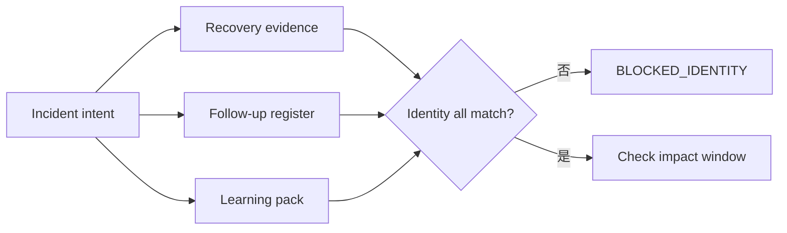
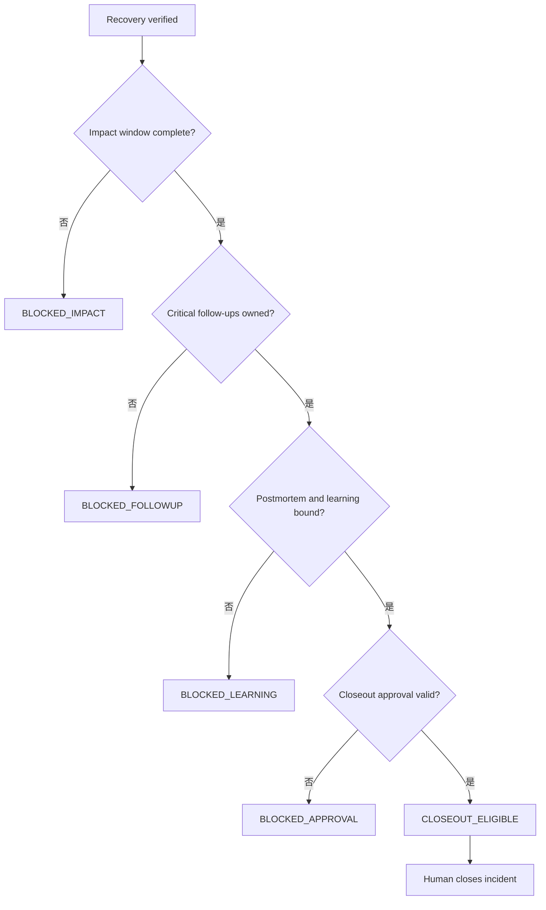

# Day 24｜恢復驗證通過就能結案嗎？用 Incident Closeout Gate 把復原、學習與追蹤責任綁起來

## 服務恢復了，為什麼 incident 還不能關？

想像付款服務剛完成 rollback。Day 23 的 Recovery Verification Gate 已經確認：target candidate 正確、traffic 正在服務、availability 與 latency 達標，資料完整性檢查也通過。

團隊很自然會想把 incident 關掉。但隔天回頭看，可能還有幾件事沒有完成：

- 客戶影響的時間範圍還沒有最後確認。
- postmortem 只寫了幾行，沒有綁回這次 incident 的 evidence。
- 監控調整、資料檢查或文件更新沒有明確 owner。
- learning pack 還沒有整理，下一次 AI 變更仍然拿不到這次事故的教訓。
- 有人拿另一個事件的 closeout 核准，誤套在目前的 incident。

所以「服務恢復」和「事件可以結案」是兩個不同問題。今天加入 `Incident Closeout Gate`，把恢復後的責任也變成可驗收 evidence。

> `recovery_verified` 代表服務證據通過；`closeout_eligible` 代表結案前提齊全；`human_closeout` 才是負責人真正做出的結案決定。

## 三個狀態，三種責任

| 狀態 | 它回答的問題 | 可以做什麼 | 不可以假裝做什麼 |
| --- | --- | --- | --- |
| `recovery_verified` | rollback 後服務是否回到安全狀態？ | 提供 recovery evidence | 直接代表 incident 已結案 |
| `closeout_eligible` | 影響、追蹤、學習與核准是否都齊了？ | 交給 owner 做最後判斷 | 自動關閉 ticket 或 incident |
| `human_closeout` | 有責任的人是否讀過 evidence 並決定結案？ | 留下可稽核的決定 | 省略 postmortem 或後續追蹤 |

`Incident Closeout Gate` 是唯讀判斷層。它只輸出可以被下一個人讀回的結果，不呼叫 incident、ticket、資料庫或通知 API。

## 第一關：固定 incident identity

結案 evidence 不能只寫「昨天的付款事故」。至少要綁住：

- `incident_id`：這次事件的唯一識別。
- `recovery_id`：Day 23 的恢復驗證批次。
- `run_id`：產生這批 evidence 的執行批次。
- `candidate_id`：恢復後實際服務的 candidate。
- `source_commit`：產生變更的來源版本。
- `input_digest`：輸入資料與設定摘要。
- `environment_id`：例如 production。
- `target`：這次結案判斷的目標環境。

只要 observation 和 intent 有一個欄位不同，就先回報 `blocked_identity`。不要因為標題、服務名稱或 approver 名字看起來一樣，就把另一個 incident 的結果搬過來。



> 圖 1｜Incident Closeout Gate 先把 recovery、follow-up 與 learning evidence 綁回同一個 incident identity。

## 第二關：recovery verified 還不夠

Day 23 的 gate 已經驗證 rollback 後的狀態，但 Day 24 不能只看一個布林值。結案前至少要重新讀到：

1. `recovery.state` 是 `recovery_verified`。
2. `customer_impact_window.complete` 是 `true`。
3. 影響窗口的秒數和樣本數達到 intent 宣告的最低值。
4. 當時的 recovery digest 仍然存在，且和 postmortem、learning pack 使用同一個摘要。

這樣可以避免「版本回去了，所以 incident 已經沒事」的跳躍。

```json
{
  "recovery": {
    "state": "recovery_verified",
    "evidence_digest": "sha256:recovery-current"
  },
  "customer_impact_window": {
    "complete": true,
    "duration_seconds": 1800,
    "sample_count": 240
  }
}
```

如果 window 尚未完成，應輸出 `impact_window_incomplete`；如果時間或樣本不足，則分別輸出 `impact_window_too_short` 或 `impact_sample_count_shortfall`。不要只看某一分鐘的綠色 dashboard。

## 第三關：每一項 follow-up 都要有人負責

事故結案不是把工作清單藏起來。Intent 應該宣告哪些 follow-up 是 critical，例如：

| Follow-up | 目的 | 結案前最低要求 |
| --- | --- | --- |
| `monitoring` | 補上能提早發現同類問題的監控 | 有 owner、due time，且 `completed` 或 `accepted` |
| `data_audit` | 確認受影響資料已完成檢查 | 有結果、有 owner，不能是 `skipped` |
| `runbook` | 把處理步驟帶回日常操作 | 文件已更新，且有人驗收 |
| `learning_pack` | 讓下一次 AI 變更拿得到事故教訓 | pack 狀態 `ready` 且 digest 綁定 |

以下任一情況都應 fail-closed：

- critical follow-up 缺少。
- 有項目但沒有 `owner_id`。
- `due_at_epoch` 缺少或早於現在的觀察時間。
- 狀態是 `pending`、`skipped` 或 `failed`。
- 項目標記完成，但 evidence digest 不是這次 incident 的 digest。

這些檢查不是行政流程，而是避免「服務穩了，責任卻沒有接住」。

## 第四關：postmortem 與 learning pack 必須可回放

Postmortem 和 learning pack 不應只是兩個檔名。它們至少要知道自己屬於哪一個 incident：

```json
{
  "postmortem": {
    "status": "published",
    "incident_id": "inc-24-001",
    "evidence_digest": "sha256:recovery-current"
  },
  "learning_pack": {
    "status": "ready",
    "incident_id": "inc-24-001",
    "evidence_digest": "sha256:recovery-current"
  }
}
```

如果 postmortem 的 incident id 不同，回報 `postmortem_identity_mismatch`；如果 digest 不同，回報 `postmortem_digest_mismatch`。Learning pack 同理。這讓下一次要載入 Context 時，可以知道這份規則來自哪次事故、哪一份已驗證 evidence。

## 第五關：closeout approval 也有 scope

最後仍然需要人類負責人做結案決定。Approval 不只看 `decision=approved`，還要驗證：

- `approver_id` 不是空值。
- `role` 是 intent 宣告的 `incident_commander` 或 `service_owner`。
- `scope` 精確等於 `incident_id/target`。
- 核准時間沒有超過 `max_age_seconds`。
- 核准對應同一組 incident identity。



> 圖 2｜只有恢復、影響窗口、追蹤責任、學習資料與人類核准都通過，才進入 closeout eligible。

## Reason code 要能告訴下一步

不要只輸出 `false`。具體 reason code 才能讓 incident owner 知道要補什麼：

- `blocked_identity`：先確認 incident、run、candidate 或 digest 是否漂移。
- `recovery_not_verified`：回到 Recovery Verification Gate 補證據。
- `impact_window_incomplete`：繼續觀察 customer impact。
- `followup_owner_missing:<name>`：補上責任人。
- `followup_overdue:<name>`：重新排程或升級追蹤。
- `postmortem_digest_mismatch`：重新綁定同一份 recovery evidence。
- `learning_pack_not_ready`：完成可回流到下一次 Context 的 pack。
- `closeout_approval_scope_mismatch`：請正確 owner 針對同一個 incident 重新核准。

Reason code 的用途是停止錯誤的結案，不是把人類排除在流程之外。

## Runnable example：唯讀 Incident Closeout Gate

`example-incident-closeout-gate/` 是一個只使用 Python 標準函式庫的最小範例：

```bash
cd day24/example-incident-closeout-gate
python3 -m unittest -v
python3 -m py_compile incident_closeout_gate.py test_incident_closeout_gate.py
python3 incident_closeout_gate.py fixtures/intent.json fixtures/observation.json
```

成功 fixture 會輸出：

```json
{
  "allowed": true,
  "state": "closeout_eligible",
  "reasons": []
}
```

`allowed=true` 只代表結案前提齊全，不是「incident 已經關閉」。範例刻意維持三個界線：

1. 唯讀：重試不會修改 intent、observation 或 follow-up register。
2. deterministic：同一組輸入永遠得到同一份 reason code。
3. 動作分離：不關閉 ticket、不更新 incident、不建立任務，也不發通知。

## Day 10 到 Day 24 的證據鏈

這條系列一路把「AI 可以猜」的空間縮小：

- Day 10–13：Context freshness、change scope、evidence binding 與 acceptance coverage。
- Day 14–16：Traceability、reproducibility 與 artifact promotion。
- Day 17–19：Release candidate、deployment verification 與 post-deployment stability。
- Day 20：把穩定性連到 availability、p95 latency 與 error budget。
- Day 21：要求有角色、有期限、有 scope 的人類核准。
- Day 22：異常時先確認 rollback candidate、trigger evidence 與 stop-loss。
- Day 23：回滾後重新驗證 target、window、metrics、checks、traffic 與 recovery digest。
- Day 24：恢復後仍要確認 impact、follow-up、learning 與 human closeout，讓責任真的接得住。


> 圖 3｜證據鏈不在 recovery verified 結束，而是把影響、學習與責任帶到 closeout。

## 結論：結案也要有邊界

Incident Closeout Gate 不是讓事故永遠不結案，而是避免把「服務暫時穩定」誤報成「所有責任都完成」。

請記住三句話：

1. `recovery_verified` 不等於 `closeout_eligible`。
2. 結案前要把 impact window、follow-up、postmortem 與 learning pack 綁回同一個 incident digest。
3. `closeout_eligible` 仍不等於已結案；最後的結案決定與責任，必須留在人類手上。

## GitHub 專案

- 系列 repository：[ChatGPT × Codex 企業級 AI 開發工作流](../)
- 本日文章來源：[`day24/article.md`](./article.md)
- Runnable example：[`example-incident-closeout-gate/`](./example-incident-closeout-gate/)
- 流程圖：[`diagrams/incident_closeout_gate_flow.mmd`](./diagrams/incident_closeout_gate_flow.mmd)
- 狀態圖：[`diagrams/incident_closeout_states.mmd`](./diagrams/incident_closeout_states.mmd)

目前 iThome 與 YouTube 仍為待後續 Release lane 處理；本 Producer 僅產製與驗證本機內容，沒有執行外部發布。
