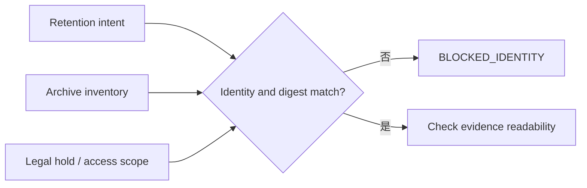

# Day 25｜Incident 結案後就能刪證據嗎？用 Evidence Retention Gate 守住留存期限與回讀能力

## 本日定位

Day 24 的 Incident Closeout Gate 確認 recovery、impact、follow-up、learning 與 human closeout 都接得起來。但 incident 結案不是證據生命週期的終點：如果團隊一結案就刪掉 recovery observation、影響範圍、postmortem 或 approval，下一次稽核、客訴、資安調查與模型學習就只剩口頭回憶。

本日加入 `Evidence Retention Gate`。它只讀取 retention intent、archive inventory、evidence metadata、legal hold 與 access scope，確認證據仍然可回讀、沒有 digest 漂移、留存期限涵蓋 policy window，而且沒有把另一個 incident 的資料混進來。Gate 不刪除、不搬移、不建立 legal hold，也不自動關閉或公開任何資料。

## 先用生活情境理解

想像付款 incident 已經完成 recovery，也由 incident commander 進行 human closeout。幾週後，客戶詢問某一段時間是否被重複扣款，稽核人員也要確認當時的核准與資料檢查。這時候可能發現：

- recovery evidence 還在 dashboard，但原始 observation 已被清理。
- postmortem 找得到，卻與當時的 evidence digest 對不上。
- archive inventory 顯示完成，但其中一個檔案實際上無法讀取。
- retention 到期時間只用檔案建立日推算，沒有涵蓋 incident closeout 後的 policy window。
- legal hold 已經被錯誤釋放，或讀取 scope 指到另一個事件。

「當時看過」不等於「現在能證明」。Evidence Retention Gate 要回答的是：**這批已結案證據，現在是否仍具備可回讀、可辨識、可追溯的留存條件？**

> `closeout_verified` 代表事件的結案前提曾經通過；`retention_ready` 代表目前仍可依政策保留與回讀；真正的 archive、delete 或 legal decision 仍由有責任的人執行。

## 三個狀態，三種責任

| 狀態 | 它回答的問題 | 可以做什麼 | 不可以假裝做什麼 |
| --- | --- | --- | --- |
| `closeout_verified` | 結案時的 recovery 與 follow-up 是否齊全？ | 保存當下的 closeout digest | 代表證據永遠存在 |
| `retention_ready` | 現在的證據是否仍可讀、綁定正確且未過期？ | 交給 owner 做留存決策 | 自動刪檔、移檔或延長期限 |
| `human_retention_decision` | 負責人是否依 policy 決定 archive、hold 或 delete？ | 留下可稽核的處置決定 | 省略 access scope 或 legal review |

Gate 是唯讀判斷層。它的輸出是下一步要補什麼 evidence，不是「可以按刪除」的按鈕。

## 第一關：先固定 retention identity

留存檢查不能只看「某個付款事故」。至少要綁住：

- `incident_id`：原始事件的唯一識別。
- `closeout_id`：哪一批結案判斷產生這份 evidence inventory。
- `run_id`：產生 inventory 的執行批次。
- `evidence_digest`：recovery、impact、follow-up、learning 與 approval 共用的摘要。
- `environment_id`、`target`：production 或其他環境與目標。

只要 intent 與 observation 有一個欄位不同，就先回報 `blocked_identity`。不要因為服務名稱相同，就把另一個事件的 archive 結果套過來。



> 圖 1｜Evidence Retention Gate 先確認 intent、inventory 與權限範圍指向同一個事件。

## 第二關：archive inventory 通過，不代表內容真的存在

`archive_complete=true` 只是一個摘要，Gate 還要重新檢查 inventory 狀態：

1. `retention.state` 必須是 `inventory_verified`。
2. archive 檢查必須標記 `archive_complete=true`。
3. 每一項 required evidence 都必須存在於 observation。
4. 每一項都要是 `readable=true`。
5. `storage_state` 只能是團隊允許的 `online` 或 `archived`。

如果 inventory 還在 `indexing`、archive 尚未完成，或檔案狀態是 `missing`、`corrupt`、`unknown`，就輸出 `retention_inventory_not_verified`、`retention_archive_incomplete` 或 `evidence_storage_invalid:<name>`。不能只看一個成功的 archive job。

## 第三關：每份 evidence 都要回到同一個 digest

結案時使用的 digest 會被後續 evidence 引用：

```json
{
  "evidence_digest": "sha256:incident-25-current",
  "evidence": {
    "recovery": {
      "readable": true,
      "storage_state": "archived",
      "digest": "sha256:incident-25-current"
    },
    "learning": {
      "readable": true,
      "storage_state": "archived",
      "digest": "sha256:incident-25-current"
    }
  }
}
```

只要其中一項 digest 變成舊值，就回報 `evidence_digest_mismatch:<name>`。這不是要求每個檔案內容永遠不能更新，而是要求任何更新都必須產生新的 identity 與新的 evidence chain，不能悄悄覆蓋原本的證據。

## 第四關：留存期限要看「現在」與政策，不只看建立日

Intent 應先宣告最低留存時間，例如示範 fixture 使用 `604800` 秒。每個 evidence 都要有：

- `created_at_epoch`：它何時產生。
- `retain_until_epoch`：在什麼時間之前必須可讀。
- `now_epoch`：這次 retention inventory 觀察時間。

Gate 至少要驗證：

```text
retain_until_epoch >= now_epoch
retain_until_epoch >= now_epoch + min_retention_seconds
```

如果已經過期，輸出 `evidence_retention_expired:<name>`；如果還沒過期但不足以涵蓋宣告的 policy window，輸出 `evidence_retention_too_short:<name>`。`created_at_epoch` 在未來或缺少，也要 fail-closed，因為那代表 metadata 本身不可信。

## 第五關：legal hold 與 access scope 不能被忽略

有些 incident 涉及稽核、客訴、資安調查或法律程序，不能只依一般 retention timer 處理。若 intent 宣告 `legal_hold_required=true`，observation 必須看到 `legal_hold.state=active`。

同時，讀取權限也要有範圍：

- intent 宣告 `required_access_scope=incident:inc-25-001`。
- observation 的 `access_scope` 必須精確相等。
- 不接受只寫 `production`、服務名稱或模糊的 team scope。

缺 hold 輸出 `legal_hold_missing`；scope 漂移輸出 `access_scope_mismatch`。Gate 不會自行建立或釋放 hold，也不會替人類做法律判斷。

## Reason code 要能告訴下一步

不要只輸出 `false`。具體 reason code 才能讓 owner 知道要補哪一層：

- `blocked_identity`：incident、closeout、run 或 digest 漂移。
- `retention_inventory_not_verified`：重新跑 inventory verification。
- `retention_archive_incomplete`：先完成 archive，再做留存判斷。
- `evidence_missing:<name>`：補回指定的 required evidence。
- `evidence_not_readable:<name>`：修復或重新取得可回讀副本。
- `evidence_storage_invalid:<name>`：確認 storage state，不接受 unknown 或 missing。
- `evidence_digest_mismatch:<name>`：建立新的 evidence chain，不要靜默覆蓋。
- `evidence_retention_expired:<name>`：交給 owner／legal review 決定處置。
- `evidence_retention_too_short:<name>`：依 policy 補足期限或升級決策。
- `legal_hold_missing`：確認 hold 是否需要重新建立。
- `access_scope_mismatch`：用正確 incident scope 重新讀取。

Reason code 的用途是停止錯誤的刪除或錯誤的稽核回覆，不是把人類排除在資料生命週期之外。

## Runnable example：唯讀 Evidence Retention Gate

`example-evidence-retention-gate/` 是一個只使用 Python 標準函式庫的最小範例：

```bash
cd day25/example-evidence-retention-gate
python3 -m unittest -v
python3 -m py_compile evidence_retention_gate.py test_evidence_retention_gate.py
python3 evidence_retention_gate.py fixtures/intent.json fixtures/observation.json
```

成功 fixture 會輸出：

```json
{
  "allowed": true,
  "state": "retention_ready",
  "reasons": []
}
```

`allowed=true` 只代表本次 evidence inventory 具備留存條件，不是允許刪除、公開、移轉或自動延長 retention。範例刻意維持三個界線：

1. 唯讀：重試不會修改 intent、observation 或 archive。
2. deterministic：同一組輸入永遠得到同一份 reason code。
3. 動作分離：不刪除 evidence、不建立 legal hold、不呼叫 archive、delete 或 permission API。

## Day 10 到 Day 25 的證據鏈

這條系列一路把「AI 可以猜」的空間縮小：

- Day 10–13：Context freshness、change scope、evidence binding 與 acceptance coverage。
- Day 14–16：Traceability、reproducibility 與 artifact promotion。
- Day 17–19：Release candidate、deployment verification 與 post-deployment stability。
- Day 20：把穩定性連到 availability、p95 latency 與 error budget 的使用者結果。
- Day 21：把 automated evidence 連到有角色、有期限、有 scope 的人類核准。
- Day 22：異常時先確認 rollback candidate、trigger evidence 與 stop-loss。
- Day 23：回滾後重新驗證 target、window、metrics、checks、traffic 與 recovery digest。
- Day 24：恢復後確認 impact、follow-up、learning 與 human closeout。
- Day 25：結案後仍然檢查 evidence 是否可回讀、未漂移、未過期，而且存取範圍正確。


> 圖 2｜證據鏈不在 incident closeout 結束，還要把可回讀性與留存期限帶到下一個生命週期。

## 結論：結案之後，證據仍然要有邊界

Evidence Retention Gate 不是讓資料永遠不能刪，而是避免把「曾經存在」誤報成「現在仍可證明」。

請記住三句話：

1. `closeout_verified` 不等於 `retention_ready`。
2. 每一份 recovery、impact、follow-up、learning 與 approval 都要綁回同一個 incident digest，並且能被讀回。
3. `retention_ready` 仍不等於可以刪除或公開；最後的 archive、legal hold 與 delete decision，必須留在人類手上。

## GitHub 專案

- 系列 repository：[ChatGPT × Codex 企業級 AI 開發工作流](../)
- 本日文章來源：[`day25/article.md`](./article.md)
- Runnable example：[`example-evidence-retention-gate/`](./example-evidence-retention-gate/)
- 流程圖：[`diagrams/evidence_retention_gate_flow.mmd`](./diagrams/evidence_retention_gate_flow.mmd)
- 狀態圖：[`diagrams/evidence_retention_states.mmd`](./diagrams/evidence_retention_states.mmd)

目前 iThome 與 YouTube 仍為待後續 Release lane 處理；本 Producer 僅產製與驗證本機內容，沒有執行外部發布。
