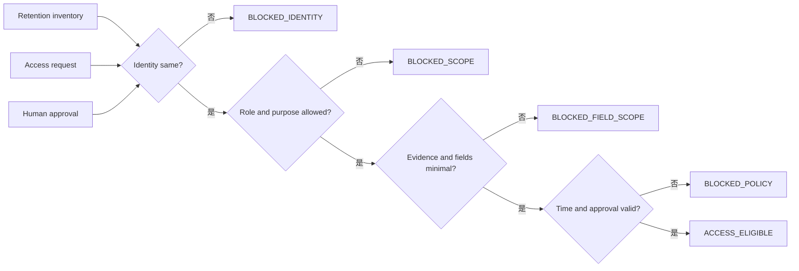

# Day 26｜證據留住了，誰都能讀嗎？用 Evidence Access Gate 守住最小權限與稽核範圍

## Day 25 的問題還沒結束

Day 25 用 `Evidence Retention Gate` 解決了一個常被忽略的問題：incident 結案後，recovery、impact、follow-up、learning 與 approval 等 evidence，是否還存在、可回讀、digest 沒有漂移，而且留存期限仍然有效。

但團隊很快會遇到下一個問題：

> 證據留住了，是否代表所有人都可以讀？

想像一位工程師正在調查付款 incident。他需要看 recovery 的 candidate 與狀態，也需要看 impact window 的 aggregate 結果。但如果系統直接把整個 incident pack 交給他，裡面可能還包含：

- 其他 tenant 的細節。
- 不在本次調查目的內的原始 payload。
- 不需要知道的 requester、customer 或內部聯絡資訊。
- 另一個 environment 的 deployment evidence。
- 已經超過核准範圍的 learning 或 approval 附件。

這不是「有沒有 retention」的問題，而是「這次 access 是否只拿到完成目的所需的最小範圍」。今天加入 `Evidence Access Gate`，把讀取前的邊界也做成可驗收 evidence。

> `retention_ready` 代表證據還在；`access_eligible` 代表這個 access request 的前提齊全；真正讀取資料，仍要由授權系統或負責人執行。

## 先分清楚三個狀態

| 狀態 | 它回答的問題 | 可以做什麼 | 不可以假裝做什麼 |
| --- | --- | --- | --- |
| `retention_ready` | 這份 evidence 是否還存在且能回讀？ | 提供可用的 evidence inventory | 代表任何人都能讀 |
| `access_eligible` | 這次請求是否符合角色、目的、欄位與時間邊界？ | 交給授權執行層或 owner | 直接發 token、讀取內容或下載檔案 |
| `access_granted` | 授權系統是否真的放行這次讀取？ | 留下實際的 access event | 被 Gate 預先宣告或猜出來 |

`Evidence Access Gate` 是唯讀判斷層。它讀取 intent、access request、evidence inventory、approval 與 audit observation，輸出 deterministic reason code；它不呼叫 IAM API、不產生 signed URL，也不把 evidence 複製到別處。

## 第一關：留存 identity 和 access identity 必須是同一件事

Access request 不能只寫「我要看付款事故」。至少要綁住：

- `incident_id`：哪一次事件。
- `closeout_id`：哪一份結案脈絡。
- `run_id`：哪一批產生的 evidence。
- `evidence_digest`：哪一組內容摘要。
- `environment_id`：production、staging 或其他環境。
- `target`：這次 access 所針對的目標。

只要 request 和 intent 有一個 identity 欄位不同，就先輸出 `blocked_identity`。不要因為 incident title 一樣、服務名稱一樣，或 requester 說「這就是昨天那筆」，就把另一個 run 的核准套過來。



> 圖 1｜Evidence Access Gate 先把 retained evidence、access request 與 approval 綁回同一個 identity，再檢查最小範圍與政策期限。

## 第二關：角色和目的不是裝飾欄位

Intent 應該先宣告這次 access 可以由哪些角色提出，以及允許哪些目的。例如：

| 欄位 | 範例 | Gate 要確認什麼 |
| --- | --- | --- |
| `requester_role` | `incident_responder` | 是否在 allowlist |
| `purpose` | `incident_investigation` | 是否為已宣告用途 |
| `evidence_names` | `recovery`, `impact` | 是否為允許的 evidence surface |
| `field_scope` | `state`, `candidate_id`, `aggregate_metrics` | 是否超過最小欄位集合 |
| `target` | `production` | 是否和 identity、approval 一致 |

角色合法，不代表目的就合法；目的合法，也不代表可以讀整個 evidence pack。這些條件要分開檢查，reason code 才能告訴下一個 owner 要補角色、改目的，還是縮小讀取範圍。

常見的錯誤是把 `admin` 當成萬用通行證。實際上，即使是 incident commander，也應該針對這次 incident、這個 target、這個 purpose 和這些欄位提出明確 request。高權限不應該消除 scope。

## 第三關：最小欄位範圍比「整包可讀」安全

Evidence inventory 可以有很多欄位，但 access request 只應該帶走完成目的所需的欄位。Intent 可以宣告每個 evidence surface 的允許欄位：

```json
{
  "permitted_fields": {
    "recovery": ["candidate_id", "state", "evidence_digest"],
    "impact": ["window_seconds", "sample_count", "aggregate_metrics"]
  }
}
```

Gate 會同時檢查三件事：

1. requested evidence 是否存在於允許清單。
2. requested fields 是否是該 evidence 的允許子集合。
3. inventory 中實際可回讀的欄位是否真的包含這些欄位。

如果 requester 想多看一個 `raw_customer_payload`，即使它存在、也即使 requester 是管理者，只要 intent 沒有宣告，就回報 `field_scope_exceeded:<evidence>:<field>`。這個阻擋不是不信任某個人，而是讓「這次目的需要什麼」可以被回放。

## 第四關：時間範圍要短，而且要能回讀

Access 不是永久權限。Request 至少要提供：

- `requested_at_epoch`：什麼時候提出。
- `expires_at_epoch`：什麼時候失效。
- intent 宣告的 `max_access_seconds`：最長可用多久。

Gate 會阻擋以下情況：

- request time 在未來。
- expiry 缺少、早於現在，或不晚於 request time。
- expiry 超過 `now + max_access_seconds`。
- access approval 已經超過 `approval_max_age_seconds`。

這讓「先申請永久權限，以後再說」變成明確的錯誤，而不是留給每個人自行解讀。短期限也不會阻止合理調查；需要延長時，應該建立新的 request 和新的 approval，而不是偷偷修改原始 observation。

## 第五關：approval 必須精確對應 scope

一筆 `decision=approved` 不代表它可以授權所有 incident。Approval 至少要綁住：

- 同一組 incident identity。
- `requester_id` 與 `requester_role`。
- `purpose`。
- `scope`：例如 `inc-26-001/production/incident_investigation`。
- 核准時間與允許的最大年齡。

如果 approval 的 target 是 `staging`、purpose 是 `training`，但 request 要讀 production 的 incident investigation evidence，Gate 應該輸出 `approval_scope_mismatch`，而不是看到 `approved` 就放行。

同樣地，approval 不是 Gate 自己生出來的。範例只檢查 observation 裡的 approval 是否符合 intent；真正的人類核准仍然是外部責任。

## 第六關：每次 access 都要留下 audit anchor

最小權限如果沒有 audit，之後仍然無法回答「誰在什麼時間以什麼目的讀了哪一組 evidence」。所以 intent 要求 audit record 至少有：

- `event_id`：這次 request 的唯一事件。
- `recorded_at_epoch`：寫入稽核紀錄的時間。
- `request_digest`：綁回這次 access request 的摘要。
- `evidence_digest`：綁回被讀取的 evidence 集合。

Gate 不會把 audit record 當成「已經讀取」的證明，而是確認如果後續真的執行 access，已經有可追蹤的 anchor。缺少 event id、digest 或 timestamp，就輸出 `audit_anchor_missing` 或 `audit_digest_mismatch`。

這裡故意保留一條清楚界線：`access_eligible` 不是 `access_granted`，audit anchor 也不是內容本身。系統必須分開記錄「可以做」、「真的做了」與「讀到了什麼範圍」。

## Reason code 要告訴下一步

不要只回報 `false`。具體 reason code 才能讓 owner 快速修正：

- `identity_mismatch:<field>`：先確認 incident、run、environment 或 digest。
- `requester_role_not_allowed`：換成 intent 允許的角色，或重新建立 intent。
- `purpose_not_allowed`：把目的改成已宣告用途，不要用模糊描述繞過。
- `evidence_not_allowed:<name>`：縮小 evidence surface 或更新正式政策。
- `field_scope_exceeded:<name>:<field>`：刪掉不必要欄位。
- `access_window_expired`：建立新的 request，不延長舊 observation。
- `approval_scope_mismatch`：請正確 owner 對同一個 request 重新核准。
- `audit_anchor_missing`：先建立可回讀的 audit event。
- `access_evidence_digest_mismatch:<name>`：回到 Day 25 檢查 retention inventory 與 digest。

Reason code 的用途是停止過大的讀取，不是把人類排除在流程之外。

## Runnable example：唯讀 Evidence Access Gate

`example-evidence-access-gate/` 使用 Python 標準函式庫，讀取兩個 JSON 檔案，輸出 deterministic access eligibility 報告：

```bash
cd day26/example-evidence-access-gate
python3 -m unittest -v
python3 -m py_compile evidence_access_gate.py test_evidence_access_gate.py
python3 evidence_access_gate.py fixtures/intent.json fixtures/observation.json
```

成功 fixture 會輸出：

```json
{
  "allowed": true,
  "state": "access_eligible",
  "reasons": []
}
```

範例刻意保持三條邊界：

1. 唯讀：不讀取 evidence 內容、不發 token、不修改 IAM 或 archive 狀態。
2. deterministic：相同 intent 與 observation 永遠得到同一組 reason code。
3. 分離：`access_eligible` 只代表可以交給授權執行層，不代表已經 access granted。

## Day 10 到 Day 26：證據鏈開始保護讀取者與被讀取者

這條系列一路把 AI 的「猜測空間」縮小：

- Day 10–13：Context freshness、change scope、evidence binding 與 acceptance coverage。
- Day 14–16：Traceability、reproducibility 與 artifact promotion。
- Day 17–19：Release candidate、deployment verification 與 post-deployment stability。
- Day 20：把穩定性連到 availability、p95 latency 與 error budget。
- Day 21：要求有角色、有期限、有 scope 的人類核准。
- Day 22：異常時固定 rollback candidate、trigger evidence 與 stop-loss。
- Day 23：回滾後重新驗證 target、window、metrics、checks、traffic 與 recovery digest。
- Day 24：恢復後確認 impact、follow-up、learning 與 human closeout。
- Day 25：結案後確認 evidence 還能留存與回讀，不能因為結案就刪除。
- Day 26：證據留住後，進一步確認誰能以什麼目的讀哪些欄位，並留下 audit anchor。


> 圖 2｜證據鏈從「能不能留」延伸到「誰能以什麼最小範圍讀」，最後才交給人類或授權系統執行。

## 結論：留存和讀取是兩道不同的 Gate

`Evidence Retention Gate` 守住「證據不能太早消失」；`Evidence Access Gate` 守住「證據不能被過大範圍讀取」。兩者都需要同一個 identity 與 digest，但責任不同。

請記住三句話：

1. `retention_ready` 不等於 `access_eligible`，留住證據不會自動放大讀取權限。
2. access request 要同時限制 role、purpose、evidence surface、field scope 與有效時間。
3. `access_eligible` 仍不等於 `access_granted`；真正讀取要由授權執行層完成，並留下可回讀的 audit anchor。

## GitHub 專案

- 系列 repository：[ChatGPT × Codex 企業級 AI 開發工作流](../)
- 本日文章來源：[`day26/article.md`](./article.md)
- Runnable example：[`example-evidence-access-gate/`](./example-evidence-access-gate/)
- 流程圖：[`diagrams/evidence_access_gate_flow.mmd`](./diagrams/evidence_access_gate_flow.mmd)
- 狀態圖：[`diagrams/evidence_access_states.mmd`](./diagrams/evidence_access_states.mmd)

目前 iThome、YouTube 與 GitHub 仍由後續 Release lane 處理；本 Producer 僅產製與驗證本機內容，沒有執行外部發布。
