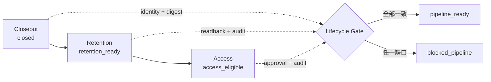

# Day 27｜Evidence 都通過了，整條 Incident Pipeline 真的接得起來嗎？用 Lifecycle Gate 串起 Closeout、Retention 與 Access

## 先從一個很常見的情境開始

事故處理完了，團隊通常會得到三種結論：Incident 已經結案、Evidence 還留著、這次讀取也有人核准。

問題是，這三句話可能各自來自不同一段流程、不同一個 run，甚至不同一份 evidence。每個局部檢查都顯示綠燈，整條 Incident Pipeline 卻不一定真的接得起來。

例如：

- Closeout 說 `inc-27-001` 已經結案。
- Retention 說同一批 evidence 還能回讀。
- Access 說請求有核准。
- 但其中一段綁的是另一個 `run_id`，或 evidence digest 已經換過。

如果系統只把三個 `true` 串在一起，就會把「每段都通過」誤當成「同一條證據鏈完整」。這正是 Day 27 要處理的問題：把 Closeout、Retention、Access 三道 Gate 接成一個可重跑、可稽核、遇到不一致就停止的 Lifecycle Gate。

## 本日主張：綠燈要屬於同一條證據鏈

Lifecycle Gate 不是第四個會讀資料的服務，也不是把所有授權決策集中到一個布林值。它是一個唯讀的 pipeline readiness check，先確認三道既有 Gate 是否真的描述同一件事，再輸出下一步能不能交給執行層。

它只回答一個問題：

> Closeout、Retention、Access 是否依正確順序完成，並且共同綁定同一份 incident evidence？

成功輸出 `pipeline_ready`，代表前提完整；失敗則輸出固定的 `reason code`。它不刪 evidence、不讀 evidence 內容、不發 token，也不呼叫 IAM、archive 或其他外部 API。

## 為什麼三道 Gate 不能只看最後一個狀態

### Closeout：事件是否真的可以收尾

Closeout Gate 的責任是確認事故復原、必要 follow-up、學習與責任交接都完成，讓 incident 有一個可追蹤的結案 identity。它回答的是「這個事件能不能被視為完成收尾」。

### Retention：證據是否還能被可靠地回讀

Retention Gate 的責任是確認 evidence 仍存在、儲存狀態正確、digest 沒有漂移，且留存期限仍符合政策。它回答的是「這份 evidence 還能不能被當成調查依據」。

### Access：這次讀取是否具備最小前提

Access Gate 的責任是確認讀取請求有正確的身份、目的、範圍與核准依據。它回答的是「這次 request 是否可以交給授權執行層」，不是「資料已經被讀取」。

三道 Gate 的狀態與責任如下：

| Stage | 它確認什麼 | 成功狀態 | 它不代表什麼 |
| --- | --- | --- | --- |
| Closeout | Incident 是否依流程完成結案 | `closed` | 不代表 evidence 永遠存在 |
| Retention | Evidence 是否仍可回讀且 digest 一致 | `retention_ready` | 不代表所有人都能讀 |
| Access | 這次讀取是否具備核准與最小範圍 | `access_eligible` | 不代表已發 token 或讀到內容 |

Lifecycle Gate 把這三個狀態放在同一個 pipeline identity 下檢查，而不是把其中一個狀態當成其他狀態的替代品。

## 先比對 Identity，再檢查 Stage

這個順序很重要。只要 identity 已經漂移，後面的 stage 綠燈就不應該再被拿來拼接。

本範例要求 intent 與 observation 的以下欄位完全一致：

- `incident_id`：是哪一次事故。
- `closeout_id`：哪一份結案紀錄。
- `run_id`：哪一次執行產生這組觀察。
- `evidence_digest`：哪一份 evidence 內容指紋。
- `environment_id`：在哪個環境完成驗證。
- `target`：這組結果要套用到哪個目標。

任何一欄不同，結果會先停在 `blocked_identity`，並回報例如 `identity_mismatch:run_id`。這個 fail-closed 行為避免把別的 incident 的 retention 或 approval 借來完成目前的 pipeline。

## Stage 順序也是契約的一部分

Lifecycle 不是任意三個完成旗標的集合。本日範例使用明確順序：

```text
closeout → retention → access
```

先確認事件完成收尾，才知道要留住哪一份證據；確認證據還能回讀，才有意義檢查這次讀取是否有正確前提。若 observation 以 `closeout → access → retention` 出現，雖然三個 key 都存在，仍然回報 `stage_order_invalid:retention_before_access`。

順序檢查不代表要執行三個 stage。Lifecycle Gate 只讀既有 observation，並驗證它是否符合 pipeline contract；真正的 Closeout、Retention、Access 執行仍由各自的流程負責。

## 每個 Stage 都要綁同一個 Evidence Digest

只檢查 stage state 還不夠。每個 stage 都必須帶著與 intent 相同的 `evidence_digest`，而且要有自己的 `audit_event_id`。

這讓系統可以區分兩種完全不同的狀況：

1. Retention 本身成功，但它驗證的是舊 evidence。
2. Retention 成功，而且它驗證的正是這次 pipeline 指定的 evidence。

第一種不能被當成第二種。若 retention 的 digest 是 `sha256:old`，結果會回報 `stage_digest_mismatch:retention`。如果某個 stage 沒有 audit event，則回報 `audit_event_missing:<stage>`，不讓無法追蹤的綠燈進入下一步。

## Readback 與 Approval 是不同的證據

Retention 與 Access 各有一個容易被混淆的欄位：

- `readback_passed=true`：證明 retention 這一段確實能回讀，並不是只有 metadata 顯示存在。
- `approval_bound=true`：證明 access 這一段有核准依據綁在同一條 pipeline 上。

前者不能代替後者。Evidence 還在，不代表 request 可以讀。

後者也不能代替前者。有人核准，不代表要讀的 evidence 還是原來那一份。

Lifecycle Gate 要兩者都存在，並且各自通過自己的 stage state 與 digest 檢查。

## 用固定 Reason Code 取代模糊的「不行」

唯讀 Gate 的輸出維持小而穩定：

```json
{
  "allowed": false,
  "state": "blocked_pipeline",
  "reasons": [
    "stage_digest_mismatch:retention",
    "access_approval_unbound"
  ]
}
```

Reason code 讓下一個人知道要修哪一段，也讓重跑結果可以被測試與稽核。範例會檢查：

| 情況 | Reason code |
| --- | --- |
| intent 與 observation identity 不同 | `identity_mismatch:<field>` |
| 缺少必要 stage | `stage_missing:<stage>` |
| 出現不在契約內的 stage | `stage_unknown:<stage>` |
| stage 順序錯誤 | `stage_order_invalid:<stage>_before_<previous>` |
| stage 狀態不符 | `stage_state_invalid:<stage>` |
| digest 不一致 | `stage_digest_mismatch:<stage>` |
| 沒有稽核事件 | `audit_event_missing:<stage>` |
| Retention 缺少回讀證據 | `retention_readback_missing` |
| Access 沒有綁定核准 | `access_approval_unbound` |

這些 reason code 不是給使用者看的裝飾，而是讓 pipeline 可以安全停止、修正後再重跑的介面。

## 搭配 GitHub 實作範例

本日的 runnable example 放在 [`example-evidence-lifecycle-gate/`](./example-evidence-lifecycle-gate/)。它使用 Python 標準函式庫，只讀兩份 JSON：`intent.json` 描述這次 pipeline 的 identity 與 stage 順序，`observation.json` 描述各 stage 的實際結果。

先執行成功案例：

```bash
cd example-evidence-lifecycle-gate
python3 evidence_lifecycle_gate.py fixtures/intent.json fixtures/observation.json
```

預期輸出：

```json
{
  "allowed": true,
  "state": "pipeline_ready",
  "reasons": []
}
```

接著執行完整測試：

```bash
python3 -m unittest -v
```

測試涵蓋成功、identity drift、缺 stage、順序錯誤、digest drift、狀態錯誤、readback／approval 缺失、audit 缺失、未知 stage，以及 deterministic retry。測試也確認函式不會修改輸入資料。

這個範例刻意不做以下事情：

- 不讀取 evidence 的實際內容。
- 不刪除或搬移任何檔案。
- 不呼叫外部 archive、IAM 或 API。
- 不產生 access token。
- 不把 `pipeline_ready` 宣稱成 `access granted`。

它示範的是「把跨 stage 的前提綁在一起」，不是把授權執行層藏在檢查器裡。

## 用 Given／When／Then 定義完成條件

### 1. 所有 Stage 以同一份 identity 完成

```text
Given intent 與 observation 的 incident、closeout、run、digest、environment、target 完全一致
And closeout、retention、access 依指定順序存在
When 執行 Lifecycle Gate
Then allowed=true
And state=pipeline_ready
And reasons=[]
```

### 2. 任一 identity 漂移就停止

```text
Given observed.run_id 與 intent.run_id 不同
When 執行 Lifecycle Gate
Then state=blocked_identity
And reasons 包含 identity_mismatch:run_id
And 不以其他 stage 的綠燈抵銷這個錯誤
```

### 3. Evidence digest 漂移不能通過

```text
Given retention.evidence_digest 與 intent.evidence_digest 不同
When 執行 Lifecycle Gate
Then allowed=false
And reasons 包含 stage_digest_mismatch:retention
```

### 4. 缺少回讀或核准要 fail-closed

```text
Given retention.readback_passed 不是 true
Or access.approval_bound 不是 true
When 執行 Lifecycle Gate
Then allowed=false
And 回報對應的 readback 或 approval reason code
```

### 5. 重試要保持 deterministic

```text
Given 相同的 intent 與 observation
When 連續執行兩次
Then 兩次輸出完全一致
And intent 與 observation 都沒有被修改
```

## 圖解：把三道 Gate 接成一條證據鏈

流程圖原始檔在 [`diagrams/evidence_lifecycle_gate_flow.mmd`](./diagrams/evidence_lifecycle_gate_flow.mmd)，狀態圖原始檔在 [`diagrams/evidence_lifecycle_states.mmd`](./diagrams/evidence_lifecycle_states.mmd)。流程的關鍵不是「多一個總開關」，而是每個 stage 都把 identity、digest 與責任帶到下一個 stage。



## 真正的責任邊界

Lifecycle Gate 通過後，仍然需要下一層決定怎麼做：

1. 人類 owner 確認 pipeline 結果符合這次操作目的。
2. 授權執行層依自己的 policy 決定是否真的放行。
3. 真正讀取 evidence 時，再留下 read event、request digest 與 scope。
4. 若任何一段在執行前後發生漂移，重新建立 observation 並重跑 Gate。

因此，`pipeline_ready` 是「可以進入下一個責任邊界」，不是「系統已經做完所有事」。這個小小的語意差異，能避免把檢查器誤用成授權器。

## 本日結語

Day 24–26 分別處理 Closeout、Retention 與 Access 的局部邊界；Day 27 把它們接起來。

請記住三句話：

1. 每一段 Gate 通過，不代表它們描述的是同一份 evidence。
2. Lifecycle Gate 要先比對 identity，再比對 stage 順序、狀態、digest 與稽核證據。
3. `pipeline_ready` 只代表跨 stage 前提完整，真正的授權、讀取與後續變更仍要留在明確的執行層。

會跑的檢查器不一定能保證整條流程安全；能把證據、責任與停止條件接在一起，才是可以交接、可以重跑、也可以被信任的 Incident Pipeline。
