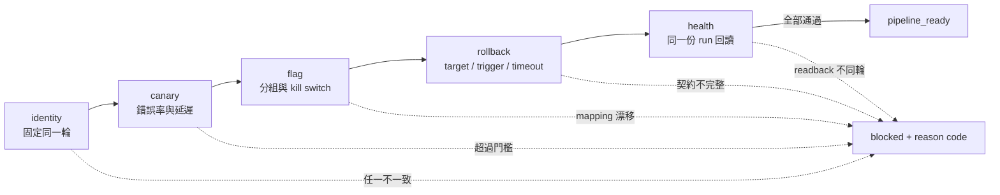
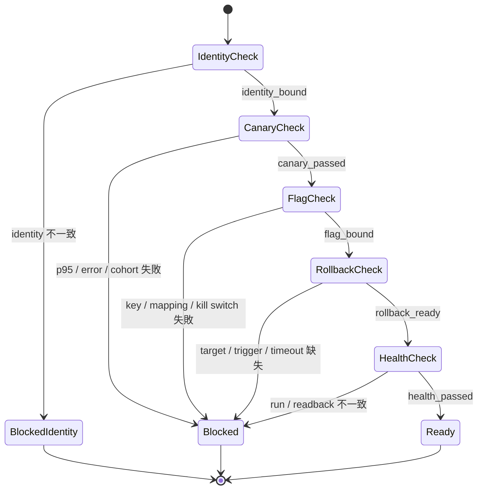

# Day 28｜rollout 不是一次推完就好！用 Progressive Rollout Gate 把 canary、flag、rollback 與健康檢查綁成可觀察流程

## 先從一個常見情境開始

新版本部署完成，監控畫面也亮起綠燈。團隊於是把流量從 10% 放大到 100%。幾分鐘後才發現：canary 看的是舊 cohort、feature flag 開到另一個分組，健康檢查則回讀另一個 run 的結果。

每一段看起來都「通過」，整條 rollout 卻沒有辦法回答最重要的問題：**這些綠燈，是不是都屬於同一輪發布？**

這就是分段發布最容易被忽略的地方。canary、feature flag、rollback 與健康檢查如果各自有一套 identity，系統就可能把不同版本的證據拼成一個假的成功結論。

本日用一個唯讀的 Progressive Rollout Gate，先固定同一份 rollout identity，再依序檢查五道關卡。它不會部署、不會開關 feature flag，也不會執行 rollback；它只確認「是否具備交給下一個責任邊界的前提」。

## 本日主張：pipeline ready 不等於全面上線

Progressive Rollout Gate 的輸出不是「現在可以對所有人開放」。它只回答：

> 這一輪 rollout 的 identity、觀察證據、回退契約與健康檢查，是否完整、同一輪、可回讀、可稽核？

如果答案是是，輸出：

```json
{"allowed": true, "state": "pipeline_ready", "reasons": []}
```

如果答案是否定，輸出固定的 reason code，例如 `identity_mismatch:cohort`、`stage_digest_mismatch:canary` 或 `health_readback_mismatch`。下一個執行層看到 blocked，就應該停在原地，不要自行猜測缺哪一段。

## 五道關卡，先比對 identity 再看 stage

流程固定為：



### 1. Identity：先確認「是哪一輪」

所有 observation 都要綁回同一份 identity。範例使用六個欄位：

| 欄位 | 要回答的問題 |
| --- | --- |
| `release_id` | 這是哪一次發行？ |
| `environment` | 在哪個環境觀察？ |
| `cohort` | 這次放量對象是哪一群？ |
| `flag_key` | 控制這次放量的開關是哪一個？ |
| `run_id` | 這組結果是哪次執行產生？ |
| `evidence_digest` | 所有 stage 是否引用同一份證據版本？ |

只要 `release_id`、`cohort` 或 `run_id` 有一欄對不上，就先回傳 `blocked_identity`。這個順序很重要：identity 已經漂移時，後面即使有一個漂亮的 p95，也不能拿來替這一輪背書。

### 2. Canary：不只看一個數字

Canary 是小比例流量的觀察窗口，但「小比例」本身不是安全保證。至少要把下列條件放在同一輪證據裡：

- `p95_ms` 沒有超過 rollout intent 的上限。
- `error_rate` 沒有超過允許門檻。
- `cohort_match` 是 `true`，確認觀察對象沒有跑錯。
- 每個 stage 的 `evidence_digest` 都和 intent 一致。

任一條件不成立，就回傳 `canary_p95_exceeded`、`canary_error_rate_exceeded` 或 `canary_cohort_mismatch`，停在 `blocked_pipeline`。Gate 不會替團隊決定要降低流量、修 bug 或延長觀察時間；它只把「不能繼續」說清楚。

### 3. Feature flag：開關也要有對象

Feature flag 不只是 `on` 或 `off`。Rollout Gate 會確認：

- `flag_key` 是否等於這次 intent 宣告的 key。
- flag mapping 是否真的指向目前的 cohort。
- 出問題時 kill switch 是否可用。
- owner 與 release identity 是否仍然一致。

如果開關開對了，但 cohort 錯了，這仍然是失敗。否則你以為正在觀察 10% canary，實際上可能是另一群使用者在承擔風險。

### 4. Rollback：事前契約，不是事後祈禱

Rollback readiness 至少需要三個可回讀欄位：

| 欄位 | 內容 |
| --- | --- |
| `target` | 要回到哪一個 release？ |
| `trigger` | 哪些錯誤率、延遲或健康條件會觸發？ |
| `timeout_seconds` | 多久內要完成判斷或下達？ |

真正的 rollback 動作仍由具有權限的 release workflow 執行。Gate 只檢查契約是否存在，避免「大家都知道出事要 rollback」卻沒有人能指出目標、條件與時間限制。

### 5. Health：回讀同一份結果

最後一關不是再看一個全新的 dashboard，而是確認健康檢查回讀的仍然是同一個 `run_id`、同一個 `cohort`、同一個 `flag_key` 與同一個 `evidence_digest`。如果 health check 回讀的是上一輪結果，就算畫面顯示 healthy，也不能把它放進這一輪的 `pipeline_ready`。

## 為什麼每一段都要有 digest 與 audit event

只檢查 stage 的 `state` 不夠。兩個 observation 都可能寫著 `canary_passed`，但其中一個來自舊資料。每個 stage 都要帶同一個 `evidence_digest`，讓 Gate 能抓到證據漂移；也要帶 `audit_event_id`，讓事後可以找到「誰在什麼時候做了這個判斷」。

狀態圖可以簡化成：



這裡的 `Ready` 只是「前提完整」，不是「系統已經完成全面 rollout」。這個名稱要在文章、程式輸出與交接文件中保持一致，避免下一個人把 readiness 誤讀成 execution success。

## 搭配 GitHub 實作範例：只讀、可重跑的 Gate

本日的 Python 範例放在 [`day28/example-progressive-rollout-gate/`](./example-progressive-rollout-gate/)。它只使用標準函式庫，讀入兩份 JSON：

- `fixtures/intent.json`：這次 rollout 預期的 identity、門檻與 stage 順序。
- `fixtures/observation.json`：各 stage 實際回報的 state、指標、digest 與 audit event。

執行：

```bash
cd day28/example-progressive-rollout-gate
python3 evidence_rollout_gate.py fixtures/intent.json fixtures/observation.json
```

實際成功結果：

```json
{
  "allowed": true,
  "state": "pipeline_ready",
  "reasons": []
}
```

測試：

```bash
python3 -m unittest -v
```

測試不只驗證 happy path，也驗證 identity 漂移、缺少或未知 stage、順序錯誤、狀態錯誤、digest 漂移、audit 缺失、canary 門檻、flag mapping、rollback contract、health readback，以及相同輸入重跑的 deterministic 行為。

## 用 Given／When／Then 把責任邊界說清楚

| Given | When | Then |
| --- | --- | --- |
| intent 與 observation 的 `cohort` 不同 | 執行 Gate | 先回傳 `blocked_identity` 與 `identity_mismatch:cohort` |
| canary 的 p95 超過門檻 | 執行 stage checks | 回傳 `canary_p95_exceeded`，不可進入 flag stage |
| flag key 正確但 mapping 不同 | 執行 flag check | 回傳 `flag_mapping_mismatch` |
| rollback 沒有 target 或 timeout | 執行 rollback check | 回傳對應 reason code，不宣稱 ready |
| health 使用不同 run 的 readback | 執行 health check | 回傳 `health_run_mismatch` 或 `health_readback_mismatch` |
| 五段 stage 同一 digest 且都有 audit event | 執行完整 Gate | 回傳 `pipeline_ready`，交給下一個責任邊界 |

這個表格的重點不是把所有情況集中到一支巨大的服務，而是讓每個責任邊界都有可以重跑的輸入與可判讀的輸出。

## 這個 Gate 刻意不做什麼

為了讓判斷可重跑，範例刻意不做下列事情：

- 不呼叫部署平台或 feature flag API。
- 不發 access token，也不代替 IAM 授權。
- 不讀取 evidence 的原始內容，只比對已產生的 digest。
- 不自動執行 rollback。
- 不把 `allowed=true` 寫成「已經發布給所有人」。

真正的 pipeline 可以把 Gate 放在 deploy、QA、release approval 或 postmortem 重跑流程中；但執行層仍要依照自己的權限與核准規則行動。唯讀 Gate 的價值，是先把跨階段的前提收斂成一份能被檢查的 contract，而不是偷偷擴大它的權限。

## 收尾：把綠燈綁回同一輪

Progressive rollout 的風險，不只是指標不夠多，而是不同階段可能在談不同一輪。Day 28 留下三個檢查習慣：

1. **先比對 identity，再相信 stage 狀態。** 不要拿上一輪的綠燈來湊這一輪。
2. **每段都要有同一份 digest 與 audit event。** 狀態相同，不代表證據相同。
3. **把 pipeline ready 和全面 rollout 分開。** readiness 只代表可以安全交給下一個責任邊界，不能替執行與核准背書。

當 canary、flag、rollback、health check 都能被同一份 rollout identity 串起來，團隊才有機會在放大流量前停下來，知道自己到底驗證了什麼、還缺哪一段，以及下一步應該由誰負責。
