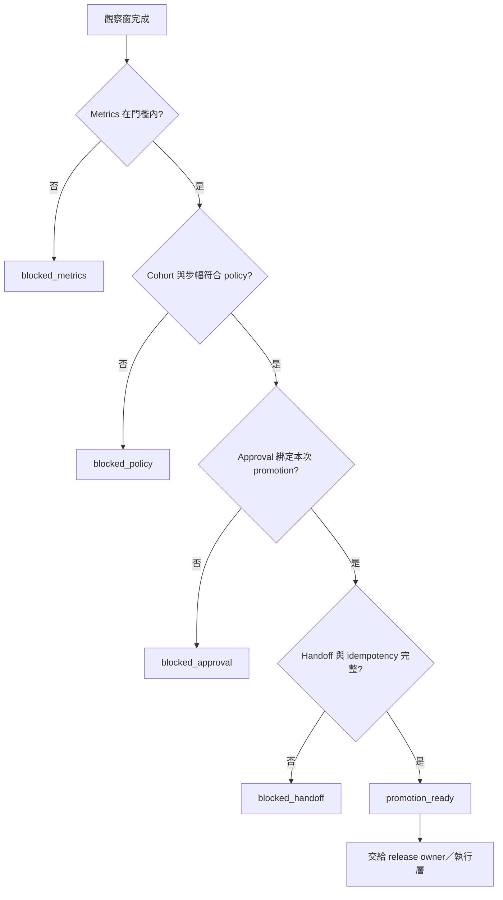
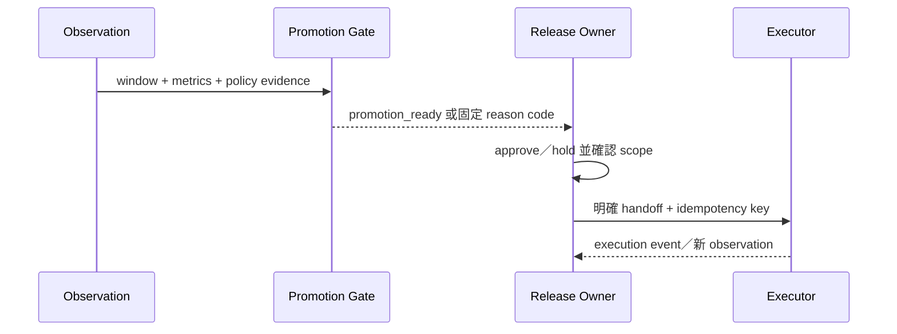

# Day 29｜放量不是看到綠燈就全開！用 Rollout Promotion Gate 把觀察窗、分段決策與責任交接綁在一起

## 先從一次「看起來可以放大」的 rollout 開始

新版本先放給 10% 使用者。幾分鐘後，dashboard 上的 error rate 是綠色，p95 latency 也沒有超過門檻。團隊於是準備把流量直接放到 100%。

但仔細回頭看，會發現幾個問題：

- dashboard 只顯示最新一筆數字，觀察窗還沒有完成。
- metrics 看的是 `run-29-a`，feature flag 的 cohort 卻來自另一輪。
- 目前是 10%，下一步卻直接要求 100%，中間沒有經過政策允許的步幅。
- release owner 說「可以繼續」，但沒有留下這次 promotion 的 scope、期限與 `promotion_id`。
- 下一個負責人不知道自己接到的是「可以評估」還是「已經執行」。

每一個局部訊號都可能是綠燈，但整個 rollout 仍然不能安全往下一階段走。這就是 Day 29 要處理的問題：**看到指標通過，不代表可以直接放大流量。**

Day 28 的 Progressive Rollout Gate 確認「這一輪 rollout 的前提是否完整」；今天再往前一步，確認「這一輪是否具備交給 promotion decision 的前提」。

## 本日主張：`promotion_ready` 不等於 traffic changed

Rollout Promotion Gate 是一個唯讀的 readiness check。它不會：

- 修改 feature flag。
- 切換 traffic route。
- 執行 promotion 或 rollback。
- 呼叫 deployment、traffic 或 IAM API。
- 替 release owner 做最終營運決策。

它只讀取兩份資料：

1. `intent`：這次 promotion 預先宣告的身份、觀察條件、允許步幅、approval 與 handoff 契約。
2. `observation`：實際收集到的觀察窗、metrics、policy、approval 與 handoff 證據。

如果全部條件一致，輸出：

```json
{
  "allowed": true,
  "state": "promotion_ready",
  "reasons": []
}
```

這個結果的意思是：「可以把決策交給下一個責任邊界」。它不是「流量已經切換」，更不是「所有使用者都已經使用新版本」。

## 五道 Gate，先觀察再談放量

本日固定順序：

```text
observe → metrics → policy → approval → handoff
```

### 1. Observe：觀察窗真的完成了嗎？

只看一筆最新數字，很容易把短暫的好運誤認成穩定。Intent 必須先寫清楚：

- `minimum_window_seconds`：至少觀察多久。
- `minimum_samples`：至少要有多少個樣本。
- `same_run_required`：是否要求所有 observation 都來自同一個 run。
- `current_cohort`：這次實際觀察的是哪一批使用者。

Observation 則要回報：

- `window_seconds`。
- `sample_count`。
- `state` 是否為 `window_complete`。
- `run_id` 與 `evidence_digest`。
- `audit_event_id`。

若觀察窗只有 90 秒、政策要求 600 秒，即使 error rate 是 0，也只能回報 `observation_window_incomplete`。這不是系統太保守，而是它拒絕把資料不足包裝成穩定。

### 2. Metrics：不能只挑一個漂亮數字

本日範例使用三項簡單指標：

| 指標 | 例子 | 它避免的誤判 |
| --- | --- | --- |
| `error_rate` | 不高於 0.02 | 只看成功筆數，忽略失敗比例 |
| `p95_ms` | 不高於 450 | 平均很快，但一小群使用者很慢 |
| `saturation` | 不高於 0.75 | 錯誤還沒出現，但資源已逼近上限 |

三項都必須屬於同一個 `run_id`、同一個 cohort、同一份 evidence digest。任一超標，輸出固定 reason code，例如 `metric_p95_exceeded`，而不是只回傳一個看不懂的 `false`。

### 3. Policy：下一個 cohort 不能隨便跳

Promotion 不是「目前 10%，想改多少都可以」。Intent 要宣告：

- `current_cohort` 與 `target_cohort`。
- 允許的 `max_step_percent`。
- `allowed_target_cohorts`。
- `policy_version`。

例如目前是 10%，政策最多只能增加 25 個百分點，那麼直接要求 100% 就應該停止。系統要回報 `promotion_step_exceeded`，讓 release owner 知道要改 target cohort 或重新取得核准。

這個檢查也能阻擋另一種常見錯誤：目前觀察的是 `canary-10`，promotion intent 卻寫成從 `canary-25` 開始。若 current cohort 對不上，後面的 metrics 再漂亮也不能拿來放行。

### 4. Approval：核准的是這一次 promotion

「昨天有人說可以」不代表今天這個 promotion 有核准。Approval 必須綁定：

- `promotion_id`。
- `owner`。
- `scope`，也就是目前 cohort 到哪個 target cohort。
- `expires_at`。
- `evidence_digest`。
- `audit_event_id`。

只要 scope 不一致、owner 缺少、核准過期，或 approval 綁的是另一個 digest，就回報 `approval_scope_mismatch`、`approval_expired` 或 `approval_digest_mismatch`。

Gate 不會自己發 token，也不會替人類簽核。它只確認「這次交給下一個責任邊界的資料，是否真的有對應的核准證據」。

### 5. Handoff：下一個人接到的是決策，不是模糊綠燈

Promotion 通常跨越多個角色：release owner 決定、SRE 觀察、平台執行、incident owner 接手例外。若沒有 handoff contract，下一個人只能從聊天紀錄猜目前狀態。

Handoff 至少要有：

- `next_owner`。
- `decision`，例如 `promote_to_next_cohort` 或 `hold`。
- `idempotency_key`。
- `audit_event_id`。

`idempotency_key` 很重要。假設 retry 讓同一個 `promotion_id` 再跑一次，Gate 應該能識別 `duplicate_promotion`，而不是讓執行層重複放量。

## Identity 要先比對，避免拼出假的成功

本日要求 intent 與 observation 的以下欄位完全一致：

- `release_id`：是哪一個 release。
- `environment`：在哪個環境觀察。
- `current_cohort`：目前正在服務哪一批使用者。
- `target_cohort`：下一步要交給哪一批使用者。
- `run_id`：哪一次執行產生 observation。
- `promotion_id`：哪一個 promotion decision。
- `evidence_digest`：哪一份資料指紋。
- `policy_version`：依哪一版放量政策判斷。

任何一欄不同，就先輸出 `blocked_identity`。不要因為 observation 的 metrics 很漂亮，就跳過身份檢查；那會把另一輪 rollout 的證據借來完成目前的 promotion。



> 圖 1｜Rollout Promotion Gate 先確認觀察與政策，再檢查 approval、handoff 與 idempotency；Gate 本身不改變 traffic。

## 固定 Reason Code，讓阻擋可以被修正

| 情況 | Reason code |
| --- | --- |
| intent 與 observation identity 不一致 | `identity_mismatch:<field>` |
| 觀察窗未完成 | `observation_window_incomplete` |
| 樣本數不足 | `observation_samples_insufficient` |
| error rate 超標 | `metric_error_rate_exceeded` |
| p95 超標 | `metric_p95_exceeded` |
| saturation 超標 | `metric_saturation_exceeded` |
| current cohort 不一致 | `current_cohort_mismatch` |
| target cohort 不在 allowlist | `target_cohort_not_allowed` |
| 放量步幅超過上限 | `promotion_step_exceeded` |
| 缺少或過期 approval | `approval_missing`、`approval_expired` |
| approval scope／digest 不一致 | `approval_scope_mismatch`、`approval_digest_mismatch` |
| handoff 欄位不足 | `handoff_incomplete` |
| 同一 promotion 已執行 | `duplicate_promotion` |

Reason code 的價值在於：下一個人知道要補資料、改 target、重新取得核准，還是應該維持 hold。它也是測試、稽核與重試可以依賴的穩定介面。

## 搭配 GitHub 實作範例

本日的 runnable example 放在 [`example-rollout-promotion-gate/`](./example-rollout-promotion-gate/)。它使用 Python 標準函式庫，只讀 `intent.json` 與 `observation.json`，不連線、不改 traffic，也不修改輸入。

先執行成功案例：

```bash
cd example-rollout-promotion-gate
python3 rollout_promotion_gate.py fixtures/intent.json fixtures/observation.json
```

預期輸出：

```json
{
  "allowed": true,
  "state": "promotion_ready",
  "reasons": []
}
```

接著執行完整測試與語法檢查：

```bash
python3 -m unittest -v
python3 -m py_compile rollout_promotion_gate.py test_rollout_promotion_gate.py
```

測試會涵蓋成功、identity drift、觀察窗不足、metrics 超標、cohort／step policy、approval、handoff、duplicate promotion，以及 deterministic retry。範例刻意保持三個界線：

1. **唯讀**：不修改 flag、traffic、deployment 或輸入 JSON。
2. **deterministic**：同一組 intent 與 observation 永遠得到同一組 reason code。
3. **分離**：`promotion_ready` 只代表可以交接，不代表 promotion 已經執行。

## 用 Given／When／Then 定義完成條件

### 1. 觀察、metrics 與政策都屬於同一輪

```text
Given intent 與 observation 的 release、environment、cohort、run、promotion、digest、policy 完全一致
And observation window 已完成且樣本數足夠
And error rate、p95、saturation 都在門檻內
And current → target cohort 與 step size 符合 policy
When 執行 Rollout Promotion Gate
Then allowed=true
And state=promotion_ready
And reasons=[]
```

### 2. 觀察窗不足就不能用漂亮數字放行

```text
Given metrics 都在門檻內
But observed.window_seconds 小於 intent.minimum_window_seconds
When 執行 Rollout Promotion Gate
Then allowed=false
And reasons 包含 observation_window_incomplete
```

### 3. 步幅超過政策就停止

```text
Given current_cohort=canary-10
And target_cohort=all-users
And max_step_percent=25
When 執行 Rollout Promotion Gate
Then allowed=false
And reasons 包含 promotion_step_exceeded
```

### 4. 同一個 promotion retry 不得重複執行

```text
Given promotion_id 已存在於 executed_promotions
When 執行 Rollout Promotion Gate
Then allowed=false
And reasons 包含 duplicate_promotion
And Gate 不修改任何輸入
```

## Gate、Owner、Executor 的責任邊界

Rollout Promotion Gate 通過後，仍然要分清楚三個角色：

| 角色 | 責任 | 不應該假設的事 |
| --- | --- | --- |
| Gate | 驗證 evidence 是否具備 promotion 前提 | 不會改 traffic |
| Release owner | 依 policy、風險與核准決定是否採用結果 | 不把 `true` 當成已執行 |
| Executor | 在明確授權下執行 flag／route 變更並留下 event | 不自行猜 target 或 scope |

這個分離讓失敗可以回溯：如果 Gate blocked，修 evidence；如果 Gate ready 但 owner 選擇 hold，記錄 decision；如果 executor 執行失敗，建立新的 observation 與新的 run，不要重用舊的綠燈。



> 圖 2｜Gate 提供可交接的判斷，Owner 做決策，Executor 才能在明確授權下改變 traffic；每次執行後都要建立新的 observation。

## GitHub 專案

本日的 companion code、fixtures、測試與 Mermaid 原始檔都保留在系列專案的 `day29/`：

- [`day29/article.md`](./article.md)：本文 Markdown 來源。
- [`day29/example-rollout-promotion-gate/`](./example-rollout-promotion-gate/)：唯讀 Rollout Promotion Gate、fixtures 與測試。
- [`day29/diagrams/rollout_promotion_gate_flow.mmd`](./diagrams/rollout_promotion_gate_flow.mmd)：五段 promotion gate 流程圖。
- [`day29/diagrams/rollout_promotion_states.mmd`](./diagrams/rollout_promotion_states.mmd)：promotion state machine 原始檔。

## 本日結語

Day 28 解決「這一輪 rollout 的證據能不能接起來」；Day 29 解決「接起來之後，是否具備交給下一個放量決策的前提」。

請記住三句話：

1. 一筆漂亮 metrics 不等於完整 observation window。
2. `promotion_ready` 只代表 identity、metrics、policy、approval 與 handoff 都能對上，不代表 traffic 已經改變。
3. 每次 promotion 都要有自己的 `promotion_id`、scope、owner 與 idempotency key；重試不能偷偷變成重複放量。

會跑的 rollout 不一定能安全放大；能把觀察窗、放量政策、責任交接與重試邊界寫成 evidence，才是一條可以被信任的 promotion pipeline。
