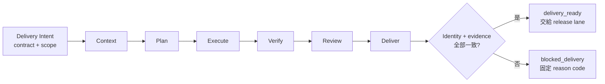
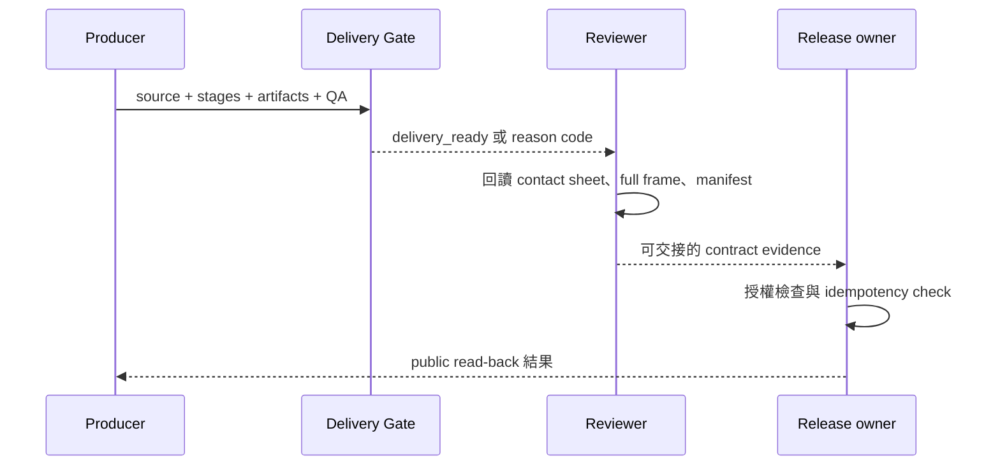

# Day 30｜AI 會跑不等於能交付！用 Delivery Contract 把 30 天工作流收成可回讀的工程閉環

## 30 天最後一關，不是按下「發布」

想像一個 AI 協作專案走到最後一天。

- 需求已經整理成可驗收條件。
- Codex 已經依照 Plan 修改程式。
- 測試與 type check 都是綠色。
- Deck、影片、字幕也都產生了。
- Reviewer 說看起來沒問題。

這時候有人問：「那可以交付了嗎？」

如果答案只是一串聊天紀錄、幾個 `true`，或一個叫做 `final` 的資料夾，這份答案其實還不夠。因為我們還不知道：這些證據是不是屬於同一輪 run、必要檔案是不是都在、QA 是真的執行過還是被標成通過，以及下一個人收到的是「可以接手」還是「已經公開」。

這就是 Day 30 要補上的最後一段：**AI 會跑不等於能交付；交付必須有一份可以被下一個人回讀的契約。**

## 本日主張：`delivery_ready` 不等於 `published`

Delivery Contract Gate 是一個唯讀的交付 readiness check。它不會：

- 發布 iThome 文章。
- 上傳 YouTube 影片或字幕。
- 修改 production 設定。
- 替人類 owner 做最後的公開決策。
- 把本機檔案複製到外部服務。

它只讀取兩份資料：

1. `intent`：這次交付預先宣告的身份、stage 順序、必要交付物與責任邊界。
2. `observation`：實際完成的 stage、artifact inventory、QA 與 handoff 證據。

全部對得上時，輸出：

```json
{
  "allowed": true,
  "state": "delivery_ready",
  "reasons": []
}
```

這個結果的意思是：「這一包可以交給下一個責任邊界」。它不是「文章已公開」，也不是「影片已上傳」。外部發布仍要由 release lane 依自己的授權與公開回讀流程處理。

## 六段工作流要留下同一條證據鏈

Day 1 建立的基本方向，可以整理成六段：

```text
context → plan → execute → verify → review → deliver
```

每一段都有自己的工作，但不能各自帶著不同身份往前走。

| Stage | 它回答什麼 | 成功狀態 | 不代表什麼 |
| --- | --- | --- | --- |
| `context` | 我們理解的是哪一份需求與背景？ | `context_bound` | 不代表已經修改程式 |
| `plan` | 要做什麼、不能做什麼？ | `plan_approved` | 不代表測試已通過 |
| `execute` | 實際改了哪些範圍？ | `executed_scoped` | 不代表可以交付 |
| `verify` | 測試與 QA 是否真的通過？ | `verified` | 不代表 reviewer 已接受 |
| `review` | 是否有人用正確範圍檢查？ | `review_complete` | 不代表已公開 |
| `deliver` | 交付物與責任是否綁定？ | `deliverable_bound` | 不代表外部服務已變更 |

只要 stage 順序錯了，或其中一段的 `evidence_digest` 不同，就不能把六個綠燈拼成一個成功結論。

## 先固定 Delivery Contract Identity

本日範例要求 `intent` 與 `observation` 完全一致的欄位包括：

- `series_id`：哪一個系列或產品。
- `day`：哪一天的交付。
- `contract_id`：哪一份交付契約。
- `run_id`：哪一次執行產生這批結果。
- `source_digest`：哪一份文章、需求或原始碼。
- `evidence_digest`：哪一份證據集合。
- `policy_version`：依哪一版交付規則判斷。
- `owner`：誰負責這一包交付。
- `target`：要交給哪一個責任邊界。



> 圖 1｜Delivery Contract Gate 先固定同一份 contract identity，再依序串起 Context、Plan、Execute、Verify、Review 與 Deliver；它只交接，不執行外部發布。

任何一欄不同，都要先回報 `blocked_identity`。不要因為 verify 的測試很漂亮，就拿另一輪 run 的 article 或 deck 來補齊交付物。

## 有檔案不等於有交付證據

交付 inventory 不能只列檔名。至少還要知道：

1. 檔案是否真的存在且 bytes 大於 0。
2. 它是否屬於這一次的 `evidence_digest`。
3. 它的狀態是不是 `verified`，而不是 `generated` 或 `candidate`。
4. QA 是否有自己的 evidence，而不是只複製一個總結果。
5. 路徑是否可攜，不把本機絕對路徑送進公開來源。

以本系列 Day 30 為例，必要交付物可以是：

| Artifact | 最小證據 | 常見誤判 |
| --- | --- | --- |
| article | canonical Markdown 非空、source digest 對得上 | 有檔案就當成內容完成 |
| example | fixture CLI 與完整 tests 實際通過 | 只看程式碼沒有執行 |
| deck | 官方 checker 無 errors／warnings | 手寫 HTML 冒充官方 scaffold |
| video | FFprobe、full decode、volume 通過 | 只有檔名叫 `final.mp4` |
| subtitles | UTF-8、單 cue 單行、時間在界線內 | 產生了 SRT 就當成可用 |
| media QA | contact sheet、full frame、獨立 visual review | `inspected=true` 沒有證據檔 |

因此 Gate 不接受只有 `path` 的 inventory。每個 required artifact 都要帶狀態、digest、bytes 與可回讀的相對路徑。

## Verify 與 Review 是兩種不同證據

`verify` 通常由工具完成：測試、syntax check、官方 deck checker、FFprobe、decode、SRT parser。它回答的是「這些可機器驗證的條件是否通過」。

`review` 則是另一個責任：有人實際查看 evidence，確認畫面沒有裁切、中文沒有變成方塊、字幕沒有蓋住資訊、文章與影片講的是同一件事。它回答的是「這批結果是否值得交接」。

兩者不能互相代替：

- 測試全綠，不代表畫面沒有被裁切。
- 視覺看起來舒服，不代表 video 有音訊或字幕時間有效。
- reviewer 說 OK，不代表他檢查的是這一次 run。

這也是為什麼本機 producer 要先產生 `PENDING_VISUAL_REVIEW`，完成獨立檢查後才轉成 `PASS`。

## Release boundary：不要把本機 Ready 偷換成 Published

Day 30 的 Producer 只負責產出與驗證本機 artifacts。當 Gate 回傳 `delivery_ready` 時，正確的交接語意是：

```text
本機證據完整 → 交給 release lane → 做外部授權檢查 → 發布 → 公開回讀
```

不正確的語意是：

```text
有 MP4 + 有 article.md → 已經發布
```

在 observation 裡，external boundary 應該明確寫成 `release_lane`。如果有人把它改成 `published`，卻沒有外部 URL 與公開 read-back evidence，Gate 必須阻擋並回報 `external_boundary_mismatch` 或 `publication_evidence_missing`。

這個界線不只是流程文件。它防止自動化在最後一步把「檔案已產生」誤報成「世界已改變」。

## 固定 Reason Code，讓失敗可以修正

| 情況 | Reason code |
| --- | --- |
| intent 與 observation identity 不一致 | `identity_mismatch:<field>` |
| 缺少必要 stage | `stage_missing:<stage>` |
| 出現未知 stage | `stage_unknown:<stage>` |
| stage 順序錯誤 | `stage_order_invalid` |
| stage state 不符 | `stage_state_invalid:<stage>` |
| stage digest 不一致 | `stage_digest_mismatch:<stage>` |
| 缺少 audit event | `audit_event_missing:<stage>` |
| 缺少交付物 | `deliverable_missing:<name>` |
| 交付物尚未驗證 | `deliverable_not_verified:<name>` |
| 交付物 digest 或 bytes 不正確 | `deliverable_digest_mismatch:<name>`、`deliverable_empty:<name>` |
| 使用本機絕對路徑 | `deliverable_path_absolute:<name>` |
| 外部責任邊界不一致 | `external_boundary_mismatch` |
| handoff 不完整 | `handoff_incomplete` |
| 同一份契約已執行 | `duplicate_delivery` |

Reason code 的價值是讓下一個人知道要補哪一段，而不是只收到一個沒有上下文的 `false`。

## 搭配 GitHub 實作範例

本日的 runnable example 放在 [`example-delivery-contract-gate/`](./example-delivery-contract-gate/)。它使用 Python 標準函式庫，讀入 `intent.json` 與 `observation.json`，只回報交付 readiness，不連線、不發布、不修改輸入。

先執行成功案例：

```bash
cd example-delivery-contract-gate
python3 delivery_contract_gate.py fixtures/intent.json fixtures/observation.json
```

預期輸出：

```json
{
  "allowed": true,
  "state": "delivery_ready",
  "reasons": []
}
```

接著執行完整測試與語法檢查：

```bash
python3 -m unittest -v
python3 -m py_compile delivery_contract_gate.py test_delivery_contract.py
```

測試會涵蓋 identity drift、stage 缺漏與亂序、digest drift、artifact inventory、絕對路徑、release boundary、handoff、duplicate contract，以及 deterministic retry。

## 用 Given／When／Then 定義完成條件

### 1. 同一份 contract 的六段證據完整

```text
Given intent 與 observation 的 identity 完全一致
And context、plan、execute、verify、review、deliver 依序完成
And 每個 stage 有相同 evidence digest 與 audit event
And 所有必要 artifacts 都是 verified 且 bytes 大於 0
And external boundary 仍是 release_lane
When 執行 Delivery Contract Gate
Then allowed=true
And state=delivery_ready
And reasons=[]
```

### 2. 另一輪 run 的 evidence 不能拼進來

```text
Given observed.run_id 與 intent.run_id 不同
When 執行 Delivery Contract Gate
Then state=blocked_identity
And reasons 包含 identity_mismatch:run_id
And 不繼續用其他綠燈抵銷 identity 漂移
```

### 3. 產生檔案不等於通過 QA

```text
Given video artifact 的 status 是 generated
Or media_qa artifact 的 bytes 是 0
When 執行 Delivery Contract Gate
Then allowed=false
And 回報 deliverable_not_verified 或 deliverable_empty
```

### 4. 本機 ready 不能冒充 public

```text
Given observation.external_boundary 不是 release_lane
And 沒有外部 read-back evidence
When 執行 Delivery Contract Gate
Then allowed=false
And 回報 external_boundary_mismatch
```

### 5. 重試必須保持 deterministic

```text
Given 相同的 intent 與 observation
When 連續執行兩次
Then 兩次輸出完全一致
And intent 與 observation 都沒有被修改
```

## 三個角色的責任邊界

| 角色 | 負責什麼 | 不應該假設的事 |
| --- | --- | --- |
| Producer | 產出 source、example、deck、media 與 local QA | 不宣稱外部已發布 |
| Reviewer | 回讀 QA evidence、確認內容與畫面可交接 | 不偷偷改 scope 或放寬 Gate |
| Release owner | 檢查授權、執行外部發布並做 public read-back | 不把 `delivery_ready` 當成 `published` |



> 圖 2｜Producer 只產出本機證據，Gate 只驗證契約，Reviewer 回讀 evidence，Release owner 才負責外部變更與公開回讀。

## 把 30 天收成一個可回讀的習慣

這 30 天不是在累積更多工具，而是在縮小「AI 可以自行猜測」的空間：

- Day 1–9：建立 Context、Plan、Execute、Verify、Review、Deliver 的基本責任鏈。
- Day 10–17：把 freshness、change、evidence、traceability、reproducibility 與 artifact promotion 寫成 Gate。
- Day 18–23：把 deployment、stability、SLO、approval、rollback、recovery 接到運維邊界。
- Day 24–29：處理 incident closeout、evidence lifecycle、progressive rollout 與 promotion decision。
- Day 30：把整條流程收成 Delivery Contract，讓交付物、QA、責任與外部發布邊界可以被回讀。

最後一個 Gate 的目的，不是再加一層 bureaucracy，而是讓「完成」有一個可驗收的意思。

## 本日結語

請記住三句話：

1. `delivery_ready` 只代表本機證據完整、可以交接，不代表已公開。
2. 測試、視覺 review、artifact inventory 與 handoff 必須屬於同一份 contract identity。
3. 任何外部結果都要靠自己的授權與公開 read-back 證明，不能從檔案存在推導出來。

AI 真的能幫忙，不是因為它把每一步都自動按下去，而是因為每一步都留下下一個人能理解、能驗證、也能安全接手的證據。這就是從需求到交付的工程閉環。

## GitHub 專案

本日的 companion code、fixtures、測試與 Mermaid 原始檔都保留在系列專案的 `day30/`：

- [`day30/article.md`](./article.md)：本文 Markdown 來源。
- [`day30/example-delivery-contract-gate/`](./example-delivery-contract-gate/)：唯讀 Delivery Contract Gate、fixtures 與測試。
- [`day30/diagrams/delivery_contract_flow.mmd`](./diagrams/delivery_contract_flow.mmd)：六段交付流程圖。
- [`day30/diagrams/delivery_contract_states.mmd`](./diagrams/delivery_contract_states.mmd)：交付狀態圖。
